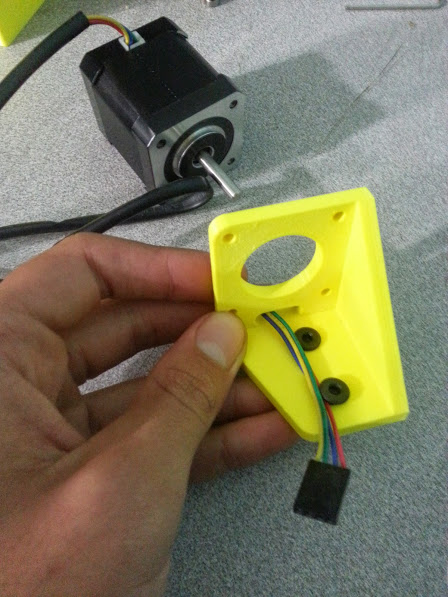
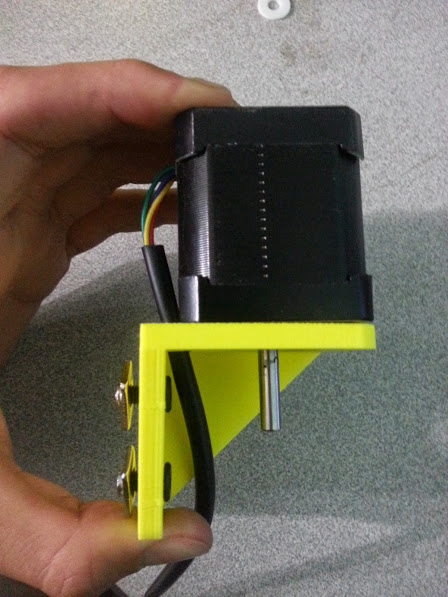

<iframe width="100%" height="480" src="https://sketchfab.com/models/a5d485221e584eba91c1a538b3f2e9e7/embed?ui_controls=0&amp;ui_infos=0&amp;ui_related=0" frameborder="0" allowfullscreen mozallowfullscreen="true" webkitallowfullscreen="true" onmousewheel=""></iframe>



# Assembly Instructions



## Step 1: Gather the Parts and Tools
Gather all the parts from the table below and lay them out in a logical manner. To complete the assembly, you will also need the following tools:

* 2mm hex (allen) wrench
* 3mm hex (allen) wrench

|Qty.                          |Component                     |
|------------------------------|------------------------------|
|1                             |Z-Axis Extrusion (20mm x 20mm x 1m)
|1                             |NEMA 17 Stepper Motor
|1                             |Z-Axis Motor Bracket
|2                             |M5 x 10mm Screws
|2                             |Tee Nuts
|4                             |M3 x 10mm Screws

## Step 2: Attach the Stepper Motor to the Z-Axis motor bracket
Partially screw two **M5x10mm screws** and **tee nuts** into the **z-axis motor bracket**.

Route the **stepper motor’s cable** through the slot opening on the top of the **z-axis motor bracket**.



Attach the **stepper motor** to the **z-axis motor bracket** with four **M3 x 10mm screws**.

# Troubleshooting and Maintenance



## Clean and lubricate the Leadscrew
The z-axis leadscrew will become dirty after being outside for a prolonged period of time. Excessive dirt and grime on the leadscrew can cause premature wear, a loss of precision, and missed steps if not addressed.



# Change Log

  * Plates are now 5mm thick
  * Motor mount screws and flex coupling setscrews are now stainless steel

# Room for Improvement

* The rotary encoder protrudes outside of the boundary of the motor on the wire side, which prevents the motor housing from fitting. The solution is to make the motor housing larger to accommodate the encoder and the added wires.
* The motor housing currently sits loose on top of the motor and can shift around and vibrate easily. The next version should have a mounting flange for securing it to the z-axis extrusion.
* The motor housing is designed to fit the chosen motor and encoder. There should be extra vertical room in the housing to accommodate other motor and encoder combinations.
* The slot for the motor wire in the z-axis motor mount is just barely large enough to fit the encoder wire and the motor wire. The solution is to make the slot larger so that both wires (and connectors) can be easily fit through.
* The z-axis motor mount is a critical structural component that must be rigid and strong for accurate and robust z movements. An extra mounting flange should be added for added rigidity and strength in the mounts' connection to the z-axis extrusion.
