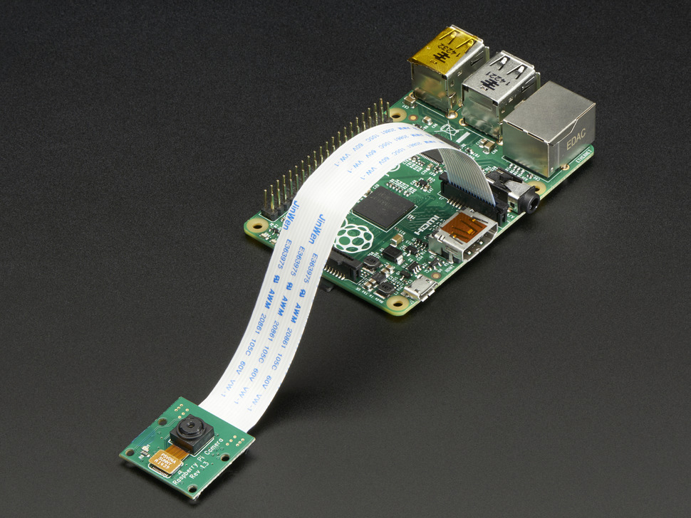

There are many reasons you might want to add a webcam to your FarmBot. Here are a few:
* To watch FarmBot move from work, inside your house, or across the world
* To show FarmBot off to your friends
* To take photos each day for timelapse photography of your plants growing
* To supplement a security system against vandals or animals
* To make sure FarmBot doesn't slack off or sleep on the job

# Setting up a Raspberry Pi Camera

The Raspberry Pi supports small 5MP cameras, called **Raspberry Pi Camera Modules**, which plug directly into the Pi's CSI bus via a [ribbon cable](https://www.adafruit.com/products/2144). You can only use one camera module at a time, so if you want to have multiple camera angles, you'll need to also use a USB web cam.

There are two types of camera modules available: one with a [regular camera](https://www.adafruit.com/products/1367), and one with an [infrared camera](https://www.adafruit.com/products/1567) that can be used at night in combination with infrared LEDs for a nice night vision ability. The camera modules need to be mounted on your FarmBot in a rain proof location. This could be done with a [small plastic bracket](https://www.adafruit.com/products/1434) and a 3D printed roof structure, or other materials. How and where you mount your camera is up to you.

Stock Raspbian (and therefore FarmBot OS) support the use of a camera module out of the box, so minimal coding is required to setup your webcam.

## Step 1: Coming soon

## Step 2: Coming soon

# Setting up a USB Webcam

Coming soon
