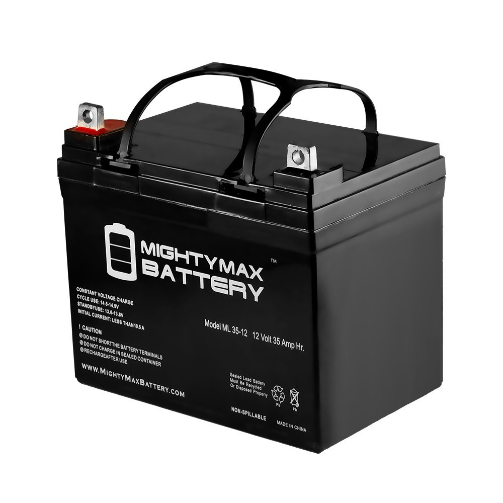
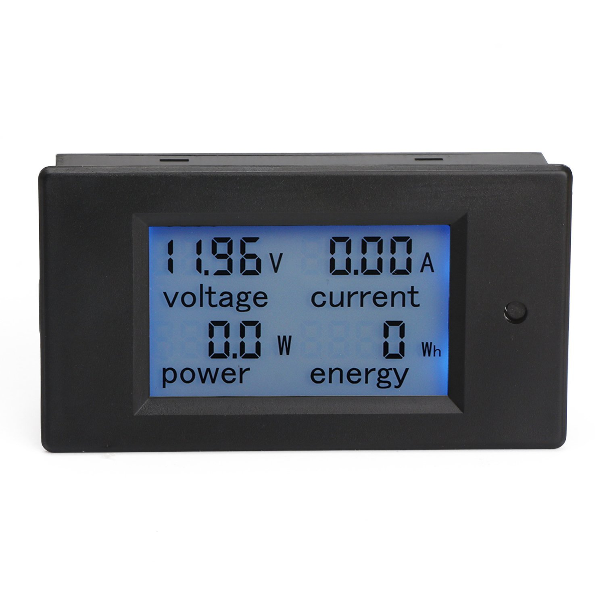
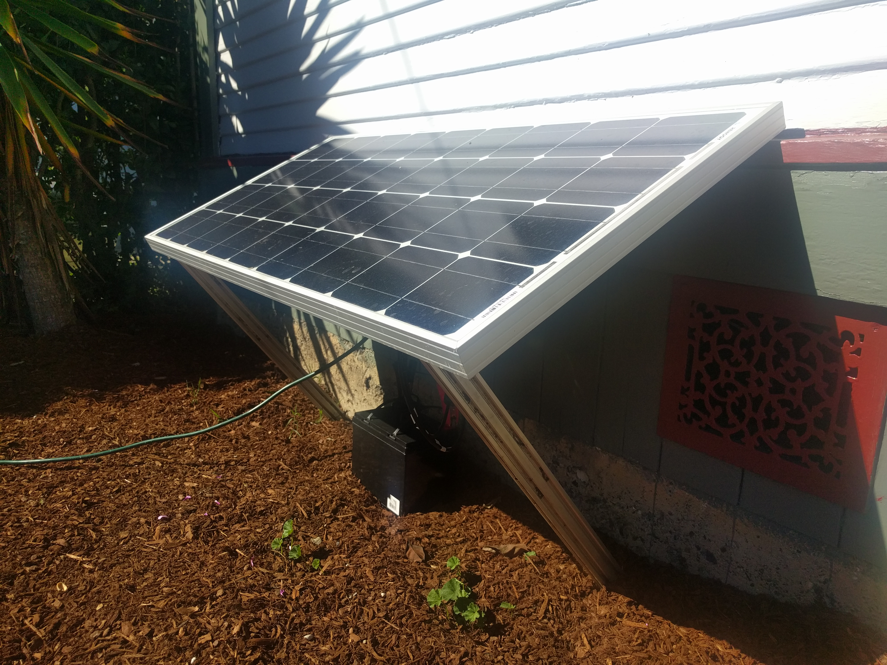
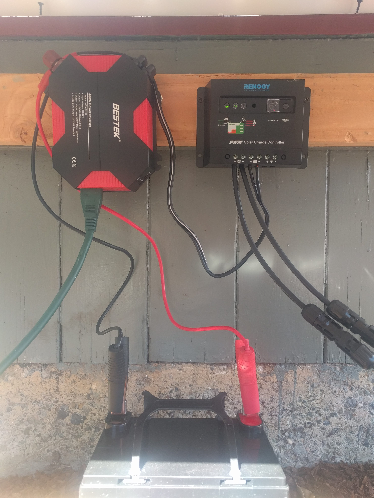
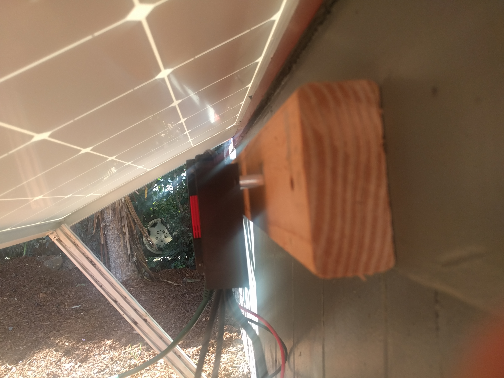

# Understanding FarmBot's Energy Usage

To power FarmBot exclusively with solar energy, we first need to calculate how much electricity FarmBot uses so that we can size our solar system appropriately. We can do this by estimating the duty cycle of each component and then tallying up the estimated energy usage.

{%
include callout.html
type="info"
title="What's duty cycle?"
content="Duty cycle is the percentage of time that the component is used. For example, the Raspberry Pi will be on all the time, so its duty cycle is 100%. The motors are not likely to be used all the time, so their duty cycle might be closer to 5%. Of course, this depends on how you use your FarmBot."
%}

## Component Daily Energy Usage

|Component                     |Power (watts)                 |Duty Cycle (%)                |Daily Energy Usage (Watt-Hours)|
|------------------------------|------------------------------|------------------------------|------------------------------|
|Raspberry Pi 2                |3.0                           |100%                          |72
|Arduino Mega 2560             |1.0                           |100%                          |24
|3x NEMA 17 Stepper Motors     |30.0                          |3 to 15%                      |21.6 to 108
|Solenoid Valve                |30.0                          |0.5 to 3%                     |3.6 to 21.6
|Vacuum Pump                   |186.0                         |0.25 to 1%                    |11 to 45
|**Optional:** 12 Volt Tools   |5.0 to 132.0                  |0.5 to 3%                     |0.6 to 95
|**Optional:** Raspberry Pi Camera|1.5                           |100%                          |36
|**Optional:** USB WiFi dongle |1.0                           |100%                          |24

## Total Daily Energy Usage

|System Configuration          |Total Daily Energy Usage (Watt-Hours)|
|------------------------------|------------------------------|
|No add-on components, low usage|132.2
|**No add-on components, medium usage**|**201.4**
|No add-on components, high usage|270.6
|All add-on components, low usage|192.8
|**All add-on components, medium usage**|**309.2**
|All add-on components, high usage|425.6

As you can see from the tables above, how you configure and use your FarmBot will vary the total daily energy usage significantly.



# Sizing Your Solar System

Once you have determined the daily energy usage of your FarmBot, you will need to size your solar panel and battery such that you can run FarmBot continuously without running out of power. In these instructions we'll be installing a system in San Luis Obispo, California where the vast majority of days are sunny. Furthermore, we'll be using an estimated daily power usage of 250 watt-hours, which we consider to be inline with an average system configuration and usage amount.

## Sizing the Solar Panel
On a sunny day, your solar panel will need to produce more power than FarmBot uses so that the extra energy can be saved in the battery for rainy days. If you live somewhere that is often sunny, then you may not need a lot of surplus power each day because you'll be fine building up your energy reserves over a few days. If you live somewhere with a lot of rain, clouds, snow, or fog, you may want a lot of surplus power so that you can fully charge your battery and run your FarmBot on just one day's worth of sun.

As a rule of thumb, you should be able to get about 5 hours of usable sun each day on your solar panel if it is properly positioned and the skies are clear. For our installation in San Luis Obispo, we're going to use a medium sized 100 watt solar panel. This means that we can expect to generate 500 watt-hours of energy each day that it is sunny. This will be able to power our FarmBot for one day (250 watt-hours) as well as put an additional 250 watt-hours of energy into our battery, which will be good for one day's worth of operation.

## Sizing the battery
Because it doesn't rain or get cloudy often in San Luis Obispo, we're going to plan to store enough energy for just two days no sun. This means we'll need at most 500 watt-hours of battery capacity - the amount of energy our FarmBot uses in two days. Considering that solar panels produce a small amount of power even on a rainy or cloudy day (10-25% of their rated power), we can count on getting at least 50 watt-hours of recharge on each day of bad weather. This means that we should be able to operate our FarmBot for our two day goal with about 400 watt-hours of battery capacity.

For our application, we selected a 12 volt, 35  amp-hour deep cycle lead acid battery, which will hold 460 watt-hours of energy.

_12 Volt, 35 Amp-Hour Deep Cycle Sealed Lead Acid Battery_



# Purchase the Components

You can use any brand solar panel, charge controller, battery, and AC inverter you like, as long as they are designed to safely work with each other. In the table below we recommend the specific components used in our San Luis Obispo system.

{%
include callout.html
type="danger"
title="Make sure your components will work together safely"
content="When purchasing components, pay close attention to their maximum operating voltages, currents, and temperatures, as well as other specifications that must be within a certain range or of a specific type.

We recommend purchasing a solar panel, charge controller, and wiring harness from one supplier as a kit, rather than mixing and matching these components.

The battery must be of the correct chemistry in order to work with your charge controller.

The battery, inverter, and any interconnecting wiring must be able to safely handle the maximum possible currents and voltages.

You must protect your solar system from rain, condensation, and animals. A damaged or malfunctioning solar system can catch fire."
%}

|Component                     |Recommended Supplier          |Cost                          |
|------------------------------|------------------------------|------------------------------|
|100 Watt, 12 Volt Monocrystalline Solar Panel, Charge Controller, and Wiring Harness|[Renogy/Amazon](http://smile.amazon.com/gp/product/B00B8L6EFA?psc=1&redirect=true&ref_=oh_aui_detailpage_o03_s01)|$170
|12 Volt, 35 Amp-Hour Deep Cycle Sealed Lead Acid Battery|[Amazon](http://smile.amazon.com/gp/product/B00K8E0WAG?psc=1&redirect=true&ref_=oh_aui_detailpage_o02_s00)|$64
|**OPTIONAL:** 400 Watt Power Inverter (12 Volts DC to 110 Volts AC)|[Bestek/Amazon](http://smile.amazon.com/gp/product/B00UFERZKO?psc=1&redirect=true&ref_=oh_aui_detailpage_o03_s00)|$35
|**OPTIONAL:** LCD Digital Power Meter|[Amazon](http://www.amazon.com/gp/product/B017FSED9I?psc=1&redirect=true&ref_=od_aui_detailpages00)|$15.89
|                              |**TOTAL with options**        |**$284**
|                              |**TOTAL without options**     |**$234**

{%
include callout.html
type="info"
title="Optional Inverter"
content="It is possible to run your FarmBot directly from the battery. If you do this, you will bypass the 12V DC to 110V AC inverter as well as FarmBot's stock 110V AC to 12V DC power supply. By doing this, you will eliminate the need for these components, which will save you money, and you will also make your system more energy efficient because the inverter and power supply will no longer use a small amount of electricity.

Keep in mind that if you completely remove your FarmBot's power supply, you will not be able to use grid power."
%}

_Optional 400 Watt Power Inverter (12 Volts DC to 110 Volts AC)_

{%
include callout.html
type="info"
title="Optional power meter"
content="Having a power meter hooked up between the solar system and FarmBot can provide you with some fun insights into how your system is performing. The one we have hooked up tells us the voltage of our battery, the current and power that FarmBot is drawing, as well as the total energy FarmBot has used.

Alternatively, you can set up your power meter in between the battery and the charge controller to show you stats on the solar panel (how much energy it has produced, and the solar panel's current output amperage and power)."
%}

# Assembly Instructions



## Step 1: Install the solar panel
The first thing you want to do is find a sunny location near your FarmBot. If you live in the Northern hemisphere, your panel will need to face South. If you live in the Southern hemisphere, your panel will need to face North. Make sure you minimize the amount of shade your panel will receive from nearby trees and plants, buildings, and even FarmBot itself. Keep in mind how the sun moves throughout each day and how that changes with the seasons.

Once you have a location chosen, proceed to install your panel. Some panels come with mounting brackets, others with small adjustable stands, and others are just the panel. You may need to build some supporting infrastructure out of wood or aluminum extrusions. You might also use an existing building or your raised bed to support your panel. Every installation will be different.

For our example installation, we used the South facing side of the house to support one half of the panel, while the other half is supported by two aluminum extrusions and a few screws, tee nuts, corner brackets, and locknuts.

### Optimize the panel angle
Depending on your latitude, you will want to angle your panel towards the sun in order to get the most power out of it each day. The table below suggests optimum panel angles for different latitudes.

|Latitude                      |Optimum Panel Angle           |
|------------------------------|------------------------------|
|0° (Quito)                    |0.0°
|5° (Bogotá)                   |4.4°
|10° (Caracas)                 |8.7°
|15° (Dakar)                   |13.1°
|20° (Mérida)                  |17.4°
|25° (Key West, Taipei)        |22.1°
|30° (Houston, Cairo)          |25.9°
|35° (Albuquerque, Tokyo)      |29.7°
|40° (Denver, Madrid)          |33.5°
|45° (Minneapolis, Milano)     |37.3°
|50° (Winnipeg, Prague)        |41.1°

## Step 2: Wire up the panel and the charge controller
Follow the instructions provided by the manufacturer of your panel and controller kit. In general, this will simply entail connecting the output of the solar panel to the input of the charge controller. Remember: negative/ground to negative/ground, and positive to positive.

## Step 3: Wire up the battery and the inverter
You can do this in two ways. Both ways will function the same. One way might make more sense to you than the other, or one might work better with the lengths of your wires, the types of connectors you have available, and the location of your components. Choose only one method.

### Method 1
First connect the output of the charge controller to the battery. Then connect the battery to the input of the inverter.

### Method 2
First connect the output of the charge controller to the input of the inverter. Then, connect the battery to the input of the inverter.

## Step 4: Rainproof the charge controller, battery, and inverter
Make sure you position these components in a rainproof location. This can be under your panel, inside your house or a shed, or under some other type of roofing structure. There should be no possible way for rain to drip onto the components either directly or from creeping along a wall or edge. Plan accordingly for rain coming in at an angle due to high winds; as well as sprinklers, hoses, and other sources of water that might be present around the solar system



## Step 5: Add the power meter (optional)
Mount your power meter somewhere where you can easily read the LCD screen, while also making sure it will be protected from the rain. Connect the meter according to the manufacturer's instructions.

## Step 6: Plug in FarmBot
Plug FarmBot into the inverter output and then turn on the inverter.



