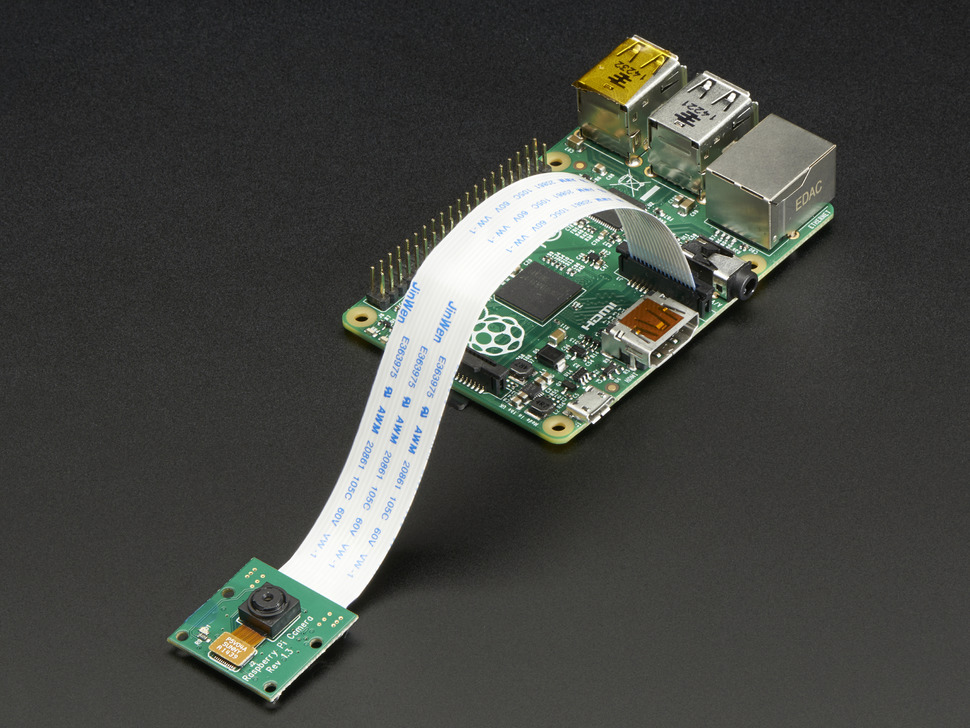

* toc
{:toc}

Want to make cool time lapse videos of your food growing? FarmBot can help you do this in a variety of ways.
## Time Lapse Examples
### Individual Plant Time Lapse
Plant a seed in the ground and then use the camera tool to take a photo from the plant's X and Y coordinates with a sufficient amount of Z-height for the plant to fully grow. Move back to this location every day at the same time to take another photo. You'll end up with a time lapse of that individual plant growing - perfect for Instagram.



### Fly-Over Time Lapse
On day 1, position your camera tool at one end of the tracks, halfway across the gantry, and at the maximum Z-height to snap a photo. The next day, move to the same position but a small distance away from the end of the tracks (maybe 2 to 3cm) and take another photo. Repeat this each day until you reach the end of the tracks. You'll end up with a cool "fly-over" style video of your entire garden growing!

# Camera Options

## Mount a USB Webcam onto the Z-Axis (Easy)
The easiest way to get started is by buying a [USB webcam](http://www.amazon.com/s/ref=nb_sb_noss_2?url=search-alias%3Daps&field-keywords=usb+web+cam&rh=i%3Aaps%2Ck%3Ausb+web+cam) and moutning it onto the Z-axis. You'll need to protect the camera from rain either by waterproofing it with a silicon sealant or by 3D printing a plastic rain cover. You can then run the USB cable through FarmBot's cable carriers to the Raspberry Pi.





## Build a USB Based Camera Tool (Difficult)
In addition to being connected to the Arduino, FarmBot's UTM is also connected via USB to the Raspberry Pi. This means that you can hack a USB webcam into a standard FarmBot tool blank, and then utilize the existing UTM wiring to power the webcam and send and receive data.





## Gantry Mounted Raspberry Pi Camera (Easy)
The [Raspberry Pi Camera Module](https://www.raspberrypi.org/products/camera-module/) is a small camera board that connects to the Raspberry Pi via a ribbon cable. You can mount this camera to the gantry to get a sideways viewpoint of your plants and the UTM/tools. You'll need to 3D print a small plastic mount and housing to protect this camera from the rain.

You can also buy a [NoIR filter version](https://www.raspberrypi.org/products/pi-noir-camera/), which can be used at night in combination with Infrared LED lights for some cool night vision of your plants!





