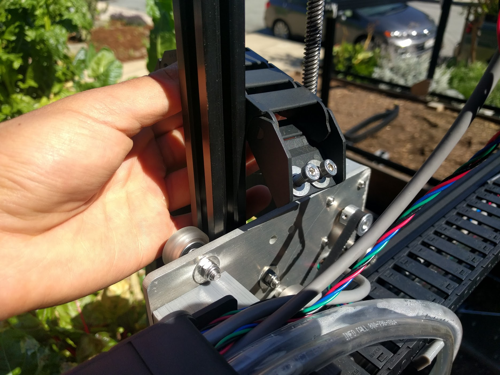
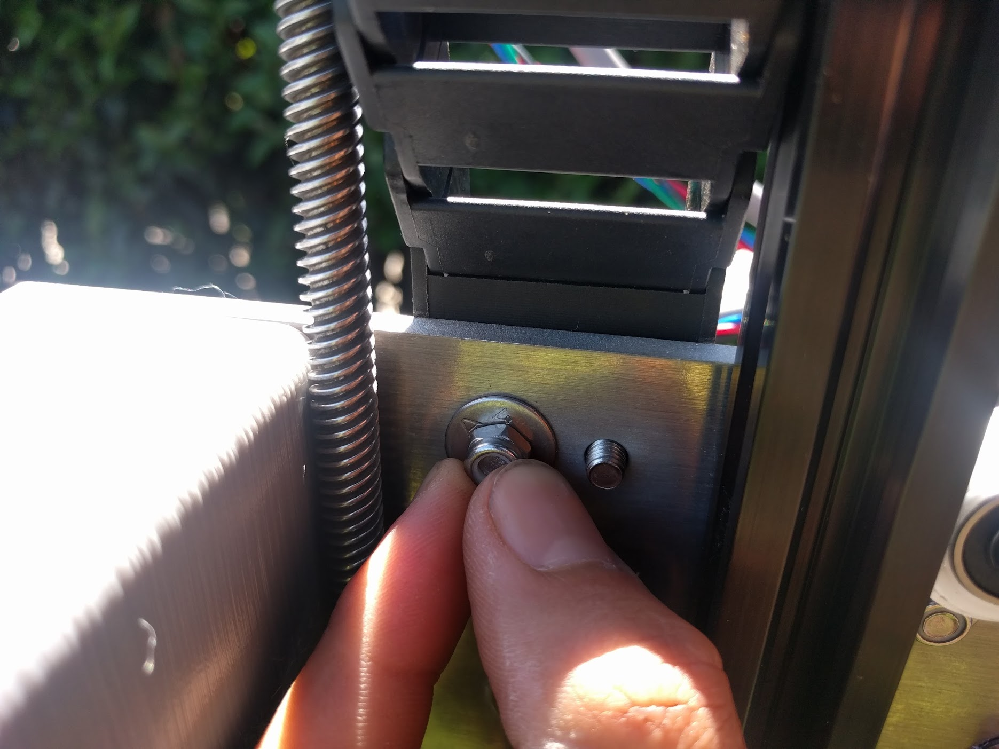
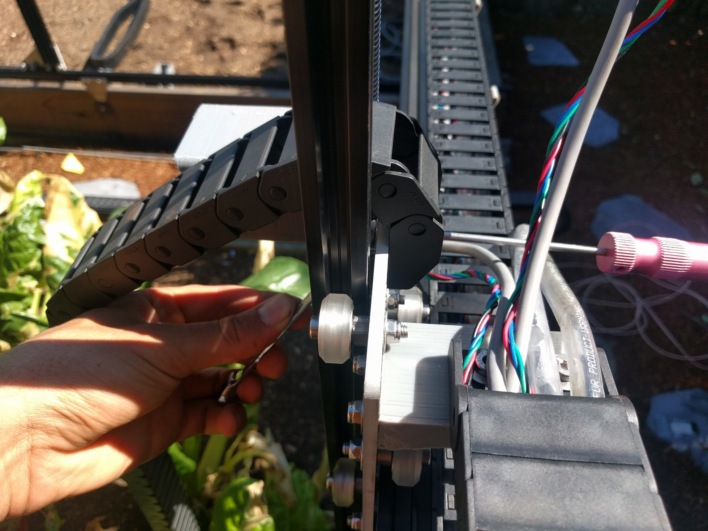
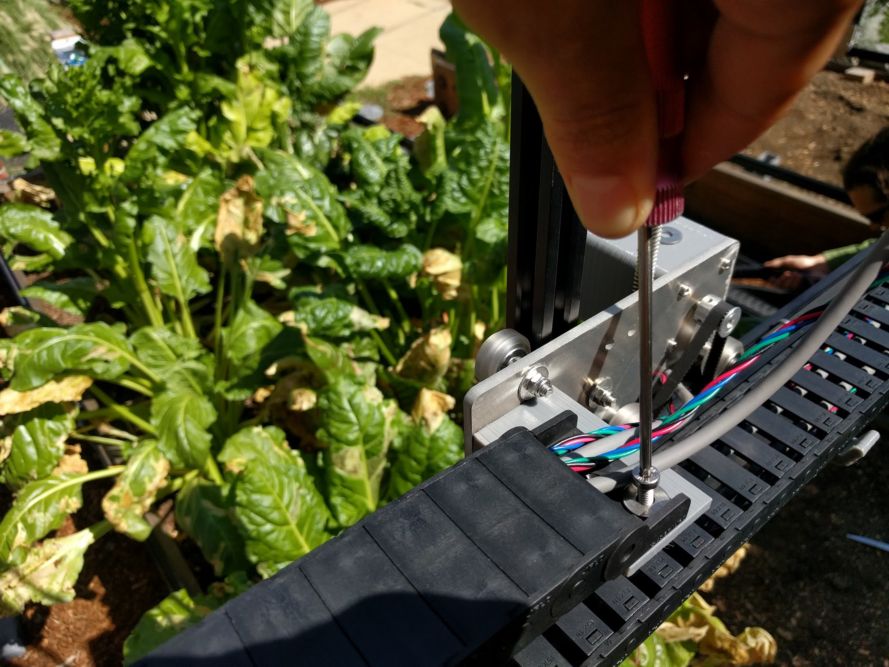
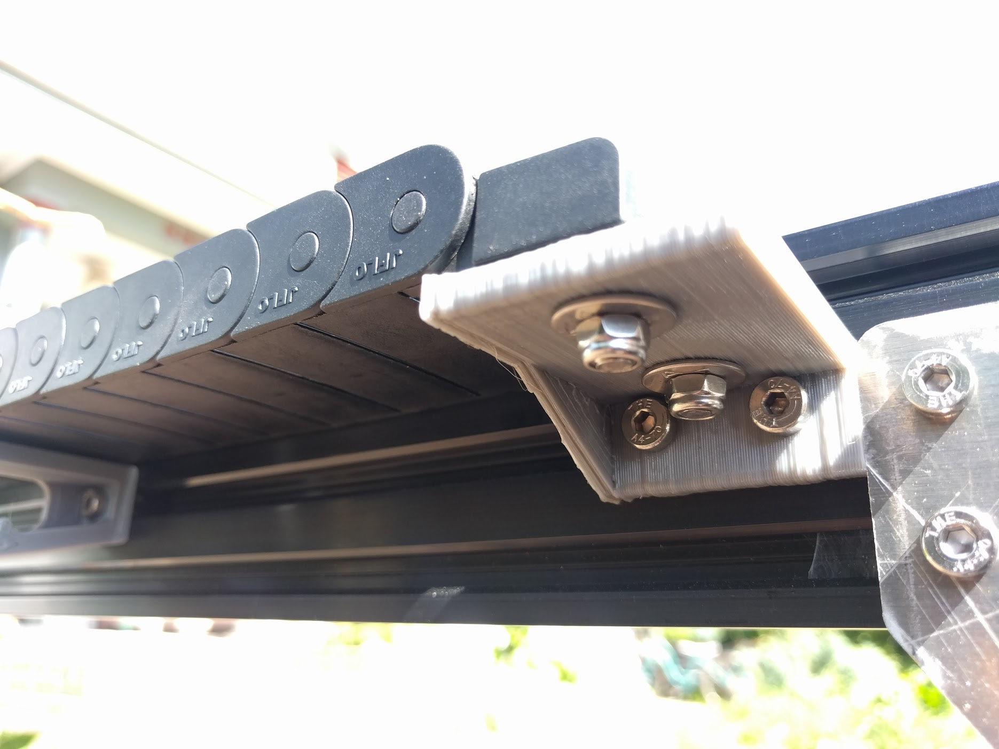
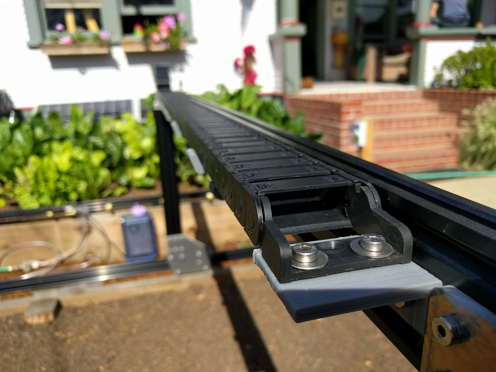
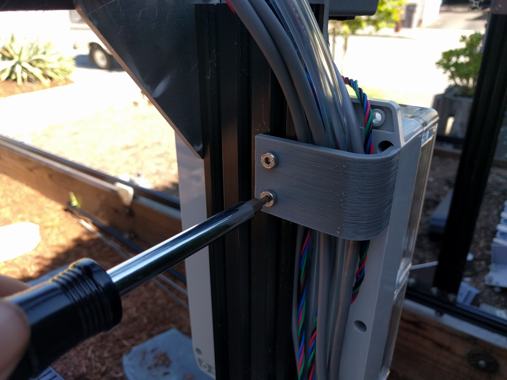

* toc
{:toc}

# Step 1: Add a Power Cord to your Power Supply

Attach a three pronged power cord to the power supply.



# Step 2: Feed the cables and tubing through the Z-axis cable carrier
Feed the **UTM cable**, all three **liquid/gas tubes**, and the **z-axis motor/encoder cable** through the **z-axis cable carrier**.

# Step 3: Attach the Z-axis Cable Carrier
Attach the **z-axis cable carrier** to the **cross-slide plate** using two **M5 x 16mm screws**, **M5 washers**, and **M5 locknuts**.

Attach the **z-axis cable carrier** to the **z-axis cable carrier mounting plate** using two **M5 x 16mm screws**, **M5 washers**, and **M5 locknuts**.

# Step 4: Feed the cables and tubing through the Z-axis cable carrier
Feed all of the cables and tubing coming from the z-axis cable carrier, as well as the **cross-slide motor/encoder cable** through the **gantry cable carrier**.

# Step 5: Attach the Gantry Cable Carrier
Attach the **gantry cable carrier** to the **long cable carrier mount** (on the cross-slide subassembly) using two **M5 x 16mm screws**, **M5 washers**, and **M5 locknuts**.

Attach the **gantry cable carrier** to the **short cable carrier mount** (on the gantry main beam) using two **M5 x 16mm screws**, **M5 washers**, and **M5 locknuts**.

# Step 6: Attach the cable clips
Attach the two **cable clips** to the **gantry column** using four **M5 x 10mm screws** and **M5 tee nuts**.

# Step 7: Feed the tubing, power cable, and peripheral cables through the tracks cable carrier
Feed the three **liquid/gas tubes**, **power cable**, and two **peripheral cables** through the **tracks cable carrier**.

# Step 8: Attach the tracks cable carrier
Attach the **tracks cable carrier** to the **short cable carrier mounts** (on the gantry main beam and on the tracks) using four **M5 x 16mm screws**, **M5 washers**, and **M5 locknuts**.

