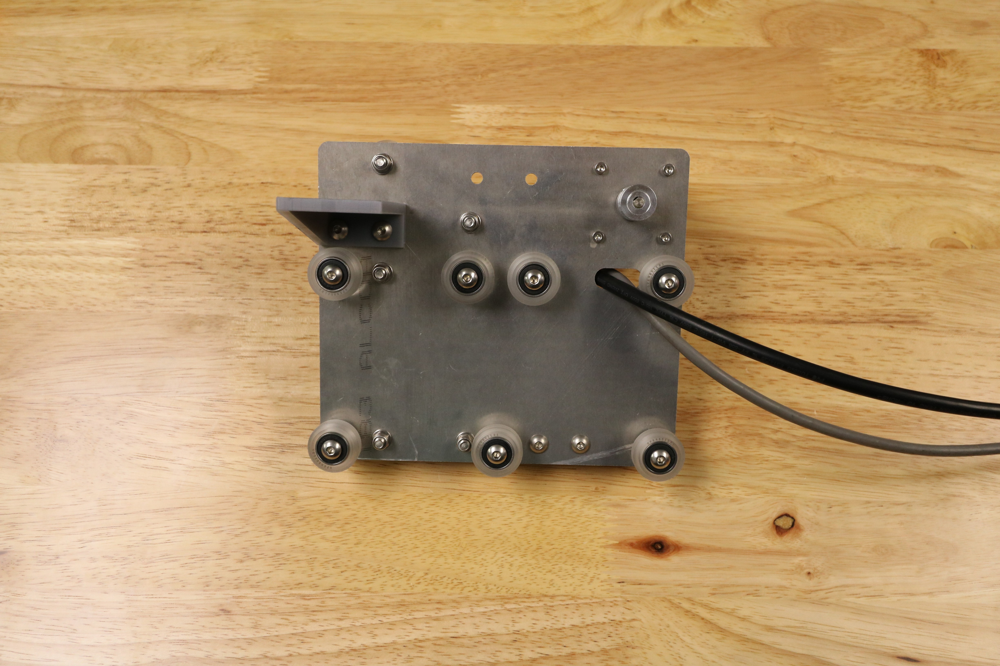
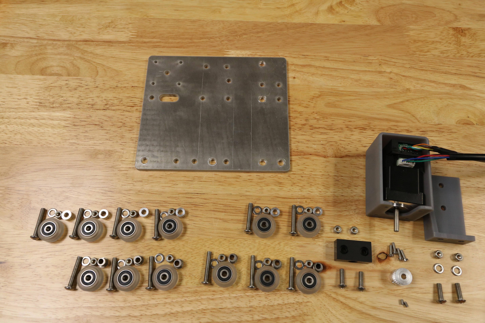

<iframe width="100%" height="480" src="https://sketchfab.com/models/542d1041c50744e8b727630e25e35e5a/embed?ui_controls=0&amp;ui_infos=0&amp;ui_related=0" frameborder="0" allowfullscreen mozallowfullscreen="true" webkitallowfullscreen="true" onmousewheel=""></iframe>

# Component List

To prepare for assembly, gather all the components from the table below and lay them out in a logical manner. To complete the assembly in the next pages, you will also need the following tools:
* 3mm hex (allen) wrench
* 8mm wrench

_Note: Not all required parts are shown in this image._

|Qty.                          |Component                     |
|------------------------------|------------------------------|
|1                             |Cross-Slide Plate
|2                             |M3 x 5mm Setscrews
|4                             |M5 x 16mm Screws
|12                            |M5 x 30mm Screws
|6                             |M5 x 6mm Spacers
|6                             |6mm Eccentric Spacers
|14                            |M5 Washers
|16                            |M5 Locknuts
|1                             |Horizontal Motor Housing
|1                             |Long Cable Carrier Mount
|12                            |Complete V-Wheels (one polycarbonate wheel, two 16 x 5 x 5mm ball bearings, and one 10 x 5 x 1mm shim)
|1                             |Leadscrew Block
|1                             |NEMA 17 Stepper Motor and Rotary Encoder with 2500mm length cables
|1                             |20 tooth GT2 Pulley
|2                             |Belt Clip Plates
|1                             |Y-Axis Belt
|2                             |M3 x 10mm Screws

# Change Log

* Horizontal motor housing has been completely re-designed to better protect the ends of the motor and the rotary encoder from rain.
* Flipped the orientation of the long drag chain mount and added a gusset for support.
* Increased the size of the slot on the cross-slide for the motor and encoder wires to be passed through more easily.
* Increased the tolerance of the eccentric spacer holes on the cross-slide plate.
* Switched to button head M5 screws.
* Increased the cross-slide plate width by 10mm to accommodate the larger z-axis cable carrier and adjusted the mounting holes accordingly.
* Added a V-wheel with eccentric spacer to the middle of the bottom edge of the cross-slide plate for added strength in the connection with the gantry main beam.

# Room for Improvement

* The Z axis cable carrier mounting holes could be changed to a slot to allow for more flexibility with which cable carrier to use, and where exactly it is mounted on the plate
 * Explore a bent metal plate version of the long drag chain mount
