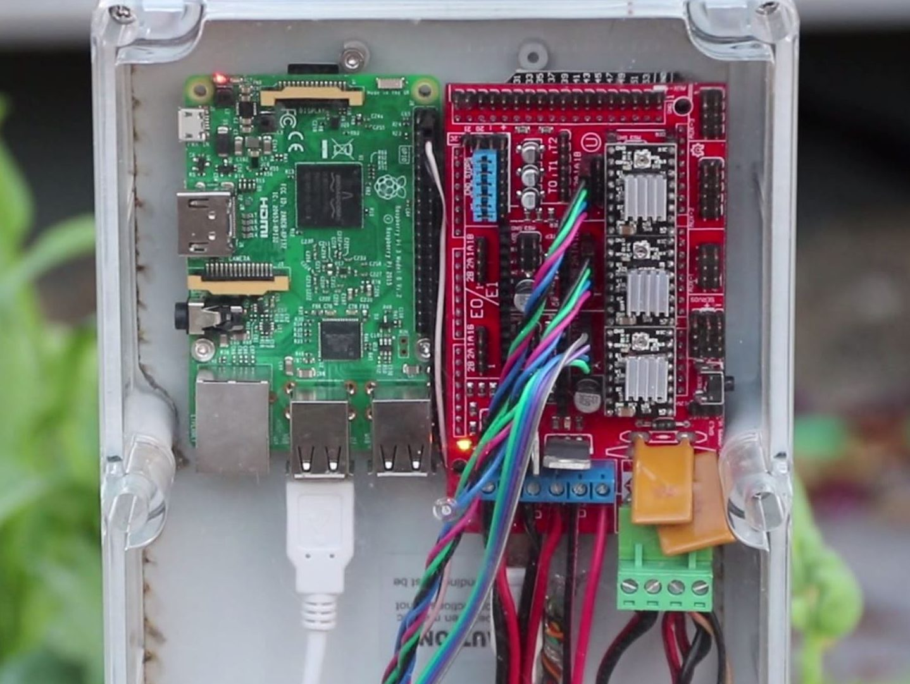

* toc
{:toc}

# Change Log

* Now using a Raspberry Pi 3 with built-in WiFi instead of a USB WiFi dongle.
* Now using DRV8825 based stepper drivers for increased max current and better microstepping for smoother and quieter movements.

# Room for Improvement

* Use standoffs to separate the circuit boards from the mounting plate
* Use a shorter USB cable
