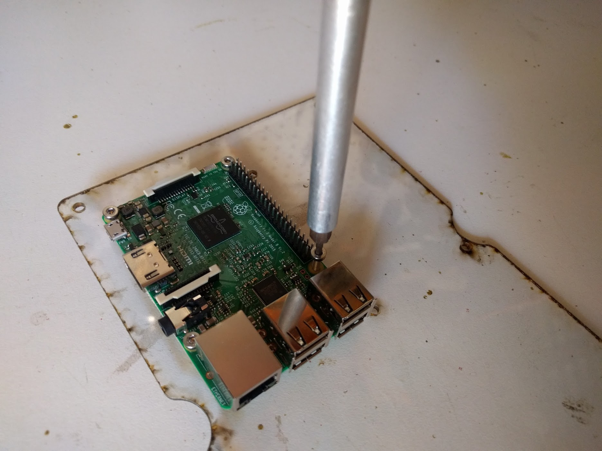
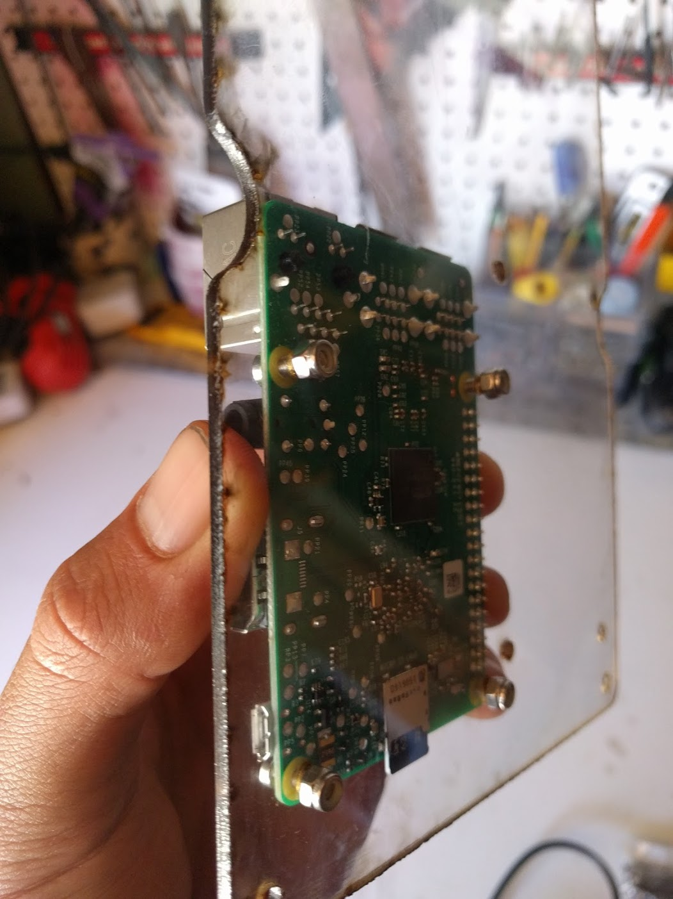
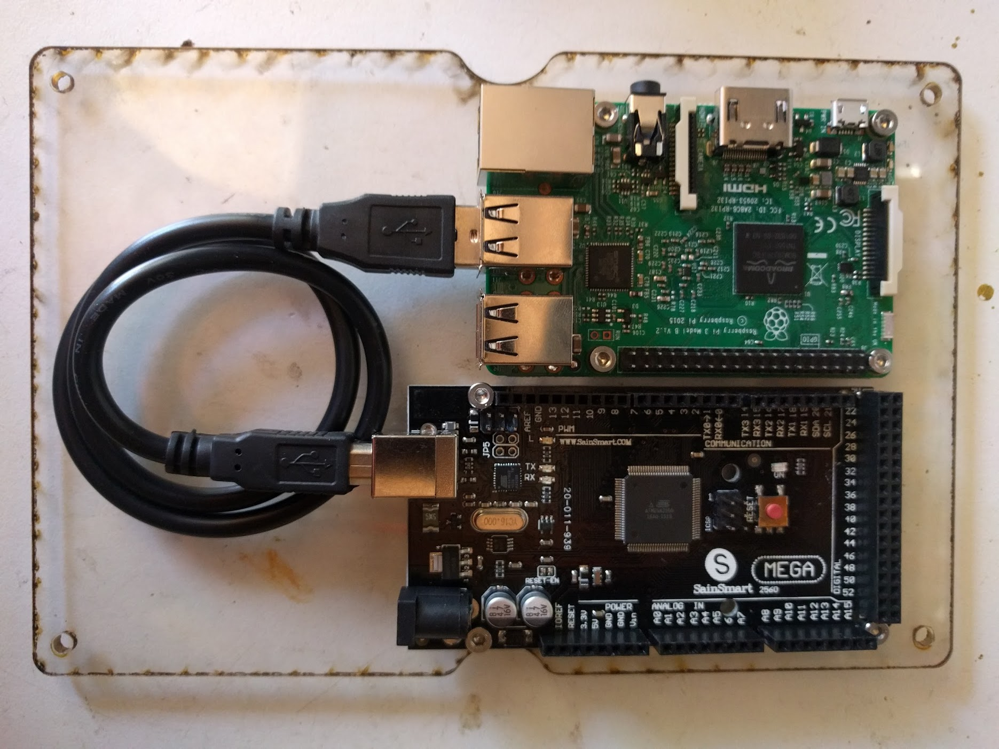
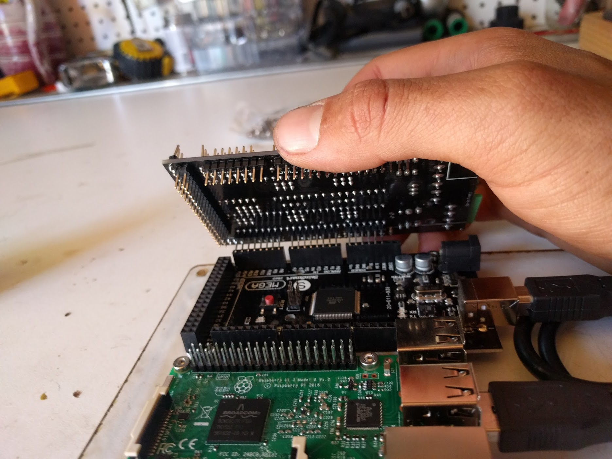
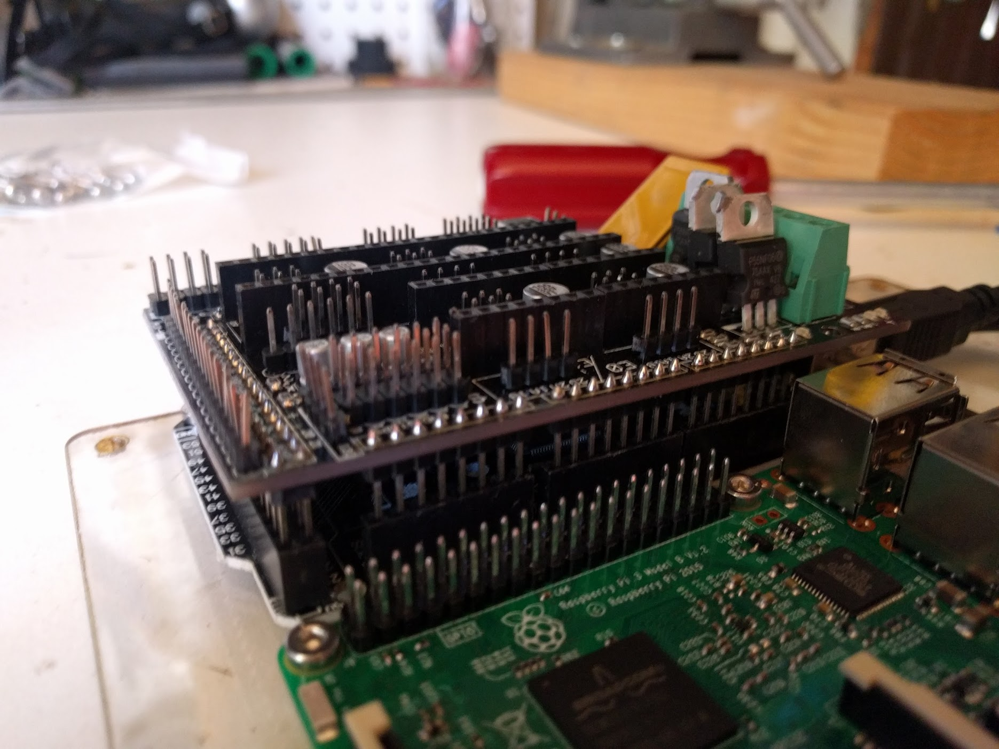
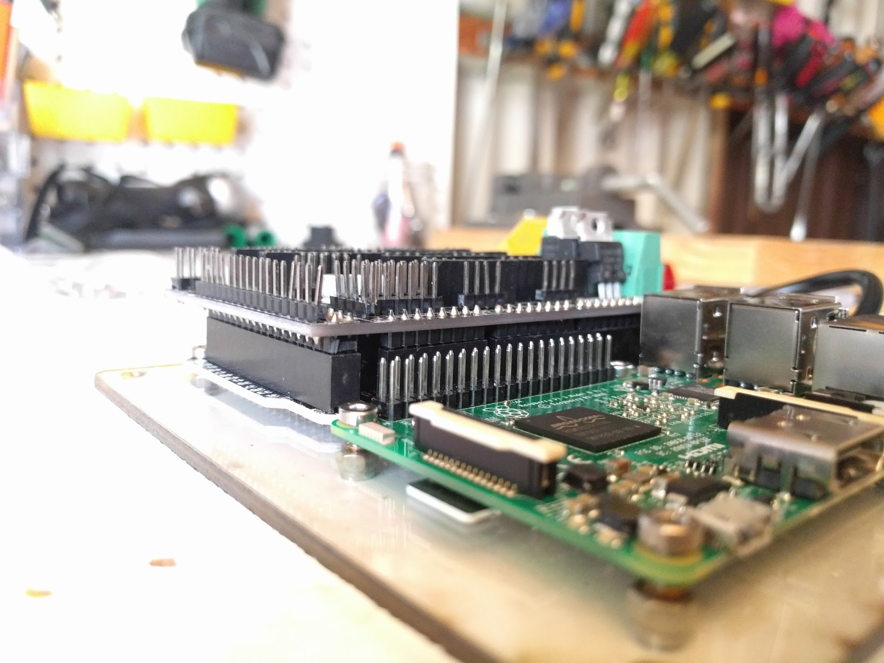



# Step 1: Gather the parts and tools
Gather all the parts from the table below and lay them out in a logical manner. To complete the assembly, you will also need the following tools:
* 3mm hex (allen) driver
* Wire strippers

|Qty.                          |Component                     |
|------------------------------|------------------------------|
|6                             |M3 x 10mm Screws
|6                             |M3 Locknuts
|2                             |M5 x 10mm Screws
|2                             |M5 Tee Nuts
|1                             |15 x 40 x 1000mm Cable Carrier
|2                             |15 x 40 x 1500mm Cable Carriers
|2                             |Cable Clips
|1                             |Electronics Housing
|1                             |Raspberry Pi 2 Model B
|1                             |Arduino Mega 2560
|1                             |RAMPS shield
|3                             |DRV8825 Stepper Drivers
|1                             |USB cable (Type A male to Type B male)
|1                             |Power Supply (12V, 30Amp)
|1                             |5V power adapter (UBEC DC/DC Step-Down (Buck) Converter - 5V @ 3A output)

# Step 2: Setup the Raspberry Pi
Follow the instructions on the [Raspberry Pi Software](https://software.farm.bot/docs/farmbot-os) page to install the necessary software onto the Raspberry Pi.

# Step 3: Mount the Raspberry Pi and Arduino
Use six **M3 x 10mm screws** and **M3 locknuts** to attach the **Raspbeery Pi** and the **Arduino** to the **electronics plate**.





# Step 4: Connect the Arduino to the Raspberry Pi

Connect the **Arduino** to the **Raspberry Pi** with the **6 inch Type A male to Type B male USB cable**. It does not matter which USB port you you use on the Pi.

# Step 5: Add the RAMPS shield
Align the **RAMPS Shield** on top of your **Arduino Mega 2560**. The green connectors of the RAMPS shield should be on top of the USB port of the Arduino.



Carefully press the two boards together. Make sure that you do not bend any of the pins.

# Step 6: Add the Stepper Drivers

**Stepper Drivers** are the small boards that mount on top of the **RAMPS shield** and power the stepper motors. The RAMPS shield has space for up to five drivers, but we're only going to use three for FarmBot. We'll use the spaces marked for the X, Y, and Z directions.

Mount your three **stepper drivers** on top of the **RAMPS shield**, being careful not to bend any pins.

{%
include callout.html
type="danger"
title="Orientation is important!"
content="If you put your stepper drivers in backwards then you risk frying all of your electronics.

For A4988 stepper drivers (min 1/16th step)
The tuning screw on each stepper driver should be on the FAR end of the driver from the green power connector of the RAMPS shield. 

For DRV8825 stepper drivers (min 1/32nd step)
The tuning screw on each stepper driver should be on the NEAR end of the driver to the green power connector on the RAMPS shield.

See https://www.youtube.com/watch?v=_wOtZCnXlT4 for a visual explanation."
%}

