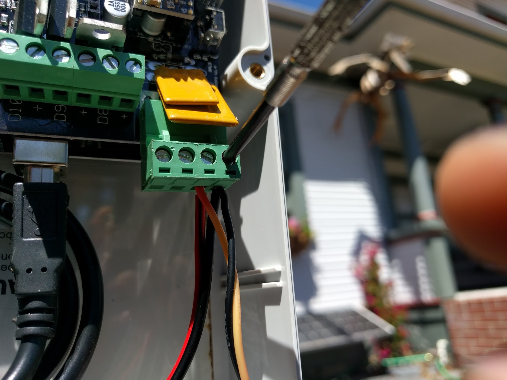
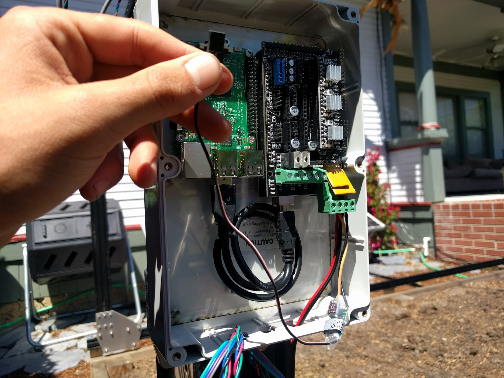
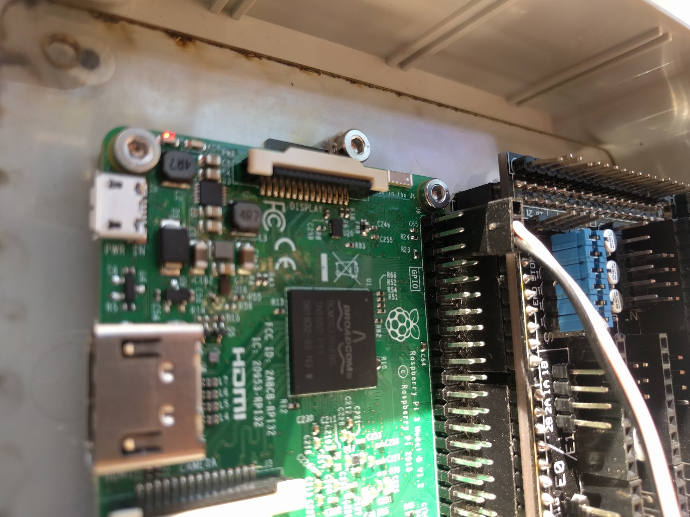

* toc
{:toc}

# Step 1: Attach the RAMPS Shield to the Power Supply
Use **2-16 stranded wire** (two stranded wires of 16 gauge) to connect the **power supply** to the **RAMPS shield**. One wire should connect the ground output of the power supply to the negative/ground input on the RAMPS shield. The other wire should connect the +12V output of the power supply to the positive input on the RAMPS shield.

# Step 2: Attach the DC/DC converter from the RAMPS Shield to the Pi

# Step 3: Plug in the Stepper Motors and Rotary Encoders
Detailed instructions coming soon

# Step 4: Plug in the UTM Cable's Connectors
Detailed instructions coming soon

# Step 5: Connect the peripherals
Detailed instructions coming soon

# Step 6: Plug in the Power Supply





