* toc
{:toc}

# Step 1: Attach the plate to the column
For this part of the assembly you will need:
* The two gantry wheel plate assemblies
* Two 20mm x 60mm x 650mm aluminum extrusions
* A 3mm allen wrench

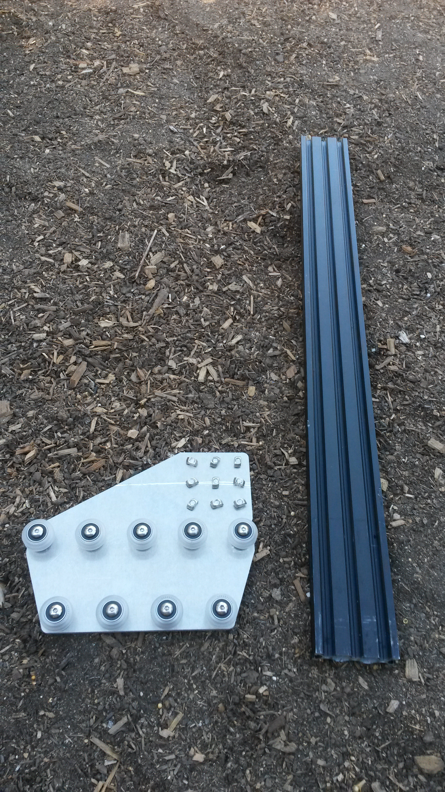

Slide the **gantry column** onto the **gantry wheel plate assembly**.

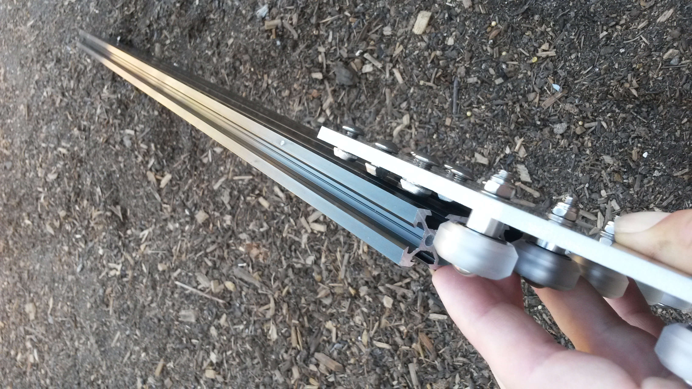

The bottom of the extrusion should be positioned just above the V-wheels. Align the **notch** on the back side of the gantry plate with the bottom of the **gantry column**.

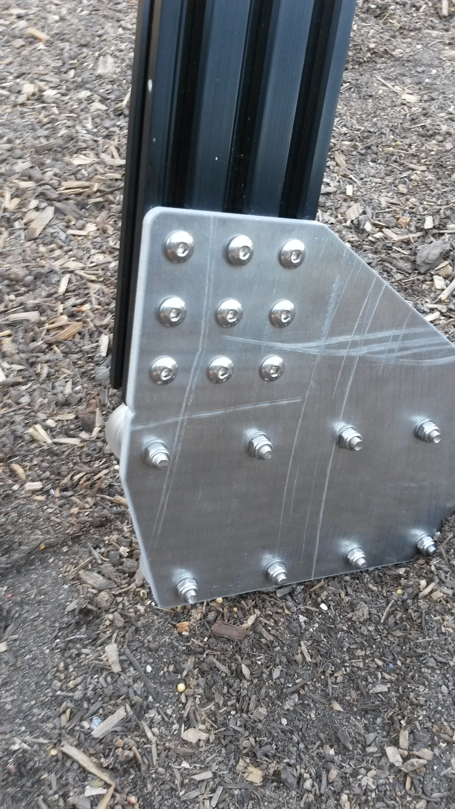

Tighten the **M5 x 10mm screws** using a **3mm allen wrench**.

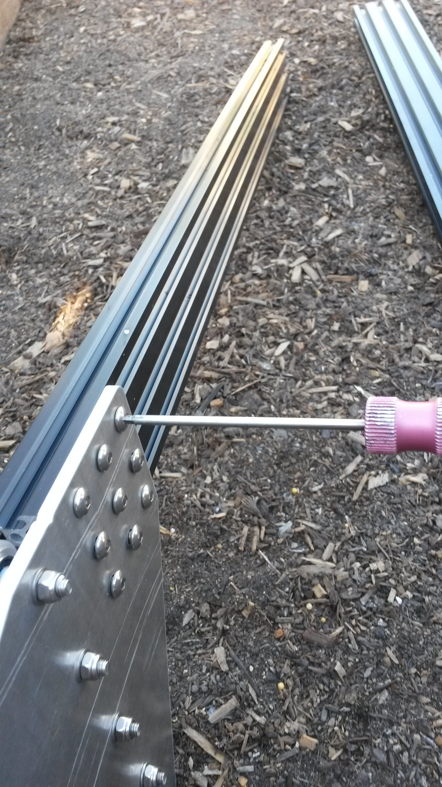

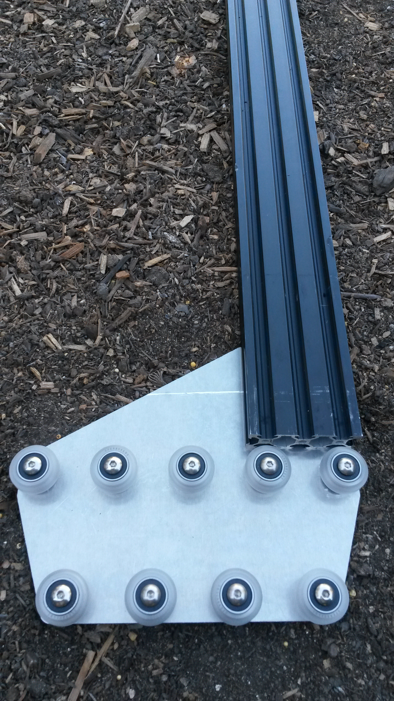

Repeat the above steps for the second gantry wheel plate and aluminum extrusion.

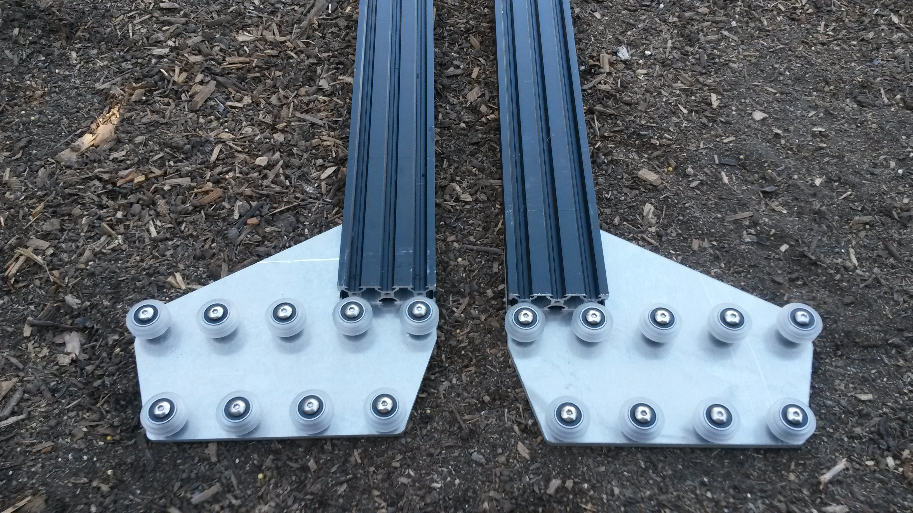

# Step 2: Attach the gantry corner brackets

For this step you will need:
* The two gantry wheel plate/column assemblies
* Two gantry corner plates
* Eight M5 x 10mm screws
* Eight M5 tee nuts
* A 3mm allen wrench

Lightly screw together four **M5 x 10mm screws** and **M5 tee nuts** on the long side of the **gantry corner plate**.

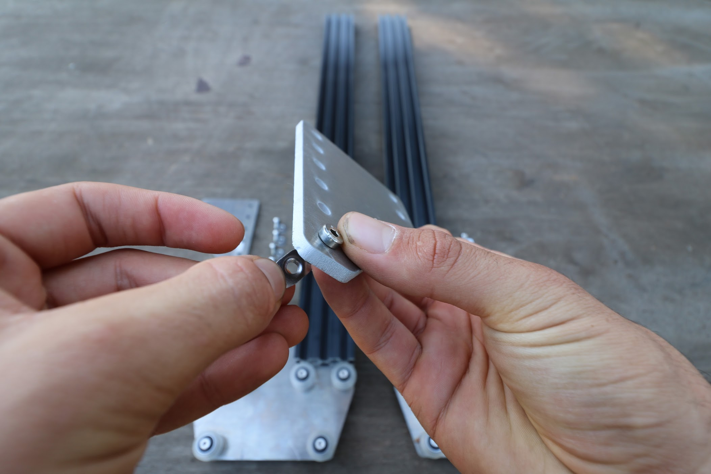

Slide the **gantry corner plate** onto the **gantry column**. The tee nuts should slide into the 20mm side of the column on the side that the **gantry wheel plate** protrudes. Furthermore, the protrusion of the corner plate should be on the same side of the column as the gantry wheel plate. Inspect the photos closely for reference.

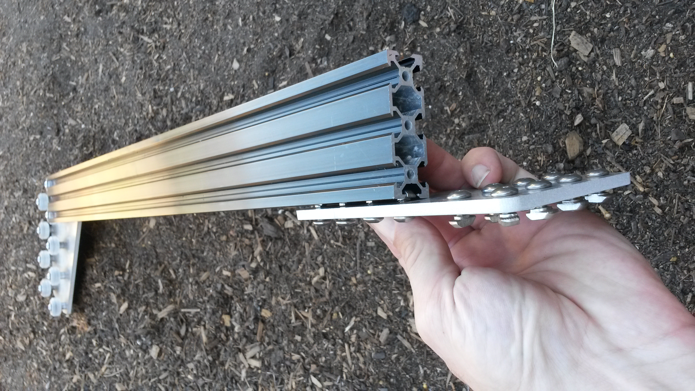

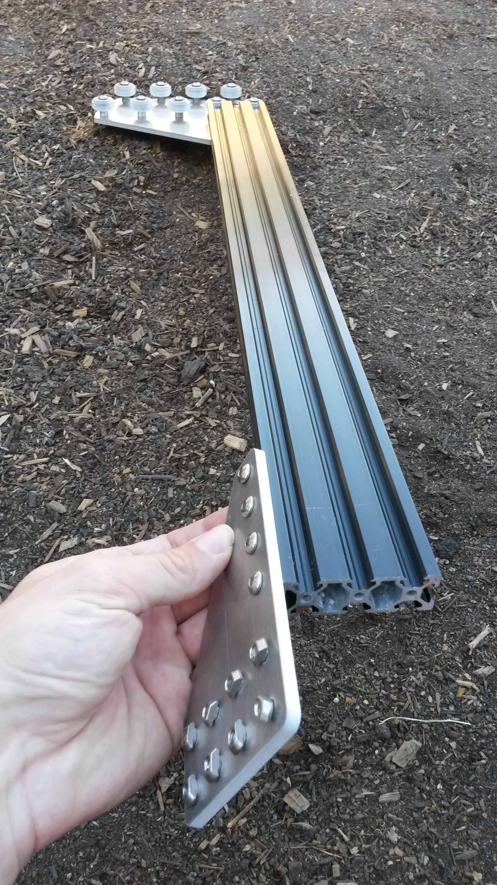

Tighten the **M5 x 10mm screws** with the **3mm allen wrench**.

# Step 3: Repeat
Repeat the above steps for the second corner bracket and column. You should end up with two assemblies that are mirror images of each other. Inspect these photos closely to ensure your corner brackets are attached to the columns in the correct orientation.

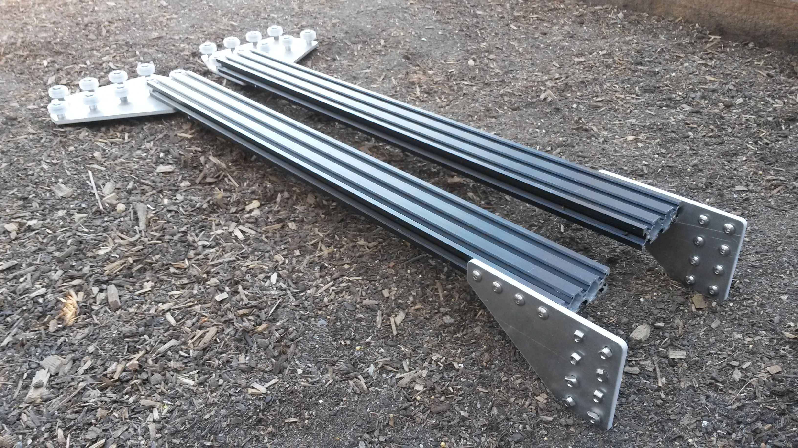

# Step 4: Attach the main beam to the columns

Slide the **gantry columns** onto the **tracks**.

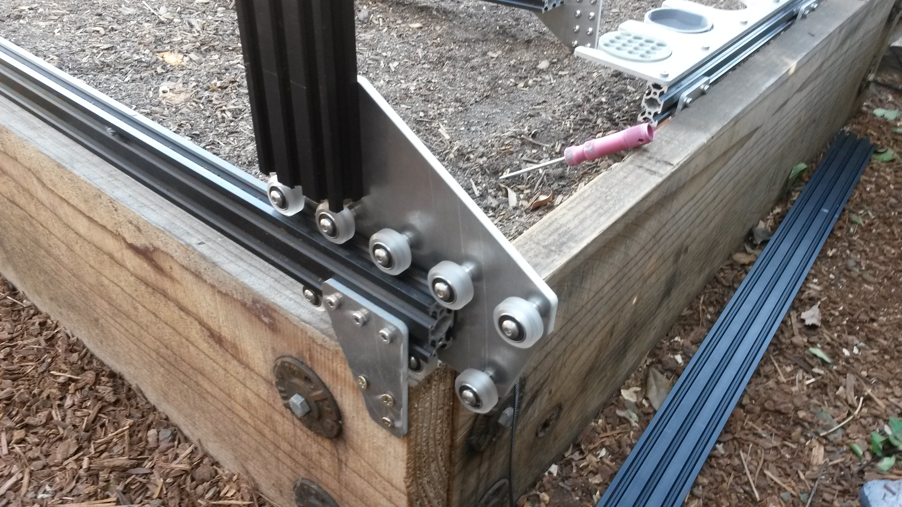

Rest the **gantry main beam** on top of the **gantry columns**.



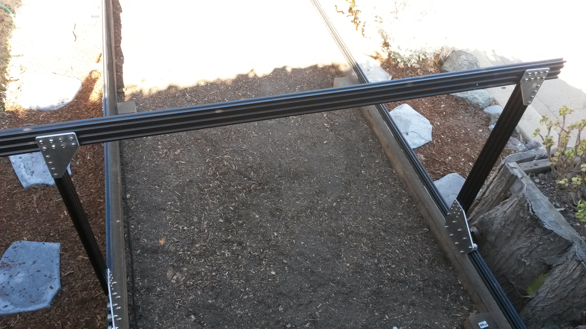

Lift up the **main beam** and position it onto the front side of the **corner bracket**. Align the tee nuts with the lower two extrusion slots of the main beam and then insert and tighten the eight M5 x 10mm screws.

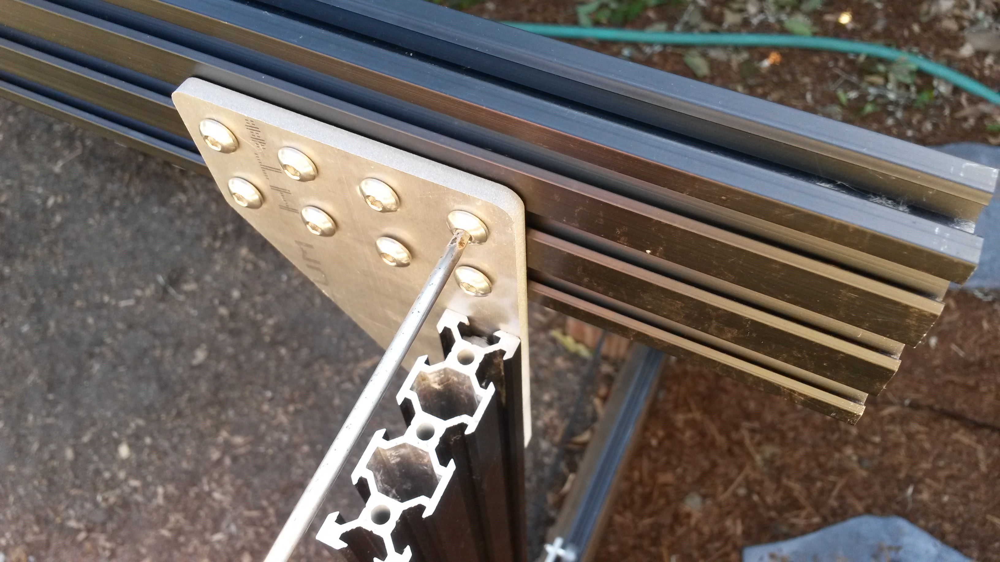

Repeat the above steps to attach the gantry main beam to the second corner bracket.

