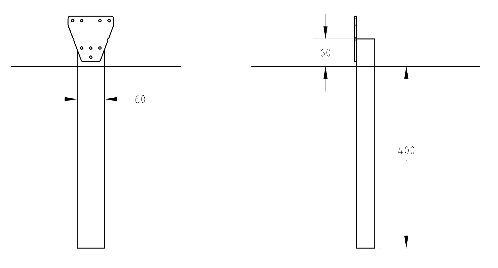
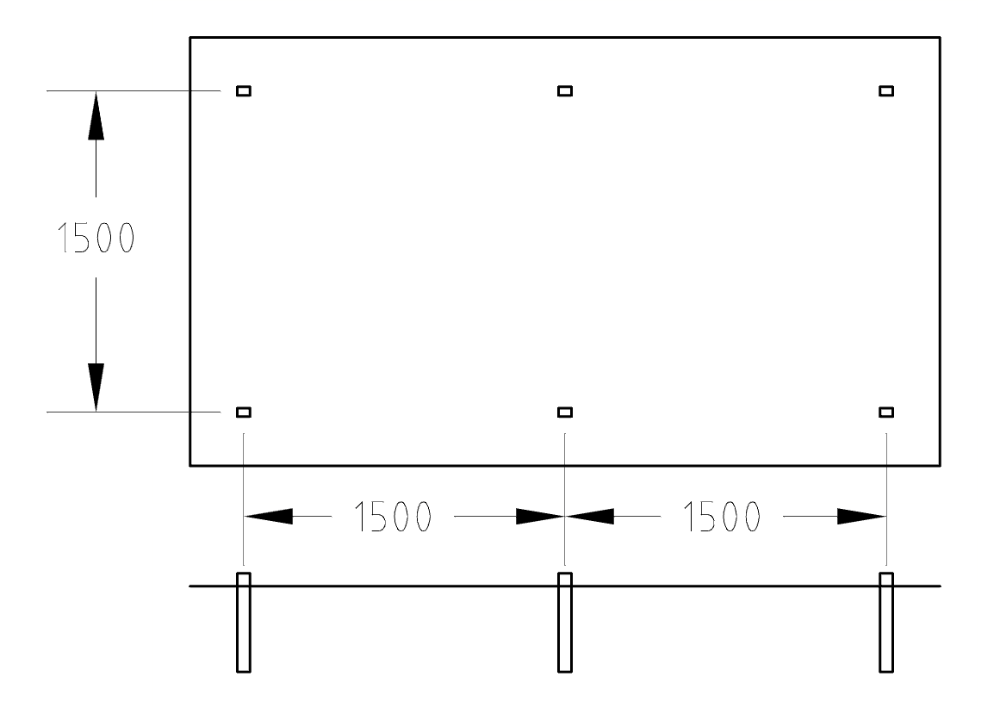

* toc
{:toc}

Alternatively, you may use only the posts for FarmBot mounting. However, with this method alignment will be trickier and the structure may be less stable without the additional support of the bed boards. Care will need to be exercised to install posts in a sturdy fashion.



  * Install short (500mm) wood posts for one of the tracks. The top of the post should protrude at least 60mm from the ground, with at least 60mm of mounting width in the direction of the planned tracks. Bury or secure the posts however you like, though it is critical to ensure that the posts will not significantly move once installed.

  * Space the posts for one track 1500mm apart, center to center, unless you are using shorter track extrusions, in which case space the posts that far apart. Ensure the posts are aligned properly and the same height. You may want to use a level to ensure this.
  * If you are setting up multiple track extrusions (more than 1500mm in total length), it is best to install the end posts first and tie a guide string in between these two posts to ensure your tracks are installed in a straight line.
  * Depending on the width of your FarmBot, space the second track’s posts the appropriate distance away from the first track’s. It is critical that the distance between the two tracks is consistent, if it is not, there will be harmful forces placed on the gantry and tracks as the gantry moves across.
  * You can use shims or other spacers to better align track plates in case your posts are not perfect.
