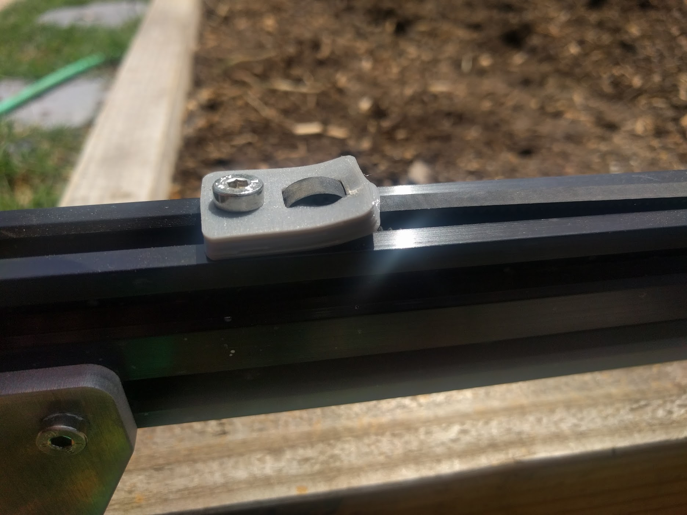
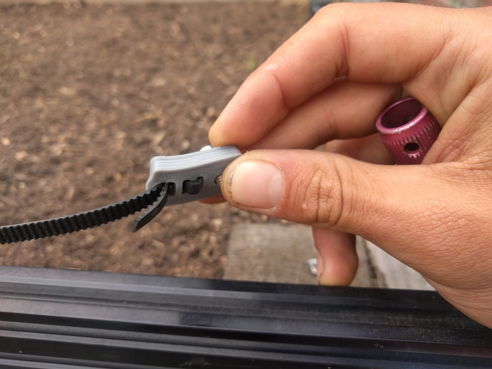

* toc
{:toc}

FarmBot's tracks allow the gantry to move in a precise motion along the x-axis. The tracks are designed to attach to a raised bed or similar [supporting infrastructure](../FarmBot-Genesis-V1.0/supporting-infrastructure.md). Standard tracks are 3m in length, though one could extend them with additional extrusions, connecting plates, cable carrier supports, and hardware; as long as longer x-axis cable carrier, belt, wiring, and tubing. The maximum track length is likely approximately 30m.

<iframe width="100%" height="480" src="https://sketchfab.com/models/813d7caf919541beb15721d5ae51b164/embed?ui_controls=0&amp;ui_infos=0&amp;ui_related=0" frameborder="0" allowfullscreen mozallowfullscreen="true" webkitallowfullscreen="true" onmousewheel=""></iframe>

# Change Log

* Track plates have designed-in notches that indicate where to position them vertically on supporting infrastructure so that a tape measure or ruler is not needed for assembly
* Increased the thickness and length of the gussets on the drag chain mounts and cable carrier supports
* Track plates are taller to accommodate the clearance between the bottom of the track extrusions and the top of the raised bed while giving ample room for screwing the plate to the supporting infrastructure
* Introduction of the belt clip plate that allows the track and gantry belts to be easily secured to the extrusions without damaging the belts
* Switched from low-profile M5 socket head screws to M5 button-head style screws. The new screws still have 3mm hex drives, but have a lower profile (2.75mm instead of 3.5mm) that provides better clearance between lower gantry v-wheel screws and track plates. They also have larger diameter heads (9.5mm from 8.5mm) that distribute loads more evenly and provide more secure connections, especially for the plastic components.
* Began tumble polishing all plates to remove burrs and manufacturing marks and improve the overall aesthetic of the platestes

# Room for Improvement

* Belt clips should be aluminum plates, not made of plastic. This is because they are susceptible to deforming when heated in the sun and under load from a tensioned belt.

* To reduce unique part count, we could combine the short cable carrier mount with the cable carrier supports
* Modify the cable carrier support gusset to allow for LED lighting and other tubing and wiring to be routed through it
* Explore a bent aluminum version of the cable carrier supports
