* toc
{:toc}



# Step 1: Gather the Parts and Tools
Gather all the parts from the table below and lay them out in a logical manner. To complete the assembly, you will also need the following tools:

* 2mm hex (allen) wrench
* 3mm hex (allen) wrench

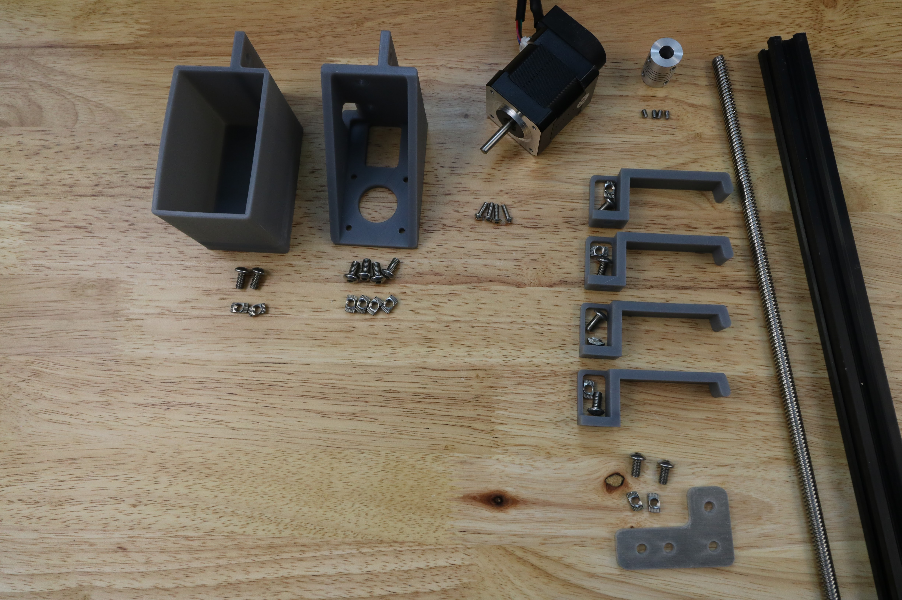

|Qty.                          |Component                     |
|------------------------------|------------------------------|
|1                             |Z-Axis Extrusion (20 x 20 x 1000mm)
|4                             |M3 x 10mm Screws
|10                            |M5 x 10mm Screws
|2                             |M5 x 16mm Screws
|2                             |M5 x 25mm Screws
|2                             |M5 x 20mm Spacers
|2                             |M5 Washers
|2                             |M5 Locknuts
|12                            |M5 Tee Nuts
|1                             |Z-Axis Motor Bracket
|1                             |Vertical Motor Housing
|4                             |Z-Axis Cable Carrier Guides
|1                             |NEMA 17 Stepper Motor and Rotary Encoder with 3500mm length cables
|1                             |5mm to 8mm Flex Coupling
|1                             |8 x 1000mm Leadscrew

# Step 2: Attach the Stepper Motor to the Z-Axis motor bracket
Feed the **z-axis motor/encoder cables** through the **z-axis motor mount**.

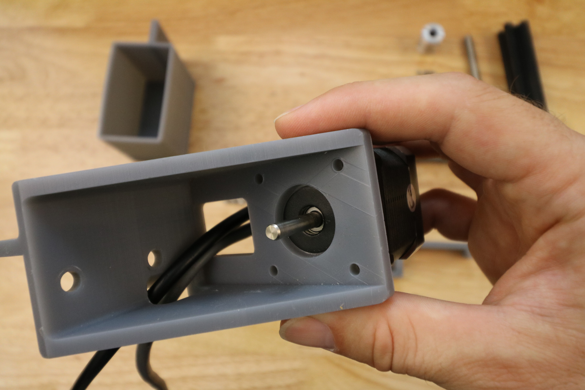

Attach the **z-axis stepper motor** to the **z-axis motor mount** using four **M3 x 10mm screws**.

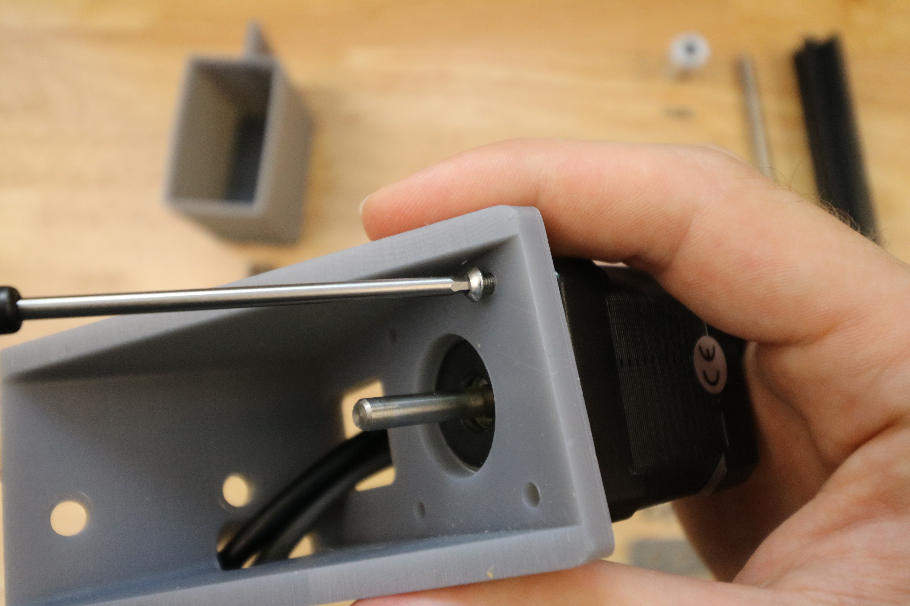

# Step 3: Attach the motor to the z-axis extrusion
Partially screw two **M5 x 10mm screws** and **M5 tee nuts** into the **z-axis motor bracket**.

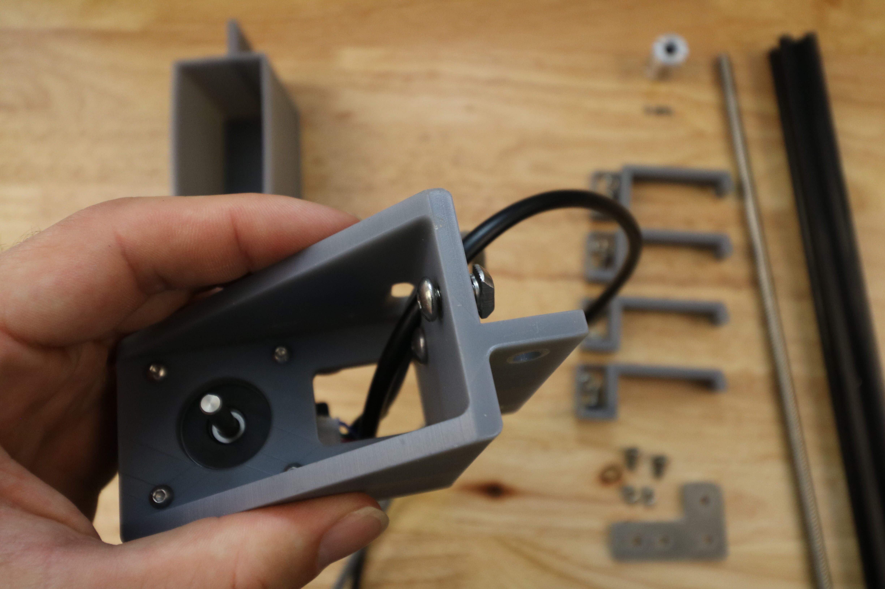

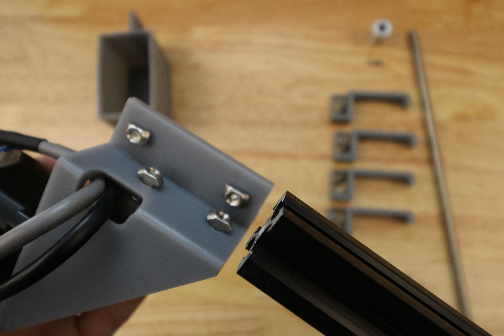

Tighten the **z-axis motor mount** onto the **z-axis extrusion**.

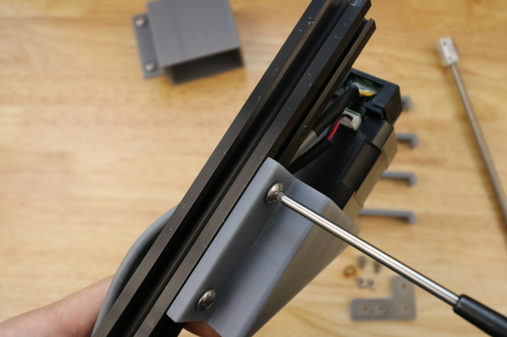

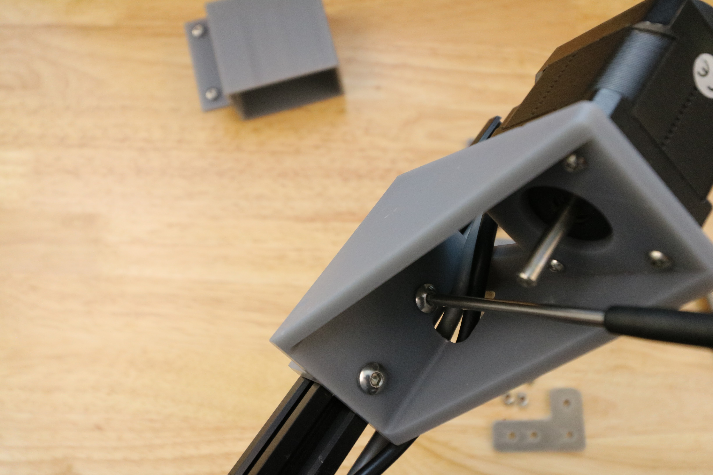

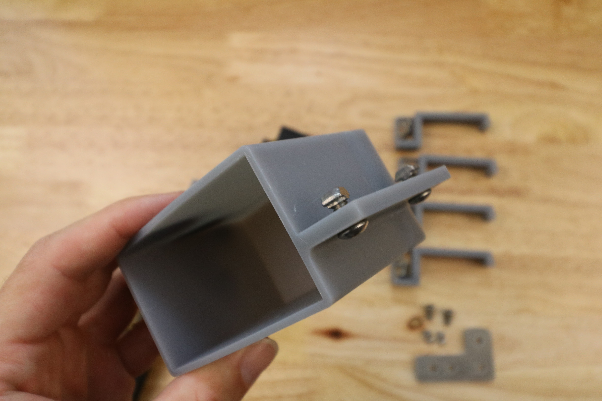

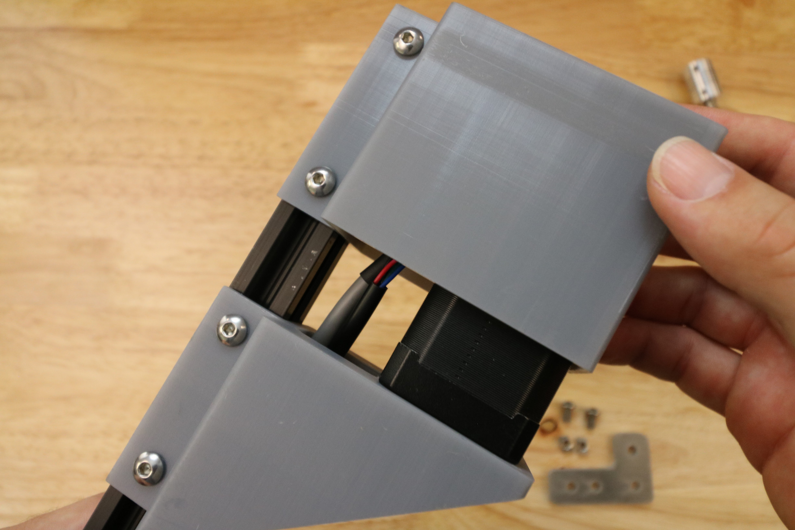

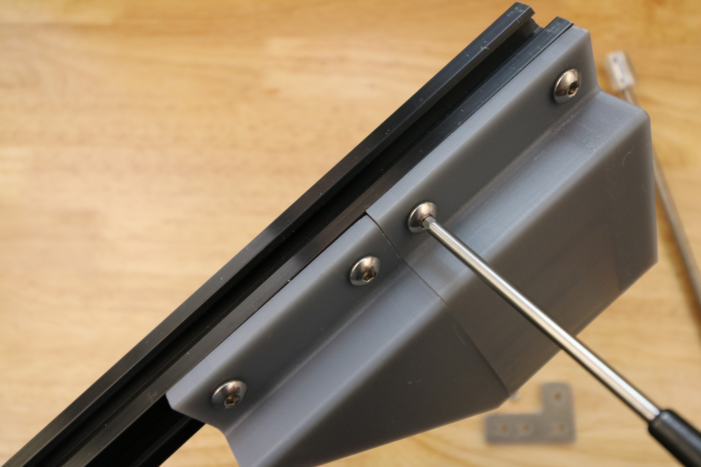

# Step 4: Attach the Leadscrew
Tighten the 8mm side of the **5 to 8mm flex coupling** onto the **leadscrew**.

Tighten the 5mm side of the **5 to 8mm flex coupling** onto the shaft of the **z-axis motor**.

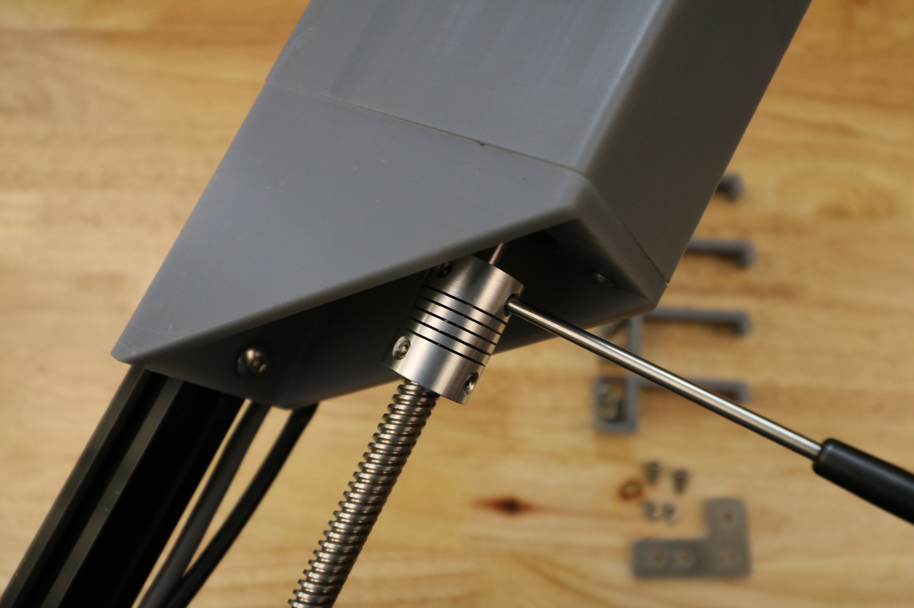

# Step 5: Attach Z-Axis Cable Carrier Guides
Partially screw two **M5 x 10mm screws** and **M5 tee nuts** into the **z-axis cable carrier guide**.

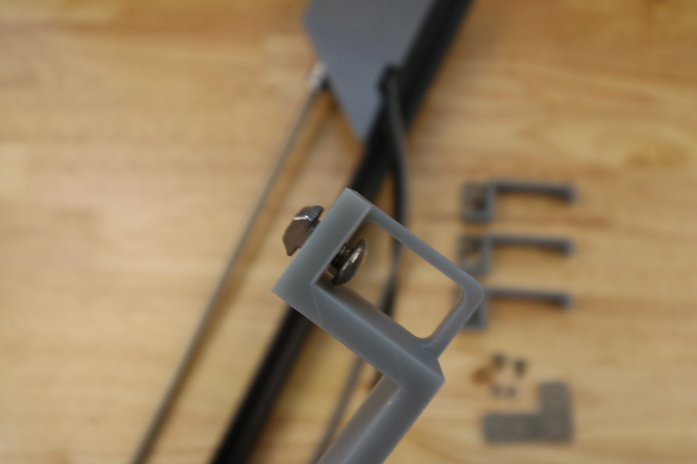

Insert into extrusion and tighten.

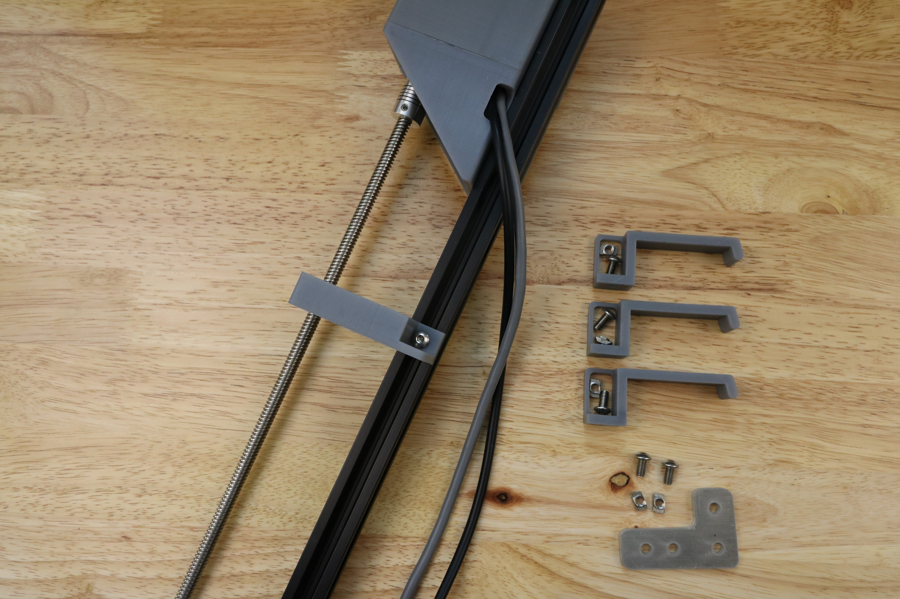

Repeat for other guides.

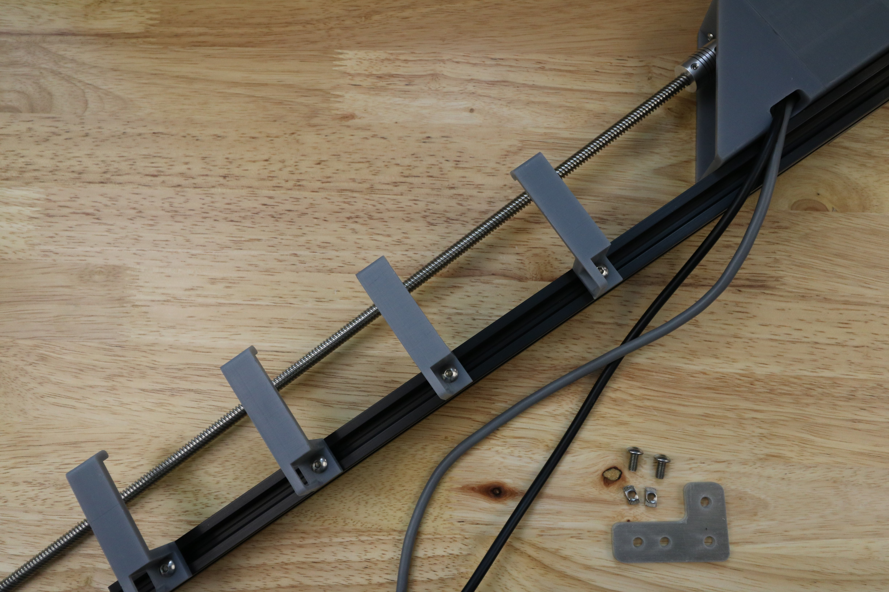

