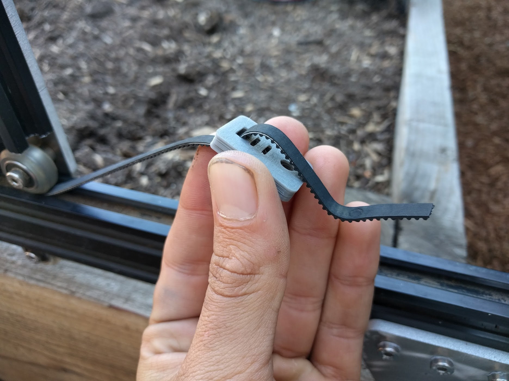
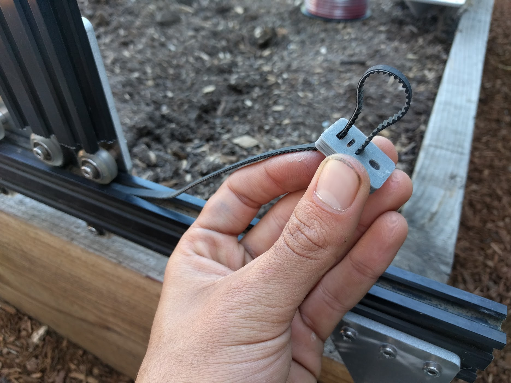
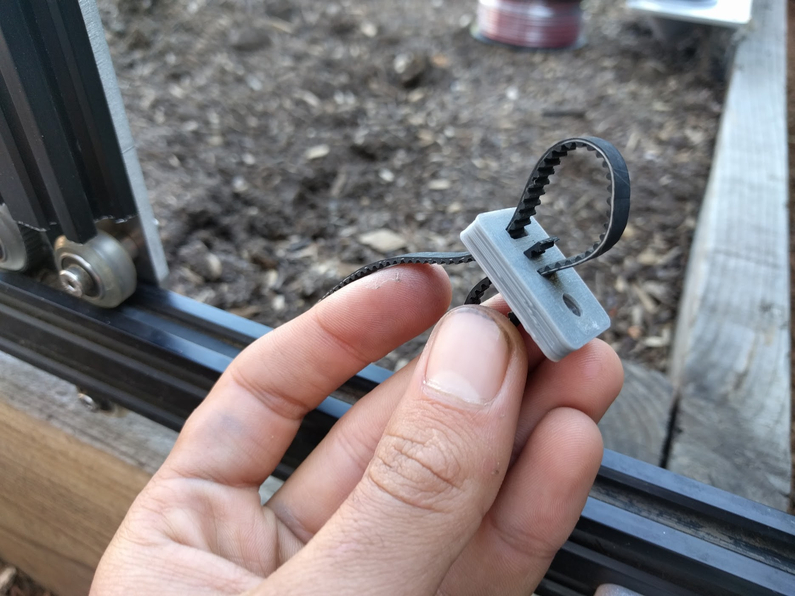
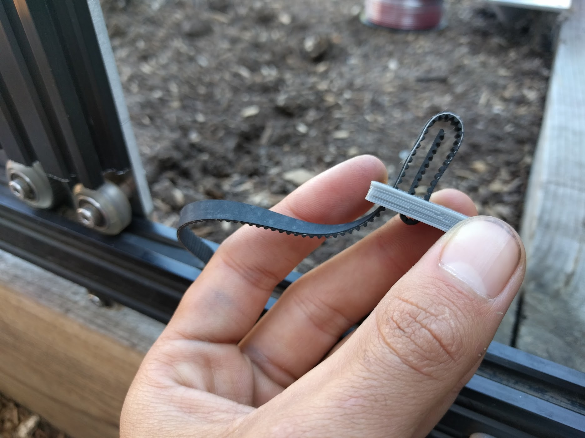
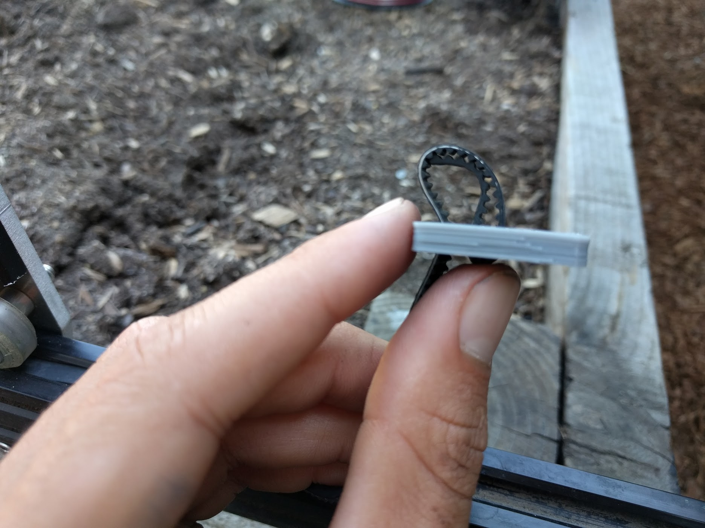
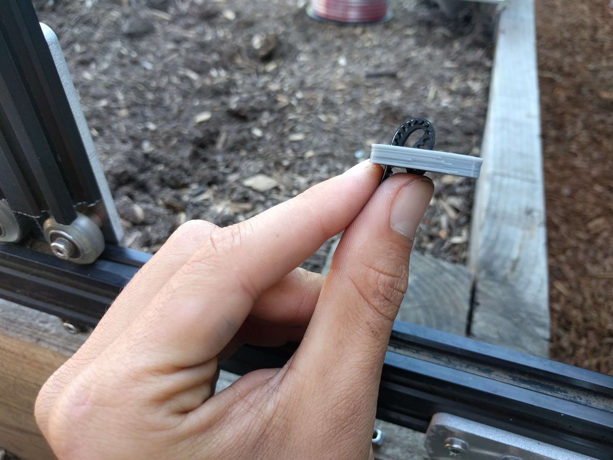
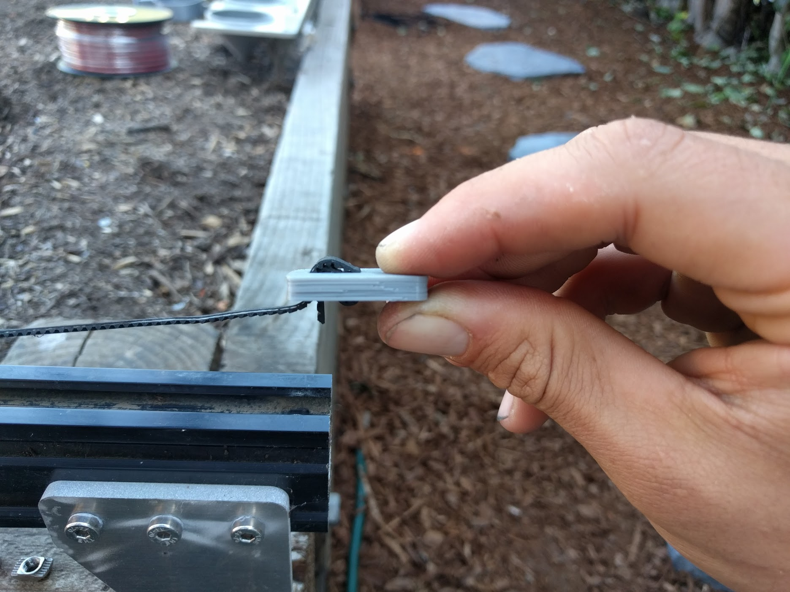
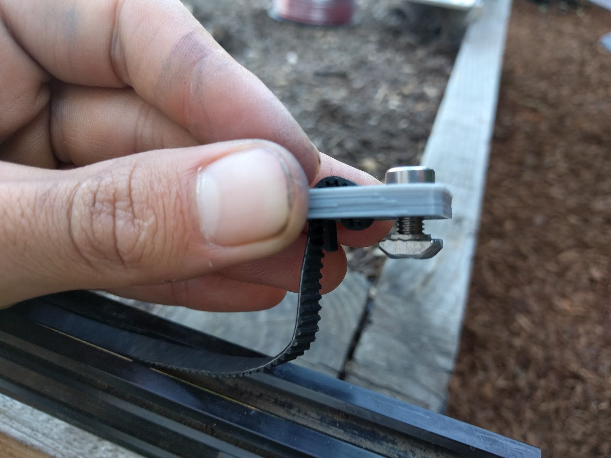
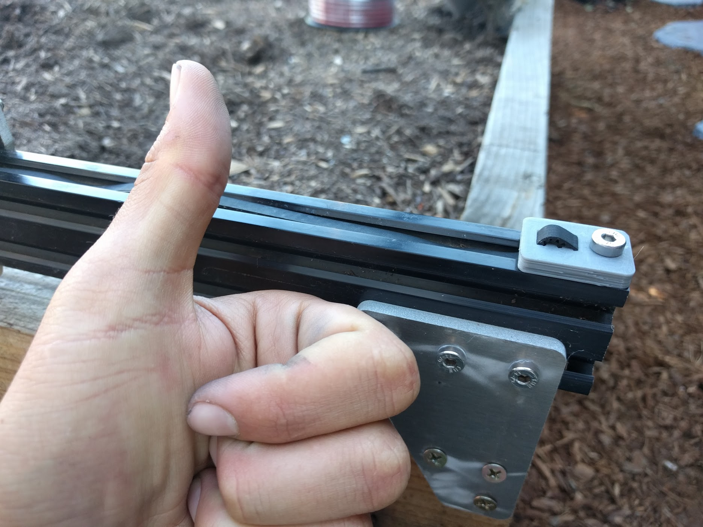

* toc
{:toc}

Secure the ends of your belts to aluminum extrusions by using a **belt clip plate**, **M5 x 10mm screw**, and an **M5 tee nut**. The belt must be wrapped through the clip as follows:

