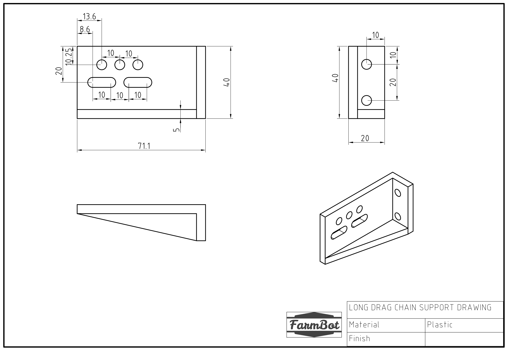
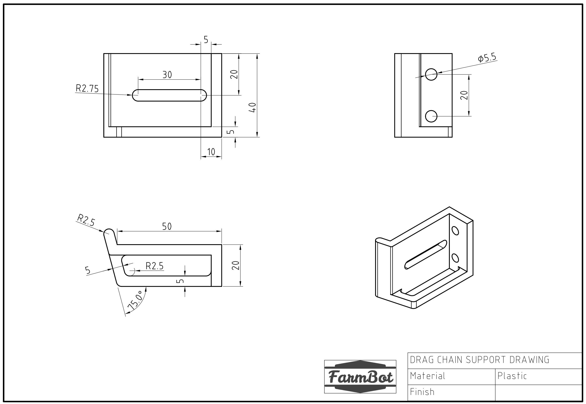
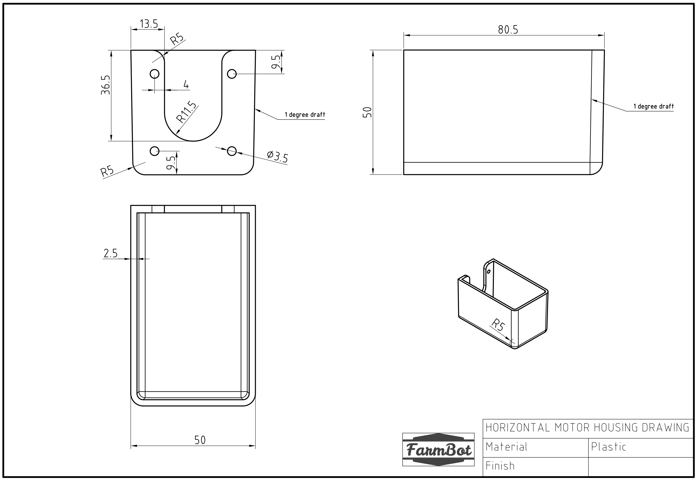
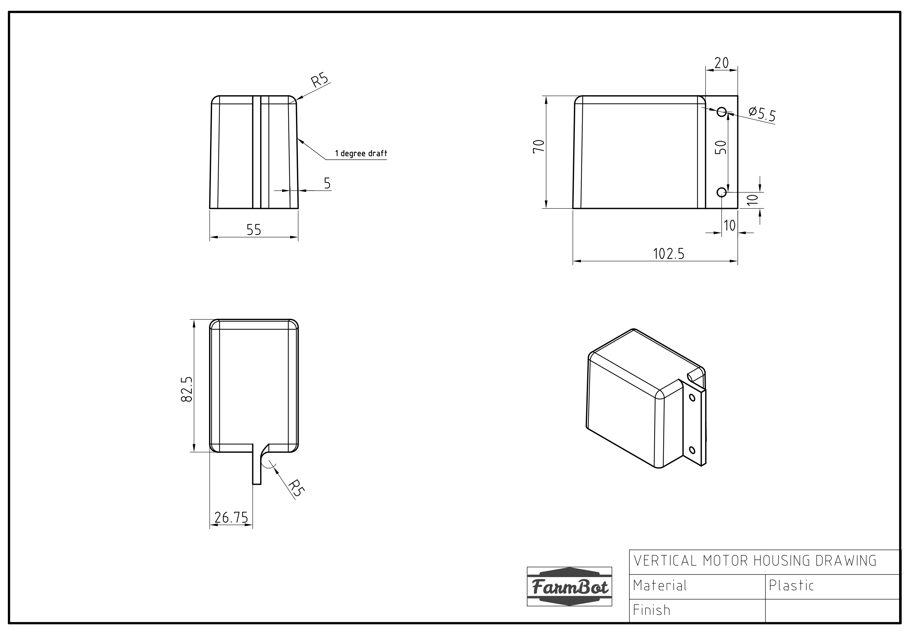
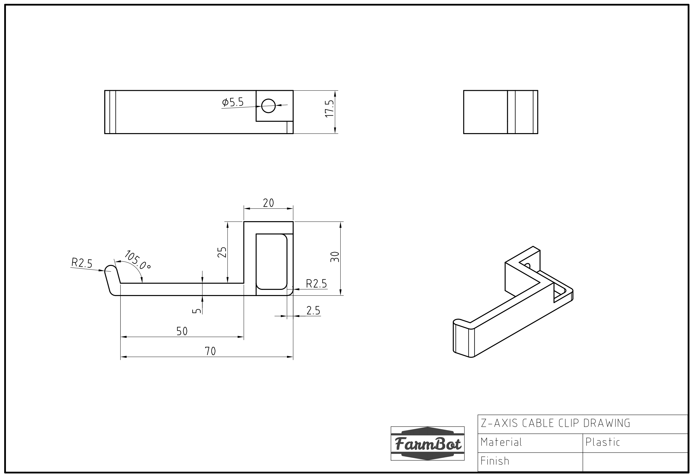
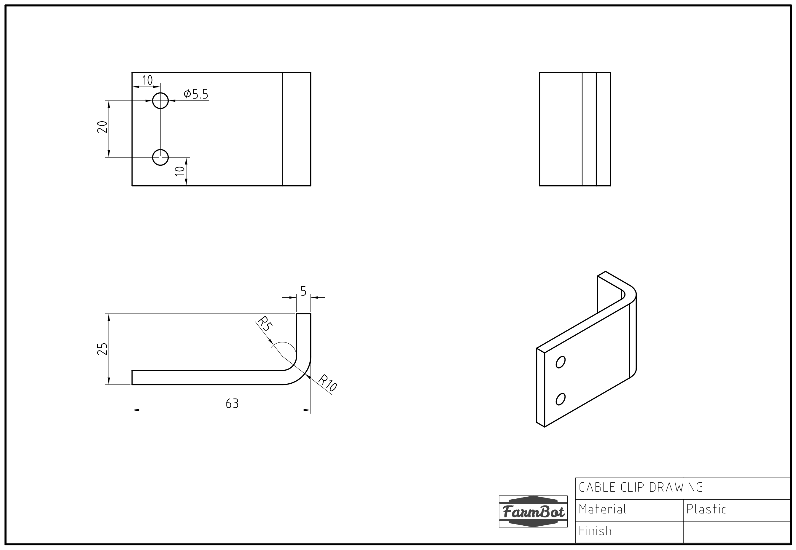

* toc
{:toc}

|Qty.                          |Component                     |$/Unit                        |Subtotal                      |
|------------------------------|------------------------------|------------------------------|------------------------------|
|1                             |[Long Cable Carrier Mount](#long-cable-carrier-mount)|$13.84                        |$13.84
|19                            |[Cable Carrier Supports](#cable-carrier-supports)|$12.43                        |$236.17
|1                             |[Z-Axis Motor Mount](#z-axis-motor-mount)|$40.99                        |$40.99
|3                             |[Horizontal Motor Cover](#horizontal-motor-cover)|$32.50                        |$97.50
|1                             |[Vertical Motor Cover](#vertical-motor-cover)|$48.41                        |$48.41
|4                             |[Z-Axis Cable Carrier Guides](#z-axis-cable-carrier-guides)|$8.51                         |$34.04
|1                             |[Universal Tool Mount](#universal-tool-mount)|$56.15                        |$56.15
|1                             |[Universal Tool Mount Cover](#universal-tool-mount-cover)|$23.68                        |$23.68
|1                             |[Seeder](#seeder)     |$18.00                        |$18.00
|1                             |[Watering Nozzle](#watering-nozzle)|$18.00                        |$18.00
|1                             |[Weeder](#weeder)     |$18.00                        |$18.00
|1                             |[Soil Sensor Mount](#soil-sensor-mount)|$18.00                        |$18.00
|2                             |[Seed Bins](#seed-bins)|$22.00                        |$44.00
|2                             |[Seed Pucks](#seed-pucks)|$15.00                        |$30.00
|1                             |[Camera Mount](#camera-mount)|$30.00                        |$30.00
|1                             |[Camera Cover](#camera-cover)|$30.00                        |$30.00
|2                             |[Cable Clips](#cable-clips)|$10.00                        |$20.00
|**43**                        |**TOTALS**                    |                              |**$776.78**

# Long Cable Carrier Mount
This part allows the y-axis cable carrier to be mounted to the cross-slide plate.

<iframe class="embedly-embed" src="//cdn.embedly.com/widgets/media.html?src=https%3A%2F%2Fsketchfab.com%2Fmodels%2F9a76f803a7494683ad952e23e9e9b5b4%2Fembed&url=https%3A%2F%2Fsketchfab.com%2Fmodels%2F9a76f803a7494683ad952e23e9e9b5b4&image=https%3A%2F%2Fd35krx4ujqgbcr.cloudfront.net%2Furls%2F9a76f803a7494683ad952e23e9e9b5b4%2Fdist%2Fthumbnails%2Ff01bab9edcb84280bd5db36cf492c3e0%2F640x360.jpeg&key=02466f963b9b4bb8845a05b53d3235d7&type=text%2Fhtml&schema=sketchfab" width="640" height="360" scrolling="no" frameborder="0" allowfullscreen></iframe>

|                              |                              |
|------------------------------|------------------------------|
|**Material**                  |Nylon
|**Color**                     |Gray
|**Mass**                      |
|**Recommended Manufacturer**  |[Shapeways](http://shapeways.com)
|**Price**                     |$13.84
|**Quantity Needed**           |1

# Cable Carrier Supports
These parts are used to mount and support both the x-axis and y-axis cable carriers. The gusset also functions as an area for cables, tubes, and LED light strips to be routed through.

<iframe class="embedly-embed" src="//cdn.embedly.com/widgets/media.html?src=https%3A%2F%2Fsketchfab.com%2Fmodels%2Fc7f6af0eae2e4d82b55a5aeaec86a369%2Fembed&url=https%3A%2F%2Fsketchfab.com%2Fmodels%2Fc7f6af0eae2e4d82b55a5aeaec86a369&image=https%3A%2F%2Fd35krx4ujqgbcr.cloudfront.net%2Furls%2Fc7f6af0eae2e4d82b55a5aeaec86a369%2Fdist%2Fthumbnails%2Feba929858b6243d2beb6ea47295365f5%2F640x360.jpeg&key=02466f963b9b4bb8845a05b53d3235d7&type=text%2Fhtml&schema=sketchfab" width="640" height="360" scrolling="no" frameborder="0" allowfullscreen></iframe>

|                              |                              |
|------------------------------|------------------------------|
|**Material**                  |Nylon
|**Color**                     |Gray
|**Mass**                      |
|**Recommended Manufacturer**  |[Shapeways](http://shapeways.com)
|**Price**                     |$12.43
|**Quantity Needed**           |19

# Z-Axis Motor Mount
This component securely attached the z-axis motor to the z-axis extrusion.

<iframe class="embedly-embed" src="//cdn.embedly.com/widgets/media.html?src=https%3A%2F%2Fsketchfab.com%2Fmodels%2Fbbb7e81f830a4992b7426af2c689ef20%2Fembed&url=https%3A%2F%2Fsketchfab.com%2Fmodels%2Fbbb7e81f830a4992b7426af2c689ef20&image=https%3A%2F%2Fd35krx4ujqgbcr.cloudfront.net%2Furls%2Fbbb7e81f830a4992b7426af2c689ef20%2Fdist%2Fthumbnails%2F1dd68f1511b84f74957556bcaf0d8bff%2F640x360.jpeg&key=02466f963b9b4bb8845a05b53d3235d7&type=text%2Fhtml&schema=sketchfab" width="640" height="360" scrolling="no" frameborder="0" allowfullscreen></iframe>

|                              |                              |
|------------------------------|------------------------------|
|**Material**                  |Nylon
|**Color**                     |Gray
|**Mass**                      |
|**Recommended Manufacturer**  |[Shapeways](http://shapeways.com)
|**Price**                     |$40.99
|**Quantity Needed**           |1

# Horizontal Motor Cover
These parts protect the gantry motors and the cross-slide motor from rain.

<iframe class="embedly-embed" src="//cdn.embedly.com/widgets/media.html?src=https%3A%2F%2Fsketchfab.com%2Fmodels%2F96f4b44ef94942c999b2bf637ae985e8%2Fembed&url=https%3A%2F%2Fsketchfab.com%2Fmodels%2F96f4b44ef94942c999b2bf637ae985e8&image=https%3A%2F%2Fd35krx4ujqgbcr.cloudfront.net%2Furls%2F96f4b44ef94942c999b2bf637ae985e8%2Fdist%2Fthumbnails%2F59e8ab3d5ff848d68174e23de28c1616%2F640x360.jpeg&key=02466f963b9b4bb8845a05b53d3235d7&type=text%2Fhtml&schema=sketchfab" width="640" height="360" scrolling="no" frameborder="0" allowfullscreen></iframe>

|                              |                              |
|------------------------------|------------------------------|
|**Material**                  |Nylon
|**Color**                     |Gray
|**Mass**                      |
|**Recommended Manufacturer**  |[Shapeways](http://shapeways.com)
|**Price**                     |$32.50
|**Quantity Needed**           |3

# Vertical Motor Cover
This component protects the z-axis motor from rain.

<iframe class="embedly-embed" src="//cdn.embedly.com/widgets/media.html?src=https%3A%2F%2Fsketchfab.com%2Fmodels%2Fb644b25b38734993b160f2c3d61c85f1%2Fembed&url=https%3A%2F%2Fsketchfab.com%2Fmodels%2Fb644b25b38734993b160f2c3d61c85f1&image=https%3A%2F%2Fd35krx4ujqgbcr.cloudfront.net%2Furls%2Fb644b25b38734993b160f2c3d61c85f1%2Fdist%2Fthumbnails%2Fdc9c6c777b47440d854379156b4c57bc%2F640x360.jpeg&key=02466f963b9b4bb8845a05b53d3235d7&type=text%2Fhtml&schema=sketchfab" width="640" height="360" scrolling="no" frameborder="0" allowfullscreen></iframe>

|                              |                              |
|------------------------------|------------------------------|
|**Material**                  |Nylon
|**Color**                     |Gray
|**Mass**                      |
|**Recommended Manufacturer**  |[Shapeways](http://shapeways.com)
|**Price**                     |$48.41
|**Quantity Needed**           |1

# Z-Axis Cable Carrier Guides
These parts are used to guide and support the z-axis cable carrier. The gusset also functions as an area for the z-axis motor's cables to be routed through.

<iframe class="embedly-embed" src="//cdn.embedly.com/widgets/media.html?src=https%3A%2F%2Fsketchfab.com%2Fmodels%2F1808c6552efd4bf2b743a44749f37613%2Fembed&url=https%3A%2F%2Fsketchfab.com%2Fmodels%2F1808c6552efd4bf2b743a44749f37613&image=https%3A%2F%2Fd35krx4ujqgbcr.cloudfront.net%2Furls%2F1808c6552efd4bf2b743a44749f37613%2Fdist%2Fthumbnails%2F684b273e30cc4462a97daa165a095801%2F640x360.jpeg&key=02466f963b9b4bb8845a05b53d3235d7&type=text%2Fhtml&schema=sketchfab" width="640" height="360" scrolling="no" frameborder="0" allowfullscreen></iframe>

|                              |                              |
|------------------------------|------------------------------|
|**Material**                  |Nylon
|**Color**                     |Gray
|**Mass**                      |
|**Recommended Manufacturer**  |[Shapeways](http://shapeways.com)
|**Price**                     |$8.51
|**Quantity Needed**           |4

# Universal Tool Mount
The UTM allows FarmBot to automatically switch tools for the task at hand. It features 12 electrical connections, three liquid/gas lines, and magnetic coupling.

<iframe class="embedly-embed" src="//cdn.embedly.com/widgets/media.html?src=https%3A%2F%2Fsketchfab.com%2Fmodels%2F8e0238e14e1f4bada7f67c9a4134a73f%2Fembed&url=https%3A%2F%2Fsketchfab.com%2Fmodels%2F8e0238e14e1f4bada7f67c9a4134a73f&image=https%3A%2F%2Fd35krx4ujqgbcr.cloudfront.net%2Furls%2F8e0238e14e1f4bada7f67c9a4134a73f%2Fdist%2Fthumbnails%2F562a330962e34377aac7f5f8b3fddea6%2F640x360.jpeg&key=02466f963b9b4bb8845a05b53d3235d7&type=text%2Fhtml&schema=sketchfab" width="640" height="360" scrolling="no" frameborder="0" allowfullscreen></iframe>

|                              |                              |
|------------------------------|------------------------------|
|**Material**                  |Nylon
|**Color**                     |Gray
|**Mass**                      |
|**Recommended Manufacturer**  |[Shapeways](http://shapeways.com)
|**Price**                     |$56.51
|**Quantity Needed**           |1

# Universal Tool Mount Cover
This cover protects the top of the UTM from the rain and dust.

<iframe class="embedly-embed" src="//cdn.embedly.com/widgets/media.html?src=https%3A%2F%2Fsketchfab.com%2Fmodels%2F692c30a1e71a4f1791a0c8058342b1dc%2Fembed&url=https%3A%2F%2Fsketchfab.com%2Fmodels%2F692c30a1e71a4f1791a0c8058342b1dc&image=https%3A%2F%2Fd35krx4ujqgbcr.cloudfront.net%2Furls%2F692c30a1e71a4f1791a0c8058342b1dc%2Fdist%2Fthumbnails%2F378c169baab14eee81ea2e6f7d94161c%2F640x360.jpeg&key=02466f963b9b4bb8845a05b53d3235d7&type=text%2Fhtml&schema=sketchfab" width="640" height="360" scrolling="no" frameborder="0" allowfullscreen></iframe>

|                              |                              |
|------------------------------|------------------------------|
|**Material**                  |Nylon
|**Color**                     |Gray
|**Mass**                      |
|**Recommended Manufacturer**  |[Shapeways](http://shapeways.com)
|**Price**                     |$23.68
|**Quantity Needed**           |1

# Seeder
The seeder, combined with the vacuum pump, allows FarmBot to pick up seeds and deposit them precisely in the ground.

<iframe class="embedly-embed" src="//cdn.embedly.com/widgets/media.html?src=https%3A%2F%2Fsketchfab.com%2Fmodels%2F2d33f58f75d54c0187a9e8590440eab9%2Fembed&url=https%3A%2F%2Fsketchfab.com%2Fmodels%2F2d33f58f75d54c0187a9e8590440eab9&image=https%3A%2F%2Fd35krx4ujqgbcr.cloudfront.net%2Furls%2F2d33f58f75d54c0187a9e8590440eab9%2Fdist%2Fthumbnails%2F20d3af82c6f5414baa7665b98f197cbc%2F640x360.jpeg&key=02466f963b9b4bb8845a05b53d3235d7&type=text%2Fhtml&schema=sketchfab" width="640" height="360" scrolling="no" frameborder="0" allowfullscreen></iframe>

|                              |                              |
|------------------------------|------------------------------|
|**Material**                  |Nylon
|**Color**                     |Gray
|**Mass**                      |
|**Recommended Manufacturer**  |[Shapeways](http://shapeways.com)
|**Price**                     |$18.00
|**Quantity Needed**           |1

# Watering Nozzle
This tool distributes the stream of water coming from the UTM into a gentle shower for your plants.

<iframe class="embedly-embed" src="//cdn.embedly.com/widgets/media.html?src=https%3A%2F%2Fsketchfab.com%2Fmodels%2Fa05907b4f82c420088da785f35e26931%2Fembed&url=https%3A%2F%2Fsketchfab.com%2Fmodels%2Fa05907b4f82c420088da785f35e26931&image=https%3A%2F%2Fd35krx4ujqgbcr.cloudfront.net%2Furls%2Fa05907b4f82c420088da785f35e26931%2Fdist%2Fthumbnails%2F71d2b06423a24e499daa0f2cfd6fdb51%2F640x360.jpeg&key=02466f963b9b4bb8845a05b53d3235d7&type=text%2Fhtml&schema=sketchfab" width="640" height="360" scrolling="no" frameborder="0" allowfullscreen></iframe>

|                              |                              |
|------------------------------|------------------------------|
|**Material**                  |Nylon
|**Color**                     |Gray
|**Mass**                      |
|**Recommended Manufacturer**  |[Shapeways](http://shapeways.com)
|**Price**                     |$18.00
|**Quantity Needed**           |1

# Weeder
This tool allows FarmBot to smash weeds into the ground, thereby killing them via mechanical disruption.

<iframe class="embedly-embed" src="//cdn.embedly.com/widgets/media.html?src=https%3A%2F%2Fsketchfab.com%2Fmodels%2F91e77ea77cd34ea987228cf9725feac0%2Fembed&url=https%3A%2F%2Fsketchfab.com%2Fmodels%2F91e77ea77cd34ea987228cf9725feac0&image=https%3A%2F%2Fd35krx4ujqgbcr.cloudfront.net%2Furls%2F91e77ea77cd34ea987228cf9725feac0%2Fdist%2Fthumbnails%2F823010d941624164a0ce539bf1974cfc%2F640x360.jpeg&key=02466f963b9b4bb8845a05b53d3235d7&type=text%2Fhtml&schema=sketchfab" width="640" height="360" scrolling="no" frameborder="0" allowfullscreen></iframe>

|                              |                              |
|------------------------------|------------------------------|
|**Material**                  |Nylon
|**Color**                     |Gray
|**Mass**                      |
|**Recommended Manufacturer**  |[Shapeways](http://shapeways.com)
|**Price**                     |$18.00
|**Quantity Needed**           |1

# Soil Sensor Mount
This tool acts as a mount for the soil sensor circuit board.

|                              |                              |
|------------------------------|------------------------------|
|**Material**                  |Nylon
|**Color**                     |Gray
|**Mass**                      |
|**Recommended Manufacturer**  |[Shapeways](http://shapeways.com)
|**Price**                     |$18.00
|**Quantity Needed**           |1

# Seed Bins
These plastic bins allow you to load many seeds of the same type into your FarmBot.

<iframe class="embedly-embed" src="//cdn.embedly.com/widgets/media.html?src=https%3A%2F%2Fsketchfab.com%2Fmodels%2F48f5596e6ee14226a559d4b73b9f93ea%2Fembed&url=https%3A%2F%2Fsketchfab.com%2Fmodels%2F48f5596e6ee14226a559d4b73b9f93ea&image=https%3A%2F%2Fd35krx4ujqgbcr.cloudfront.net%2Furls%2F48f5596e6ee14226a559d4b73b9f93ea%2Fdist%2Fthumbnails%2F301da320c004470c99d472b07568cf83%2F640x360.jpeg&key=02466f963b9b4bb8845a05b53d3235d7&type=text%2Fhtml&schema=sketchfab" width="640" height="360" scrolling="no" frameborder="0" allowfullscreen></iframe>

|                              |                              |
|------------------------------|------------------------------|
|**Material**                  |Nylon
|**Color**                     |Gray
|**Mass**                      |
|**Recommended Manufacturer**  |[Shapeways](http://shapeways.com)
|**Price**                     |$22.00
|**Quantity Needed**           |2

# Seed Pucks
The seed pucks feature 16 small bins allowing you to load 16 precise quantities/types of seeds into your FarmBot.

<iframe class="embedly-embed" src="//cdn.embedly.com/widgets/media.html?src=https%3A%2F%2Fsketchfab.com%2Fmodels%2F787a69e53a5b4ea0bb5e3b783f52be3f%2Fembed&url=https%3A%2F%2Fsketchfab.com%2Fmodels%2F787a69e53a5b4ea0bb5e3b783f52be3f&image=https%3A%2F%2Fd35krx4ujqgbcr.cloudfront.net%2Fthumbnails%2F4c57687b657445e1b46c83b35e494ad4%2F640.jpg&key=02466f963b9b4bb8845a05b53d3235d7&type=text%2Fhtml&schema=sketchfab" width="640" height="360" scrolling="no" frameborder="0" allowfullscreen></iframe>

|                              |                              |
|------------------------------|------------------------------|
|**Material**                  |Nylon
|**Color**                     |Gray
|**Mass**                      |
|**Recommended Manufacturer**  |[Shapeways](http://shapeways.com)
|**Price**                     |$15.00
|**Quantity Needed**           |2

# Camera Mount
This piece holds FarmBots camera system.

|                              |                              |
|------------------------------|------------------------------|
|**Material**                  |Nylon
|**Color**                     |Gray
|**Mass**                      |
|**Recommended Manufacturer**  |[Shapeways](http://shapeways.com)
|**Price**                     |$30.00
|**Quantity Needed**           |1

# Camera Cover
This cover protects FarmBot's camera from the rain and dust

|                              |                              |
|------------------------------|------------------------------|
|**Material**                  |Nylon
|**Color**                     |Gray
|**Mass**                      |
|**Recommended Manufacturer**  |[Shapeways](http://shapeways.com)
|**Price**                     |$30.00
|**Quantity Needed**           |1

# Cable Clips
These simple components help organize and route the cables and tubes coming from the y-axis cable carrier.

|                              |                              |
|------------------------------|------------------------------|
|**Material**                  |Nylon
|**Color**                     |Gray
|**Mass**                      |
|**Recommended Manufacturer**  |[Shapeways](http://shapeways.com)
|**Price**                     |$10.00
|**Quantity Needed**           |2

