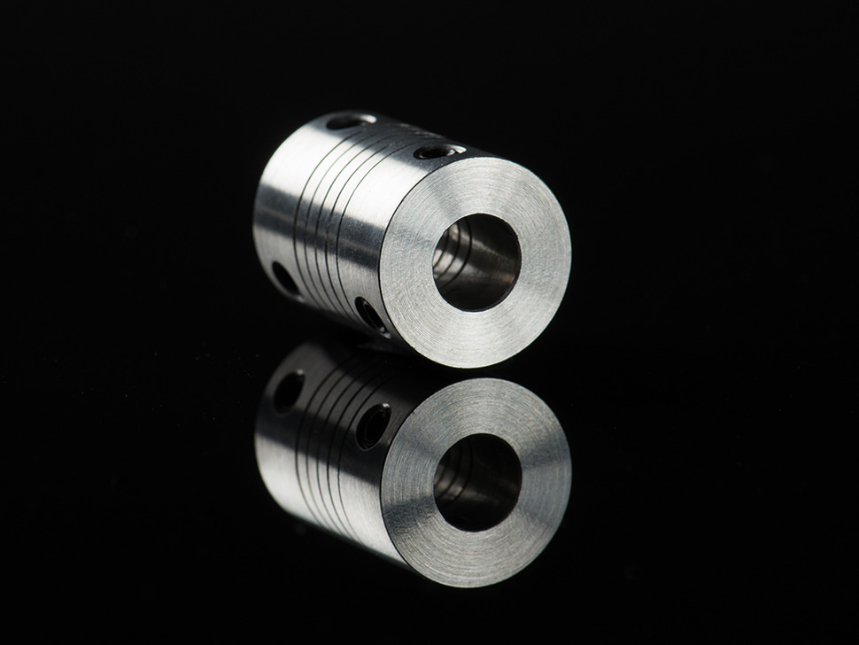
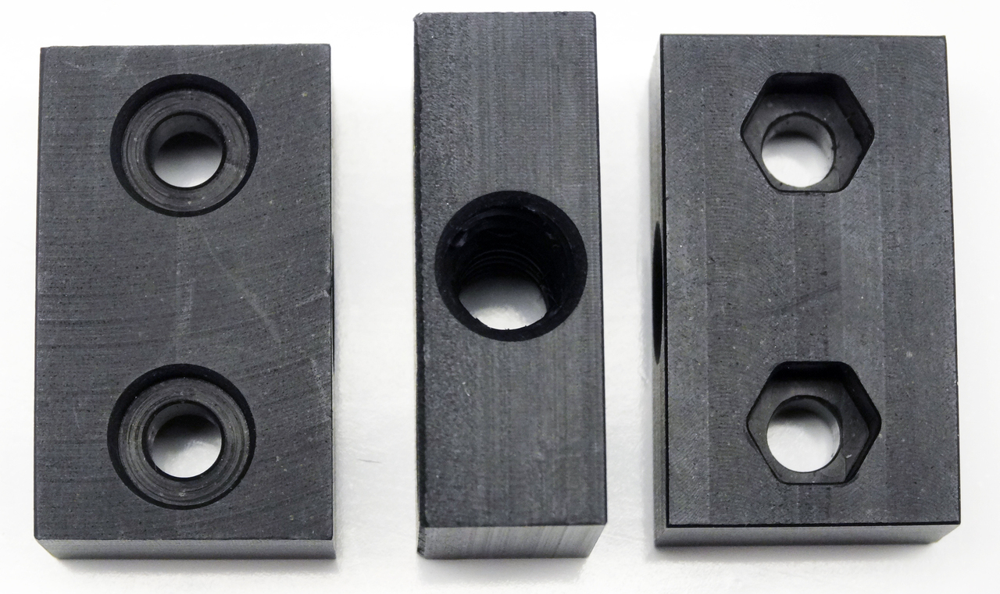

|Qty.                          |Component                     |$/Unit                        |Subtotal                      |
|------------------------------|------------------------------|------------------------------|------------------------------|
|30                            |[V-Wheels](#v-wheels) |$3.60                         |$108.00
|66                            |[Bearings](#bearings) |$0.40                         |$26.40
|30                            |[Precision Shims](#precision-shims)|$0.25                         |$7.50
|12m                           |[GT2 Timing Belt](#gt2-timing-belt)|$8.20/m                       |$98.40
|3                             |[20 Tooth GT2 Pulleys](#gt2-pulleys)|$5.50                         |$16.50
|1                             |[5mm to 8mm Flex Coupling](#5mm-to-8mm-flex-coupling)|$4.95                         |$4.95
|1                             |[8mm ACME Leadscrew](#8mm-acme-leadscrew)|$31.50                        |$31.50
|1                             |[Leadscrew Block](#leadscrew-block)|$6.95                         |$6.95
|**136**                       |**TOTALS**                    |                              |**$300.20**

# V-Wheels
These polycarbonate V-wheels are precision machined to allow FarmBot to move in the X, Y, and Z directions smoothly and precisely. Each wheel requires two bearings and one precision shim to operate correctly.



|                              |                              |
|------------------------------|------------------------------|
|**Material**                  |Clear Polycarbonate
|**Outer Diameter**            |23.9mm
|**Inner Diameter**            |16mm
|**Width**                     |10.23mm
|**Compression Strength**      |86 Mpa
|**Rockwell Hardness**         |M 75
|**Recommended Supplier**      |[OpenBuilds ](http://openbuildspartstore.com) (United States)
|**Price**                     |$3.95/each or $71.95/pack of 20
|**Quantity Needed**           |30

# Bearings
These stainless steel bearings resist corrosion and have rubber seals to keep debris out. Two of them are used in every V-wheel, and one is used to support the driveshaft in the driveshaft bearing plate.

.JPG)

|                              |                              |
|------------------------------|------------------------------|
|**Trade Name**                |SS-625-2RS (SS = Stainless Steel, 625 = Bearing Size, 2RS = Two Rubber Seals)
|**Material**                  |Stainless Steel
|**Outer Diameter**            |16mm
|**Inner Diameter**            |5mm
|**Width/Thickness**           |5mm
|**Sealed?**                   |Rubber sealed
|**Recommended Supplier**      |Alibaba
|**Price**                     |$0.30/each, MOQ = 1,000
|**Quantity Needed**           |66

# Precision Shims
These small washers are placed in between the two bearings in every V-wheel. They keep the bearings from squishing into each other and binding when the wheel is tightened onto a plate.

|                              |                              |
|------------------------------|------------------------------|
|**Material**                  |Stainless Steel
|**Outer Diameter**            |10mm
|**Inner Diameter**            |5mm
|**Thickness**                 |1mm
|**Recommended Supplier**      |[OpenBuilds](http://openbuildspartstore.com) (United States)
|**Price**                     |$0.25/each
|**Quantity Needed**           |30

# GT2 Timing Belt

|                              |                              |
|------------------------------|------------------------------|
|**Material**                  |Neoprene with Fiberglass Cords
|**Lengths**                   |4.5m and 2m
|**Width**                     |5mm
|**Thickness**                 |0.75mm
|**Pitch**                     |GT2 (2mm)
|**Recommended Supplier**      |[OpenBuilds](http://openbuildspartstore.com) (United States)
|**Price**                     |$8.20/meter
|**Quantity Needed**           |4.5m - 2 2m - 1

# GT2 Pulleys
These pulleys are attached directly to NEMA 17 stepper motor shafts or onto the driveshaft. They transfer power from the motor to the belt such that FarmBot can move in the X and Y directions.

|                              |                              |
|------------------------------|------------------------------|
|**Material**                  |Aluminum
|**Number of Teeth**           |20
|**Inner Diameter**            |5mm
|**Outer Diameter**            |15mm
|**Height**                    |14mm
|**Setscrews**                 |Two, 1.5mm
|**Max Belt Width**            |7mm
|**Pitch**                     |GT2 (2mm)
|**Recommended Supplier**      |[OpenBuilds](http://openbuildspartstore.com) (United States)
|**Price**                     |$5.50
|**Quantity Needed**           |3

# 5mm to 8mm Flex Coupling
This aluminum coupling connects the Z-axis stepper motor to the leadscrew to allow FarmBot to move in the Z direction.

|                              |                              |
|------------------------------|------------------------------|
|**Material**                  |Aluminum
|**Length**                    |25mm
|**Outer Diameter**            |18mm
|**Inner Diameters**           |5mm and 8mm
|**Recommended Supplier**      |[Adafruit](https://www.adafruit.com/products/1176) (United States)
|**Price**                     |$4.95
|**Quantity Needed**           |1

# 8mm ACME Leadscrew
This stainless steel leadscrew allows FarmBot to move in the Z direction.

|                              |                              |
|------------------------------|------------------------------|
|**Material**                  |Stainless Steel
|**Diameter**                  |8mm
|**Threads**                   |Tr8*8-2p (4 starts)
|**Pitch**                     |2mm
|**Lead**                      |8mm
|**Length**                    |1,040mm
|**Recommended Supplier**      |[OpenBuilds](http://openbuildspartstore.com) (United States)
|**Price**                     |$31.50
|**Quantity Needed**           |1

# Leadscrew Block
This delrin block attaches to the cross-slide plate so that the leadscrew can move through it, allowing FarmBot to move in the Z direction.



|                              |                              |
|------------------------------|------------------------------|
|**Material**                  |Delrin
|**Threads**                   |Tr8*8-2p (4 starts)
|**Pitch**                     |2mm
|**Lead**                      |8mm
|**Mounting Holes**            |M5, 20mm apart
|**Length**                    |34mm
|**Width**                     |20mm
|**Thickness**                 |12mm
|**Supplier**                  |[OpenBuilds](http://openbuildspartstore.com) (United States)
|**Price**                     |$6.95
|**Quantity Needed**           |1

