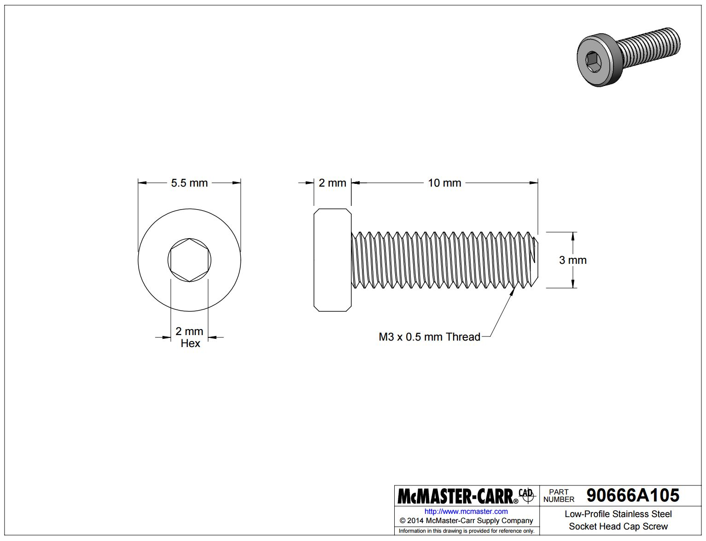
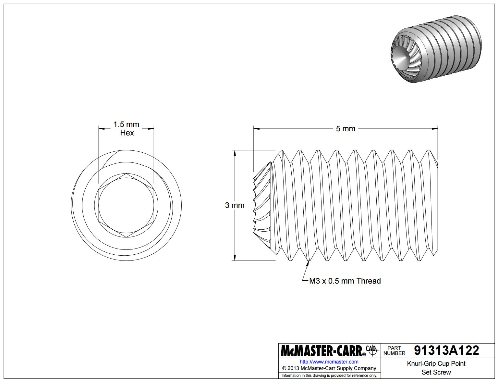
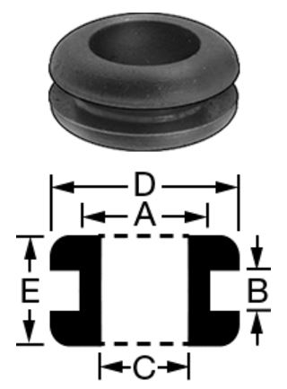
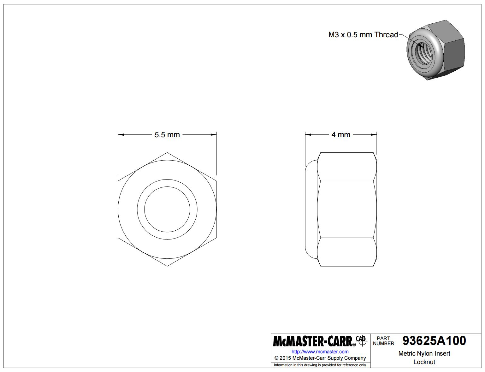
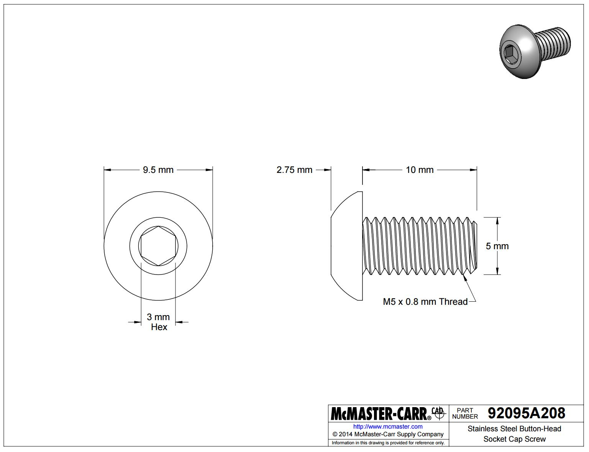
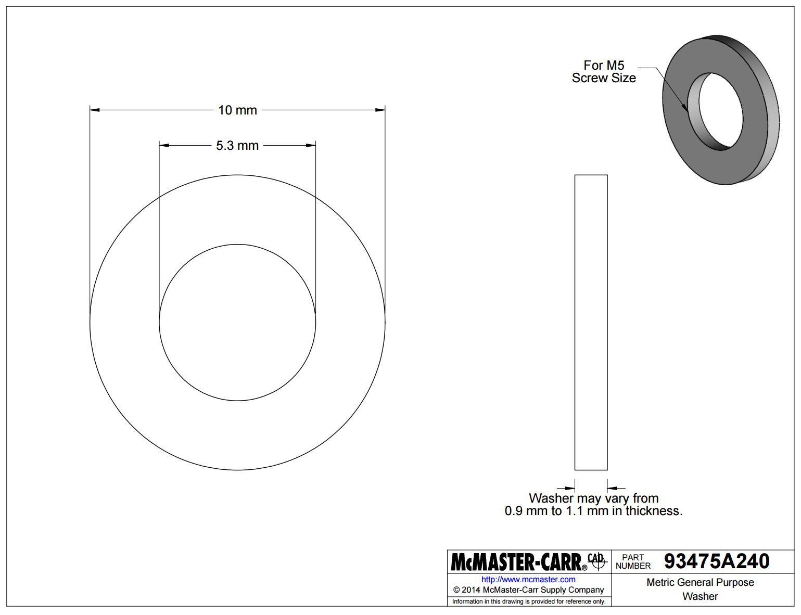
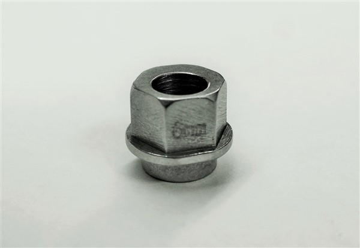
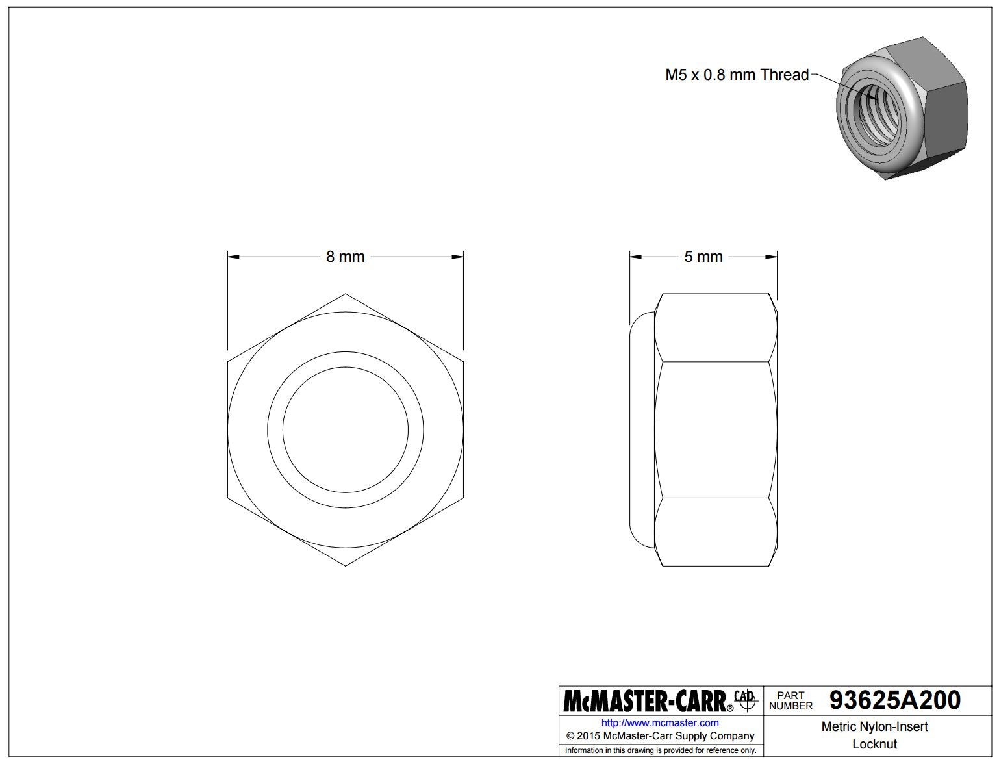
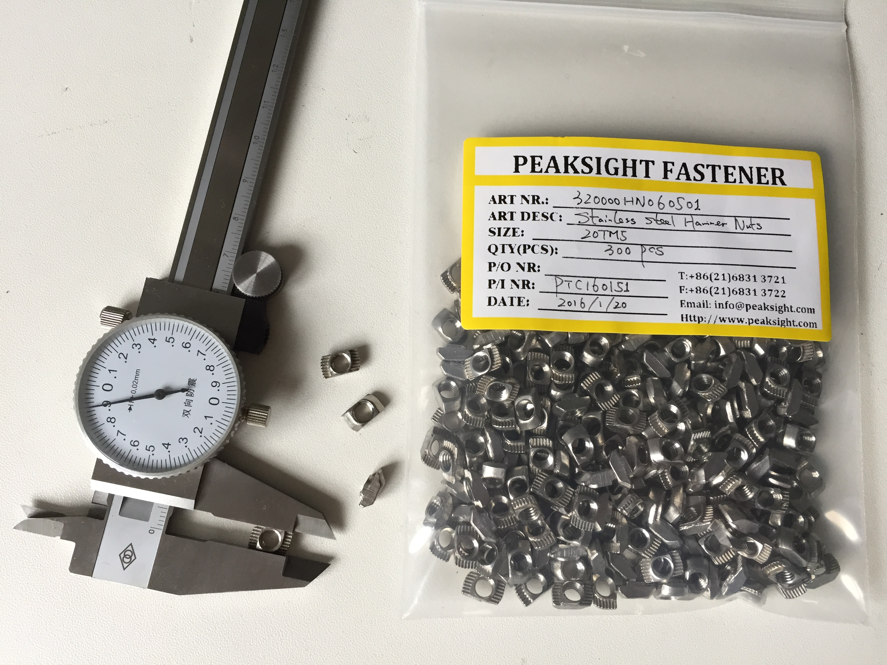
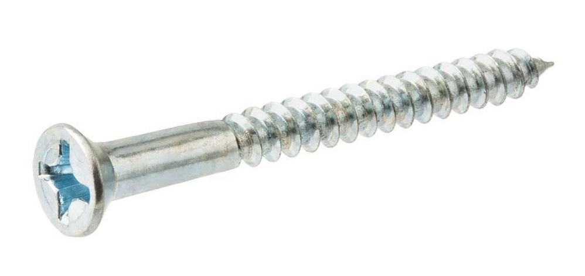

* toc
{:toc}

|Qty.                          |Component                     |$/Unit                        |Subtotal                      |
|------------------------------|------------------------------|------------------------------|------------------------------|
|14                            |[M3 x 10mm Screws](#m3-screws)|$0.08                         |$1.12
|4                             |[M3 x 20mm Screws](#m3-screws)|$0.17                         |$0.68
|12                            |[M3 x 30mm Screws](#m3-screws)|$0.17                         |$2.04
|6                             |[M3 x 5mm Setscrews](#m3-setscrews)|$0.25                         |$1.50
|4                             |[M4 x 5mm Setscrews](#m4-setscrews)|$0.25                         |$1.00
|24                            |[M3 Locknuts](#m3-locknuts)|$0.04                         |$0.96
|116                           |[M5 x 10mm Screws](#m5-screws)|$0.12                         |$13.92
|23                            |[M5 x 16mm Screws](#m5-screws)|$0.17                         |$3.91
|22                            |[M5 x 30mm Screws](#m5-screws)|$0.27                         |$5.94
|48                            |[M5 Washers](#m5-washers)|$0.03                         |$1.44
|16                            |[M5 x 6mm Spacers](#m5-spacers)|$0.20                         |$3.20
|2                             |[M5 x 20mm Spacers](#m5-spacers)|$0.45                         |$0.90
|14                            |[M5 x 6mm Eccentric Spacers](#m5-x-6mm-eccentric-spacers)|$2.00                         |$28.00
|60                            |[M5 Locknuts](#m5-locknuts)|$0.08                         |$4.80
|118                           |[M5 Tee Nuts](#m5-tee-nuts)|$0.28                         |$33.04
|20                            |[Wood Screws](#wood-screws)|$0.05                         |$1.00
|**511**                       |**TOTALS**                    |                              |**$103.45**

# M3 Screws

|                              |                              |
|------------------------------|------------------------------|
|**Trade Name**                |M3 Low-Profile Socket Head Cap Screw
|**Material**                  |10mm, 20mm - Type 316 Stainless Steel 30mm - 18-8 Stainless Steel
|**Lengths**                   |10mm, 20mm, and 30mm
|**Threads**                   |M3 x 0.5mm
|**Head Height**               |2mm
|**Head Diameter**             |5.5mm
|**Socket Size**               |2mm Hex
|**Tensile Strength**          |70,000 psi
|**Recommended Supplier**      |[McMaster Carr](http://mcmaster.com) (United States)
|**Supplier Part Numbers**     |10mm - [90666A105](http://www.mcmaster.com/#90666A105) 20mm - [90666A108](http://www.mcmaster.com/#90666A108) 30mm - [92855A335](http://www.mcmaster.com/#92855A335)
|**Price**                     |10mm - $9.19/pack of 100 ($0.09 each) 20mm - $8.67/pack of 50 ($0.17 each) 30mm - $8.40/pack of 25 ($0.34 each)
|**Quantity Needed**           |10mm - 14 20mm - 4 30mm - 12

# M3 Setscrews
Two of these setscrews are used to secure each GT2 pulley to the motor's shaft. The cup edge is knurled for gripping strength so these screws resist loosening.

|                              |                              |
|------------------------------|------------------------------|
|**Trade Name**                |Knurl Grip Cup Point Set Screw
|**Material**                  |18-8 Stainless Steel
|**Length**                    |5mm
|**Threads**                   |M3 x 0.5mm
|**Hex Size**                  |1.5mm
|**RoHS**                      |Compliant
|**Recommended Supplier**      |[McMaster Carr](http://mcmaster.com) (United States)
|**Supplier Part Number**      |[91313A122](http://www.mcmaster.com/#91313A122)
|**Price**                     |$6.22/pack of 25 ($0.25 each)
|**Quantity Needed**           |6

# M4 Setscrews
These setscrews are used to secure the Z-Axis flex coupling to the lead screw and to the Z-Axis motor's primary shaft. The cup edge is knurled for gripping strength so these screws resist loosening.

|                              |                              |
|------------------------------|------------------------------|
|**Trade Name**                |Knurl Grip Cup Point Set Screw
|**Material**                  |18-8 Stainless Steel
|**Length**                    |5mm
|**Threads**                   |M4 x 0.7mm
|**Hex Size**                  |2mm
|**RoHS**                      |Compliant
|**Recommended Supplier**      |[McMaster Carr](http://mcmaster.com) (United States)
|**Supplier Part Number**      |[91313A137](http://www.mcmaster.com/#91313A137)
|**Price**                     |$6.30/pack of 25 ($0.25 each)
|**Quantity**                  |4

# M3 Locknuts
Twelve of these locknuts are used to secure the UTM electronic pin screws in place. The nylon insert allows them to resist loosening when subjected to vibration.

|                              |                              |
|------------------------------|------------------------------|
|**Trade Name**                |Nylon-Insert Locknut
|**Threads**                   |M3 x 0.5mm
|**Height**                    |4mm
|**Width**                     |5.5mm
|**Material**                  |18-8 Stainless Steel
|**RoHS**                      |Compliant
|**Recommended Supplier**      |McMaster Carr - [Part Number 93625A100](http://www.mcmaster.com/#93625A100) (United States)
|**Price**                     |$5.10/pack of 100 ($0.05 each)
|**Quantity**                  |24

# M5 Screws
M5 button-head screws of various lengths are used throughout FarmBot to attach plates and 3D printed parts to extrusions, V-wheels to plates, and other components together. They are usually used in combination with M5 washers, and terminated with an M5 tee nut or locknut. The button head provides a wide bearing surface, a low-profile head, and a finished appearance. Length is measured from under the head.

|                              |                              |
|------------------------------|------------------------------|
|**Trade Name**                |Button-Head Socket Cap Screw
|**Material**                  |18-8 Stainless Steel
|**Tensile Strength**          |70,000psi
|**Lengths**                   |10, 16, and 30mm
|**Threads**                   |M5, 0.8 pitch
|**Head Type**                 |3mm Hex
|**Head Height**               |2.75mm
|**Head Diameter**             |9.5mm
|**Recommended Supplier**      |[McMaster Carr](http://mcmaster.com) (United States)
|**Supplier Part Numbers**     |10mm - [92095A208](http://www.mcmaster.com/#92095A208) 16mm - [92095A212](http://www.mcmaster.com/#92095A212) 30mm - [92095A218](http://www.mcmaster.com/#92095A218)
|**Price**                     |10mm - $11.98/box of 100 ($0.12/piece) 16mm - $8.31/box of 50 ($0.17/piece) 30mm - $6.76/box of 25 ($0.27/piece)
|**Quantity Needed**           |10mm - 116 16mm - 23 30mm - 22

# M5 Washers
These washers are used throughout FarmBot in combination with M5 screws and M5 locknuts. They allow nuts to be tightened on plastic components and plates while preventing damage and distributing load.

|                              |                              |
|------------------------------|------------------------------|
|**Material**                  |18-8 Stainless Steel
|**Outer Diameter**            |10mm
|**Inner Diameter**            |5.3mm
|**Thickness**                 |0.9 to 1.1mm
|**Recommended Supplier**      |[McMaster Carr](http://mcmaster.com) (United States)
|**Supplier Part Number**      |[93475A240](http://www.mcmaster.com/#93475A240)
|**Price**                     |$2.57/pack of 100 ($0.03/piece)
|**Quantity Needed**           |48

# M5 Spacers
These spacers are used to offset V-wheels from plates so that they may engage extrusions.

|                              |                              |
|------------------------------|------------------------------|
|**Material**                  |Aluminum
|**Outer Diameter**            |10mm
|**Inner Diameter**            |5.10mm
|**Length**                    |6mm, 20mm
|**Recommended Supplier**      |[OpenBuilds](http://openbuildspartstore.com) (United States)
|**Price**                     |6mm length - $0.20/each 20mm length - $0.45/each
|**Quantity Needed**           |6mm - 16 20mm - 2

# M5 x 6mm Eccentric Spacers
When rotated, eccentric spacers accurately position V-wheels on a plate such that they can firmly engage V-slot aluminum extrusions. They are only used on wheels on one side of an extrusion. Adjustments are made by using a 8mm wrench on the spacer itself.

|                              |                              |
|------------------------------|------------------------------|
|**Material**                  |Stainless Steel
|**Height**                    |6mm (not including rim)
|**Bore**                      |5mm
|**Rim**                       |Fits into a 7.12mm hole
|**Hex Size**                  |8mm
|**Divot**                     |Indicates shortest distance from rim to bore
|**Recommended Supplier**      |[OpenBuilds](http://openbuildspartstore.com) (United States)
|**Price**                     |$2.00 each
|**Quantity Needed**           |14

# M5 Locknuts
These nuts resist loosening because their nylon insert grips the screw that they are attached to. They are used in combination with M5 screws throughout FarmBot.

|                              |                              |
|------------------------------|------------------------------|
|**Material**                  |18-8 Stainless Steel
|**Hex Size**                  |8mm
|**Height**                    |5mm
|**Threads**                   |M5 x 0.8 pitch
|**Locking Mechanism**         |Nylon Insert
|**Recommended Supplier**      |[McMaster Carr](http://www.mcmaster.com/) (United States)
|**Supplier Part Number**      |[93625A200](http://www.mcmaster.com/#93625A200)
|**Price**                     |$6.30/pack of 100 ($0.06/piece)
|**Quantity Needed**           |60

# M5 Tee Nuts
Combined with M5 screws, these drop-in style tee nuts allow components such as plates and 3D printed parts to be attached quickly and securely anywhere on a V-slot aluminum extrusion.

|                              |                              |
|------------------------------|------------------------------|
|**Material**                  |Stainless Steel
|**Threads**                   |M5 x 0.8mm pitch
|**Fits Slot Size**            |6
|**Recommended Supplier**      |[Alibaba](http://alibaba.com)
|**Price**                     |$0.28/each
|**Quantity Needed**           |118

# Wood Screws
These are used to attach the track end plates and track joining plates to supporting infrastructure such as a raised.

|                              |                              |
|------------------------------|------------------------------|
|**Material**                  |Steel
|**Finish**                    |Zinc Plated
|**Length**                    |1 inch
|**Head Diameter**             |0.438 inches
|**Recommended Supplier**      |[Home Depot](http://homedepot.com) (United States)
|**Price**                     |$4.76/pack of 100
|**Quantity Needed**           |20

