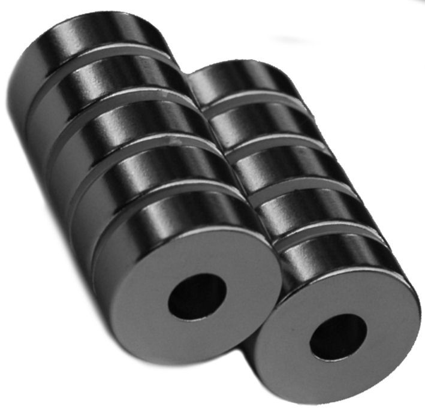
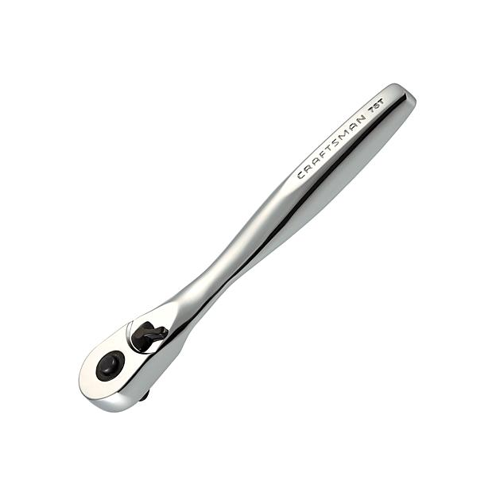

|Qty.                          |Component                     |$/unit                        |Subtotal                      |
|------------------------------|------------------------------|------------------------------|------------------------------|
|12                            |[15 x 5 x 5mm Ring Magnets](#ring-magnets)|$1.69                         |$20.28
|12                            |[Compression Springs](#compression-springs)|$1.73                         |$20.76
|12                            |[Zip Ties](#zip-ties) |$0.05                         |$0.60
|1                             |[Hex Driver Set](#hex-drivers) (1.5, 2, 2.5, and 3mm)|$14.50                        |$14.50
|1                             |[8mm Socket](#8mm-socket)|$2.49                         |$2.49
|1                             |[Ratchet Wrench](#ratchet-wrench)|$11.99                        |$11.99
|1                             |[8mm Wrench](#8mm-wrench)|$4.99                         |$4.99
|1                             |[Wire Stripper](#wire-stripper)|$11.97                        |$11.97
|**41**                        |**TOTALS**                    |                              |**$87.58**

# Ring Magnets
These magnets keep tools attached to the UTM.

|                              |                              |
|------------------------------|------------------------------|
|**Material**                  |Neodymium (NdFeB)
|**Grade**                     |N48
|**Coating**                   |Nickle (Ni)
|**Magnetization**             |Through ring
|**Pull Force**                |7.59 lbf
|**Outer Diameter**            |15mm
|**Inner Diameter**            |5mm
|**Thickness**                 |5mm
|**ReocmmendedSupplier**       |[Apex Magnets](https://www.apexmagnets.com/15-x-5-x-5mm-rings)
|**Price**                     |$16.99/pack of 10
|**Quantity Needed**           |15

# Compression Springs
These springs keep the screws in the UTM in contact with screws in the tools for electrical connections.



|                              |                              |
|------------------------------|------------------------------|
|**Material**                  |Stainless Steel
|**Free Length**               |11mm
|**Compressed Length**         |4.09mm
|**Outer Diameter**            |4.4mm
|**Inner Diameter**            |3.6mm
|**Wire Diameter**             |0.4mm
|**Spring Rate**               |0.62 Newtons/mm
|**Load Capacity**             |4.36 Newtons
|**Recommended Supplier**      |[Amazon](https://smile.amazon.com/gp/product/B005S4HP6K/)
|**Price**                     |$1.73
|**Quantity Needed**           |12

# Zip Ties
These zip ties are used to attach wires to the UTM electrical connection screws and for cable management.

|                              |                              |
|------------------------------|------------------------------|
|**Material**                  |Nylon
|**Color**                     |Black
|**Length**                    |3"
|**Recommended Supplier**      |
|**Price**                     |
|**Quantity Needed**           |

# Hex Drivers
These high quality hex (allen) drivers are used to tighten all M5 and M3 screws on FarmBot as well as all setscrews. They are clearly labelled, color-coded for convenience, and coated with an ultra hard titanium nitride finish.

|                              |                              |
|------------------------------|------------------------------|
|**Hex Sizes**                 |1.5, 2, 2.5, and 3mm
|**Bit Material**              |Hardened steel with a titanium nitride coating
|**Handle Material**           |Color coded anodized aluminum
|**Replaceable Bit?**          |Yes
|**Brand**                     |Neewer
|**Price**                     |$14.50
|**Recommended Supplier**      |[Amazon](http://www.amazon.com/NEEWER%C2%AE-Titanium-Nitride-Driver-Wrench/dp/B00CP2GGBI/ref=sr_1_2?ie=UTF8&qid=1461476878&sr=8-2&keywords=hex+drivers)
|**Quantity Needed**           |1 pack

# 8mm Socket
This socket is used in combination with the ratchet wrench to tighten most of the M5 locknuts.

|                              |                              |
|------------------------------|------------------------------|
|**Size**                      |8mm
|**Drive**                     |1/4"
|**Recommended Supplier**      |[Sears](http://www.sears.com/craftsman-socket-1-4-dr-8mm-6pt/p-00934604000P?prdNo=1&blockNo=1&blockType=G1)
|**Price**                     |$2.49
|**Quantity Needed**           |1

# Ratchet Wrench
This wrench is used incombination with the 8mm socket to tighten most of the M5 locknuts.

|                              |                              |
|------------------------------|------------------------------|
|**Drive**                     |1/4"
|**Length**                    |5.55"
|**Brand**                     |Craftsman
|**Swing Arc**                 |4.8 degrees
|**Recommended Supplier**      |[Sears](http://www.sears.com/craftsman-1-4inch-drive-75-tooth-full-polish-ratchet/p-00902072000P?rrec=true)
|**Price**                     |$11.99
|**Quantity Needed**           |1

# 8mm Wrench
The wrench is for the M5 locknuts that are in spaces too constrained for the socket wrench and to adjust eccentric spacers.

|                              |                              |
|------------------------------|------------------------------|
|**Size**                      |8mm
|**Length**                    |5.6"
|**Brand**                     |Tekton
|**Recommended Supplier**      |[Amazon](https://smile.amazon.com/TEKTON-18277-Polished-Combination-Wrench/dp/B00Q01O86K/ref=sr_1_1?ie=UTF8&qid=1465624404&sr=8-1&keywords=8mm+wrench)
|**Price**                     |$4.99
|**Quantity Needed**           |1

# Wire Stripper
This tool is used to remove the rubber insulation from wires so that they may be attached to peripherals and other terminals. The tool is also used to cut wires to length.

|                              |                              |
|------------------------------|------------------------------|
|**Functions**                 |Wire stripping, cutting, and crimping
|**Gauge Range**               |10-22 AWG
|**Brand**                     |Irwin
|**Recommended Supplier**      |[Amazon](https://smile.amazon.com/Tools-VISE-GRIP-Stripper-Crimper-2078309/dp/B000JNNWQ2/ref=sr_1_2?s=hi&ie=UTF8&qid=1465631297&sr=1-2&keywords=wire+stripper)
|**Price**                     |$11.97
|**Quantity Needed**           |1

