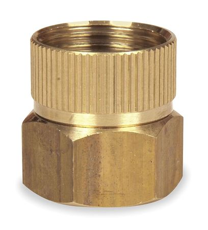
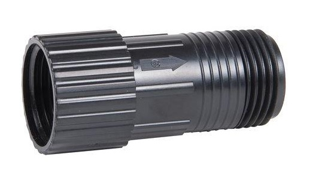

|Qty.                          |Component                     |$/Unit                        |Subtotal                      |
|------------------------------|------------------------------|------------------------------|------------------------------|
|3                             |[Liquid/Gas Tubing](#liquid-gas-tubing)|$4.74                         |$14.22
|3                             |[Barbs](#barbs)       |$5.60                         |$16.80
|1                             |[Barbed Adapter](#barbed-adapter)|$1.62                         |$1.62
|1                             |[Garden Hose Adapter](#garden-hose-adapter)|$4.81                         |$4.81
|3                             |[O-rings](#o-rings)   |$0.27                         |$0.81
|4                             |[Grommets](#grommets) |$0.07                         |$0.28
|1                             |[Pressure Regulator](#pressure-regulator)|$5.27                         |$5.27
|**17**                        |**TOTALS**                    |                              |**$43.36**

# Liquid/Gas Tubing
This ultra flexible tubing carriers liquids and gases to and from the UTM including water and vacuum air.

|                              |                              |
|------------------------------|------------------------------|
|**Length Needed**             |6m
|**Material**                  |Masterkleer PVC
|**Color**                     |Clear
|**Flexibility**               |Very Flexible
|**Compatible Tube Fittings**  |Barbs
|**Inner Diameter**            |1/4"
|**Outer Diameter**            |3/8"
|**Wall Thickness**            |1/16"
|**Bend Radius**               |1" Minimum
|**Max Pressure**              |35 psi at 73° F
|**Temperature Range**         |-45° to 165° F
|**Recommended Supplier**      |McMaster Carr - Part Number [5233K56](http://www.mcmaster.com/#5233k56)
|**Price**                     |$0.79/m ($4.74 per 6m length)
|**Quantity Needed**           |3 tubes, each 6m long

# Barbs
These stainless steel barbs screw into the UTM's three liquid/gas ports and accept the three liquid/gas lines coming from the z-axis cable carrier.

|                              |                              |
|------------------------------|------------------------------|
|**For Tube ID**               |1/4"
|**Threads**                   |10-32 UNF Straight Threads
|**Hex Size**                  |5/16"
|**Overall Length**            |25/32"
|**Temperature Range**         |–40° to 1200° F
|**Maximum Pressure**          |500 psi @ 72° F
|**RoHS**                      |Compliant
|**Gasket?**                   |Yes
|**Material**                  |Type 303 Stainless Steel
|**Recommended Supplier**      |McMaster Carr - Part Number [4406T14](http://www.mcmaster.com/#4406t14/=14ab6e0)
|**Price**                     |$5.60 each
|**Quantity Needed**           |3

# Barbed Adapter
This adapter threads onto the solenoid valve and is connected to the water tube leading to the UTM.

|                              |                              |
|------------------------------|------------------------------|
|**Material**                  |Nylon
|**For Tube ID**               |1/4"
|**Threads**                   |3/4" NPSM (National Pipe Straight Mechanical) connection, which is compatible with NPT threads
|**Hex Size**                  |1.25"
|**Overall Length**            |1.656"
|**Recommended Supplier**      |McMaster Carr - Part Number [5372K221](https://www.mcmaster.com/#5372k221/=14z0mfg)
|**Price**                     |$1.62
|**Quantity Needed**           |1

# Garden Hose Adapter
This adapter connects standard US garden hoses to the solenoid valve.

|                              |                              |
|------------------------------|------------------------------|
|**Material**                  |Brass
|**Threads**                   |3/4" Female GHT (Garden Hose Thread) 3/4" Female NPT (National Pipe Thread)
|**Swivel Type**               |Swivels until tightened
|**Seal**                      |Rubber Gasket
|**Maximum Temperature**       |195° F
|**RoHS**                      |Not compliant
|**Recommended Suppliers**     |[Zoro](https://www.zoro.com/westward-hose-to-pipe-adapter-swivel-dbl-female-4kg88/i/G0911032/)  McMaster Carr - Part Number [70815t44](https://www.mcmaster.com/#70815t44/=14jz0ff)
|**Price**                     |$4.81
|**Quantity Needed**           |1

# O-rings
These O-rings fit onto the UTM's liquid/gas ports and create a solid seal when tools are mounted.

|                              |                              |
|------------------------------|------------------------------|
|**Material**                  |Buna-N
|**Durometer**                 |A70 (Medium)
|**Outer Diameter**            |10.5mm
|**Inner Diameter**            |7.5mm
|**Thickness**                 |1.5mm
|**Temperature Range**         |-30° to 212° F
|**Color**                     |Black
|**Recommended Supplier**      |McMaster Carr - Part Number [1171n145](http://www.mcmaster.com/#1171n145/=14abs96)
|**Price**                     |$0.27
|**Quantity Needed**           |3

# Grommets
These grommets fit onto the UTM cover and allow the liquid/gas tubes and the UTM cable to pass into the UTM assembly while keeping water and dust out.

|                              |                              |
|------------------------------|------------------------------|
|**Material**                  |SBR Rubber
|**Durometer**                 |45A-65A
|**Temperature Range**         |–30° to 175° F
|**Panel Hole Diameter (A)**   |7/16"
|**Panel Thickness (B)**       |3/32"
|**ID (C)**                    |3/8"
|**OD (D)**                    |5/8"
|**Overall Thickness (E)**     |9/32"
|**Color**                     |Black
|**Recommended Supplier**      |McMaster Carr - Part Number [9600k33](http://www.mcmaster.com/#9600k33/=14ac8cm)
|**Price**                     |$0.07
|**Quantity Needed**           |4

# Pressure Regulator
This pressure regulator reduces the pressure from a municipal water supply down to 25 PSI (172 kpa, 1.72 bar) so that FarmBot can more easily control the amount of water it disperses.

|                              |                              |
|------------------------------|------------------------------|
|**Material**                  |UV resistant plastic
|**Inlet**                     |3/4 in. FHT (female hose thread)
|**Outlet**                    |3/4 in. MHT (male hose thread)
|**Color**                     |Black
|**Length**                    |6 inches (152.4mm)
|**Outer Diameter**            |1.25 inches (31.75mm)
|**Outlet Pressure**           |25 PSI (172 kpa, 1.72 bar)
|**Max Input Pressure**        |100 PSI (688 kpa, 6.88 bar)
|**Recommended Supplier**      |[Home Depot](http://www.homedepot.com/p/DIG-25-psi-Hose-Thread-Pressure-Regulator-D46/100180295)
|**Price**                     |$5.27
|**Quantity Needed**           |1

