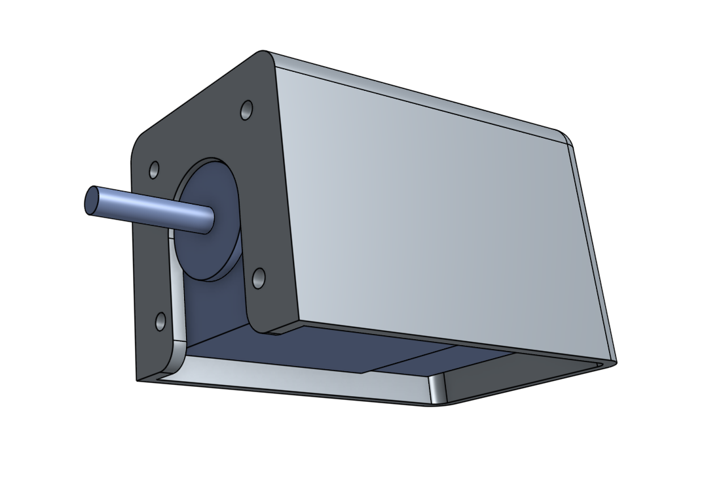
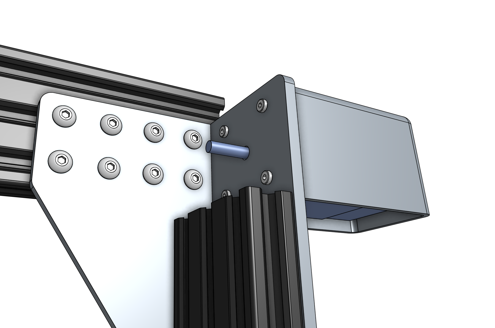
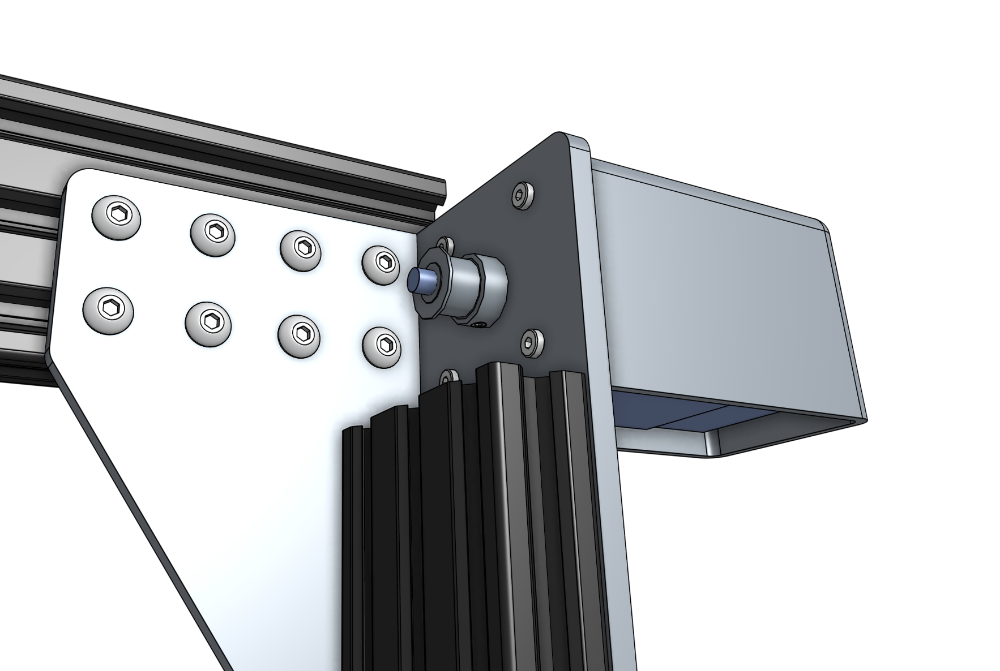
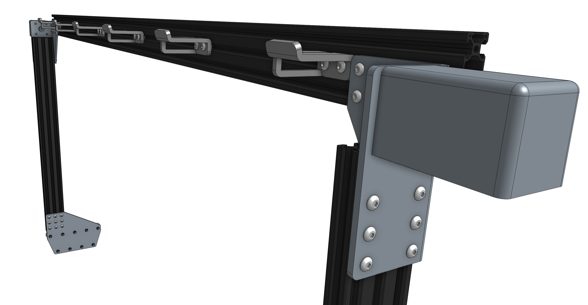
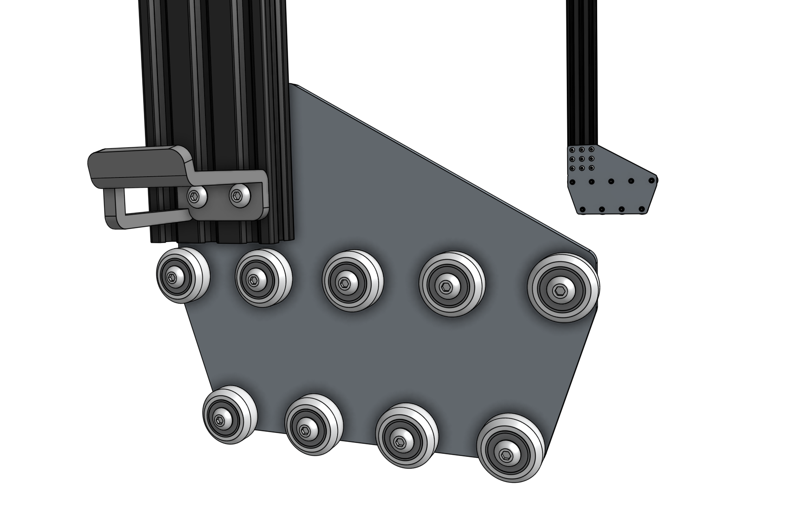

* toc
{:toc}

# Step 1: Attach the gantry motors
For this step you will need:
* Two NEMA 17 stepper motors with rotary encoders
* Two horizontal motor housings
* Eight M3 x 16mm screws
* The 2mm and 3mm hex drivers

Slide a **motor** into a **horizontal motor housing**, ensuring that the shaft of the motor is coming out of the housing and that the motor and encoder's wires are facing down through the open bottom of the housing.

Position the motor and housing onto the gantry corner bracket and attach it with four **M3 x 10mm screws**.

Slide a **GT2 pulley** onto the **motor shaft** and tighten it using the two **M3 setscrews** and the 2mm hex driver.

Repeat the above steps for the second motor on the other gantry corner bracket.

# Step 2: Install the cable carrier supports
Attach six **cable carrier supports** to the back side of the **gantry main beam** using two **M5 x 10mm screws** and **M5 tee nuts** for each support. The supports should reside in the **middle slot** of the main beam extrusion and be equally spaced along its length.

Attach one more **cable carrier support** to the left-side **gantry column** using two **M5 x 10mm screws** and **M5 tee nuts**.

