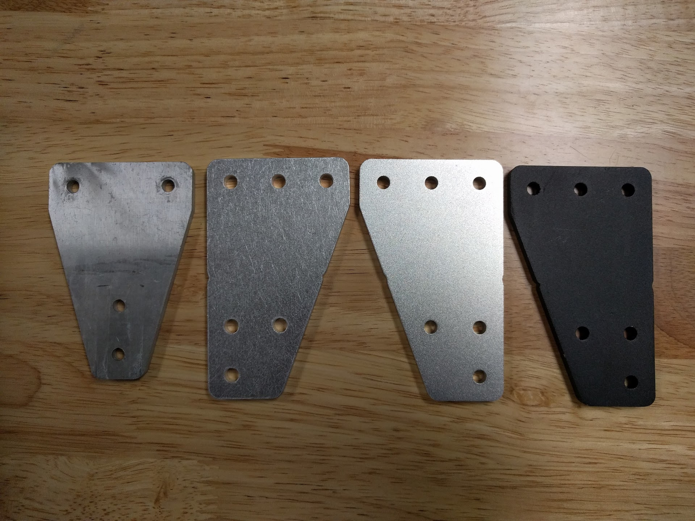

* toc
{:toc}

# New Metal Surface Treatment
Previous prototypes have called for the metal plates and brackets to be tumble polished. However, we have found through some experimentation that tumble polishing is not good enough. Now we are using a three step process:
  * Tumble polishing to remove burrs and sharp edges/corners
  * Sandblasting to remove any surface imperfections and give the parts a nice texture
  * Clear or black anodization to give the parts a protective coating and professional, finished feel

_From left: Raw waterjet cut; laser cut with tumble polishing; machined with tumble polishing, sand blasting, and clear anodization; and machined with tumble polishing, sand blasting, and black anodization._

# Tighter M5 Hole Tolerance
All M5 holes have been reduced in size from 5.5mm to 5.25mm to reduce the propensity to install them misaligned.

# Improved UTM
* Decreased the wire diameter of the electronics screw springs to 0.3mm to allow the tools to mount better on the UTM and create better seals with the o-rings.
* Switched from square profile o-rings to x profile o-rings to allow for better sealing with less required force.
* Removed the o-ring recess in the UTM to allow the o-rings to squish and seal more easily.

# Z-Axis Cable Carrier Guides
* Renamed to **Vertical CC Supports**, where CC is short for Cable Carrier.
* Now made of machined or 3D printed plastic instead of bent metal.
* Made the component taller so that it can be mounted with two M5 screws and tee nuts for a more stable connection with the z-axis extrusion.
* Added a horizontal slot so that any of the supports can be used to mount the z-axis cable carrier to the z-axis extrusion. The z-axis cable carrier mounting plate is now deprecated and has been replaced with an additional vertical CC support.
* Wire routing guide has been increased in size for added strength.

# Cable Carrier Supports
* Renamed to **Horizontal CC Supports**, where CC is short for Cable Carrier.
* Now made of machined or 3D printed plastic instead of bent metal.

# Addition of the CC Spacer Block
This component is mounted between the z-axis cable carrier and the cross-slide plate in order to offset the cable carrier and allow it to make its tight bend radius more easily when the z-axis is extended as low as it can go.

# Z-Axis Motor Mount
Replaced the bent metal and welded design with a lighter weight and lower cost single bent plate design.

# Tool Bay
The FarmBot logo is no longer cut out of the metal. Instead the entire tool bay is anodized black and the logo has been laser engraved onto it.

# Back to Borescopes
After testing the Raspberry Pi camera as FarmBot's downward facing camera, we have decided to go back to using a modified borescope camera. This is because the Raspberry Pi camera board is bulky, required a special and expensive and bulky ribbon cable to HDMI to ribbon cable connection to the Raspberry Pi, a custom rainproof housing, and a complicated mount.

# 2-Piece Watering Nozzle
The previous watering nozzle design could only be produced with 3D printing because of the complicated internal cavity features.

The new design is a two-piece system that allows the individual pieces to be either machined or injection molded in addition to 3D printed. The two pieces are then screwed together using the same screws that hold the magnets onto the tool.

# Luer Lock Needle Seed Injector
The previous seed injector design could only be produced with 3D printing because of the complicated internal cavity features. Furthermore, the design had poor internal airflow properties, and was an expensive component to produce that was limited to one orifice size.

The new design uses a more easily produced tool base that can be machined or injection molded in addition to 3D printed. Interchangeable luer lock needles allow the user to switch out the orifice size of their seed injector in just 10 seconds and for very little cost. This will aid the user in finding the best orifice size to use for their particular seeds and soil conditions. We plan to ship a variety of luer lock needles with every FarmBot kit.
