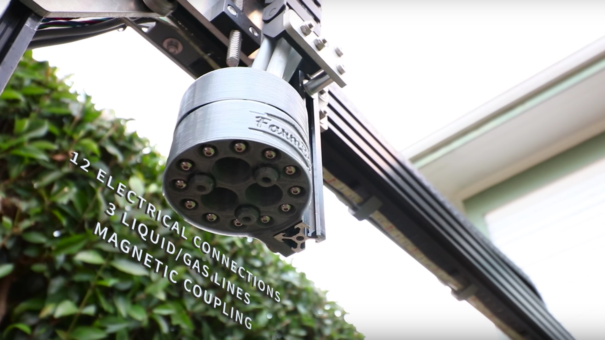

* toc
{:toc}

The Universal Tool Mount (UTM) allows FarmBot Genesis to automatically switch tools on the z-axis to preform different operations. The UTM is necessary because it is not feasible to have all tools mounted on the z-axis at one time for several reasons:

  * This would be very heavy and increase stresses on all components, as well as necessitate a larger z-axis motor.
  * Most tools need to be the “lowest” thing on the z-axis in order to work. Having multiple tools competing for the lowest position (ex: a temperature probe and a seed injector) would not be ideal and may not work at all. The use of individual tool raising and lowering mechanisms, or a turret style mechanism would be complex, heavy, bulky, and limited in the number of tools it could support.
  * The x-axis’s size must be kept to a minimum in order for it to have minimal impact on the plants, especially when there is not very much space between them.

The UTM is a single 3D-printed component that mounts to the z-axis aluminum extrusion using two M5 screws and tee nuts.
It features:
* 3 strong neodymium ring magnets to magnetically hold tools in place via other magnets placed in the same configuration on the tool.
* Passageways for water, liquid amendments (eg: fertilizer), and vacuum or compressed air to pass through from the UTM (and the rest of FarmBot) to the tool.
* 12 spring loaded screws that make electrical connections with tools. (See: [Pin Mapping](#pin-mapping))

<iframe width="100%" height="480" src="https://sketchfab.com/models/555a50936d5d4f6d835a3daf9fd48c95/embed?ui_controls=0&amp;ui_infos=0&amp;ui_related=0" frameborder="0" allowfullscreen mozallowfullscreen="true" webkitallowfullscreen="true" onmousewheel=""></iframe>



