* toc
{:toc}



# Step 1: Gather the Parts and Tools
Gather all the UTM parts from the table below and lay them out in a logical manner. To complete the assembly, you will also need the following tools:

* 2mm hex (allen) driver
* 3mm hex (allen) driver
* 6mm wrench
* 8mm wrench
* Exacto blade
* Wire strippers

|Qty.                          |Component                     |
|------------------------------|------------------------------|
|12                            |M3 x 30mm Screws
|12                            |M3 x 10mm Compression Springs
|12                            |M3 Locknuts
|2                             |M5 x 12mm Screws
|3                             |M5 x 30mm Screws
|3                             |M5 Washers
|2                             |M5 Tee Nuts
|3                             |M5 Locknuts
|1                             |Universal Tool Mount Base
|12                            |Zipties
|1                             |20 Gauge, 12 Wire Cable, 3m Length
|3                             |Barbs for 1/4" Tube ID
|3                             |1.5mm Wide, 9mm ID Square-Profile O-Rings
|3                             |15 x 5 x 5mm Ring Magnets

# Step 2: Install the magnets

{%
include callout.html
type="info"
title="Opposites attract"
content="For the UTM to correctly mount tools, all magnets on the UTM and all tools must have the same polar orientation. For example, all of the magnets could have the North pole/face of the magnet facing towards the ground. This way, the North pole/face of the *UTM* magnets (which face the ground) will be attracted to the South pole/face of the *tool* magnets (which face the sky).

Which side is North and which is South does not matter. The important part is that the orientation of all the magnets are the same."
%}

Insert an **M5 x 30mm screw** through one of the **ring magnets**. For the first magnet, the orientation does not matter.

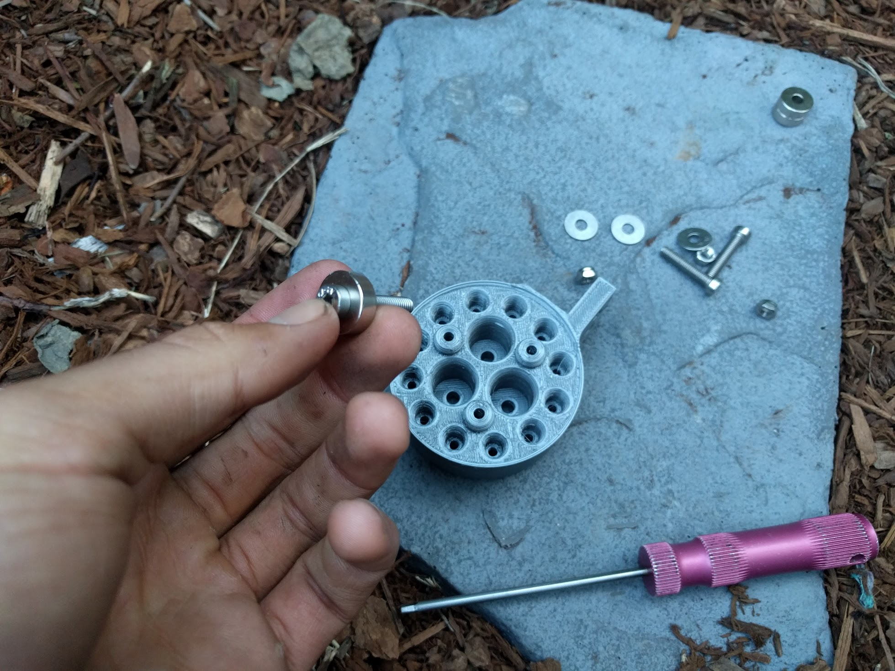

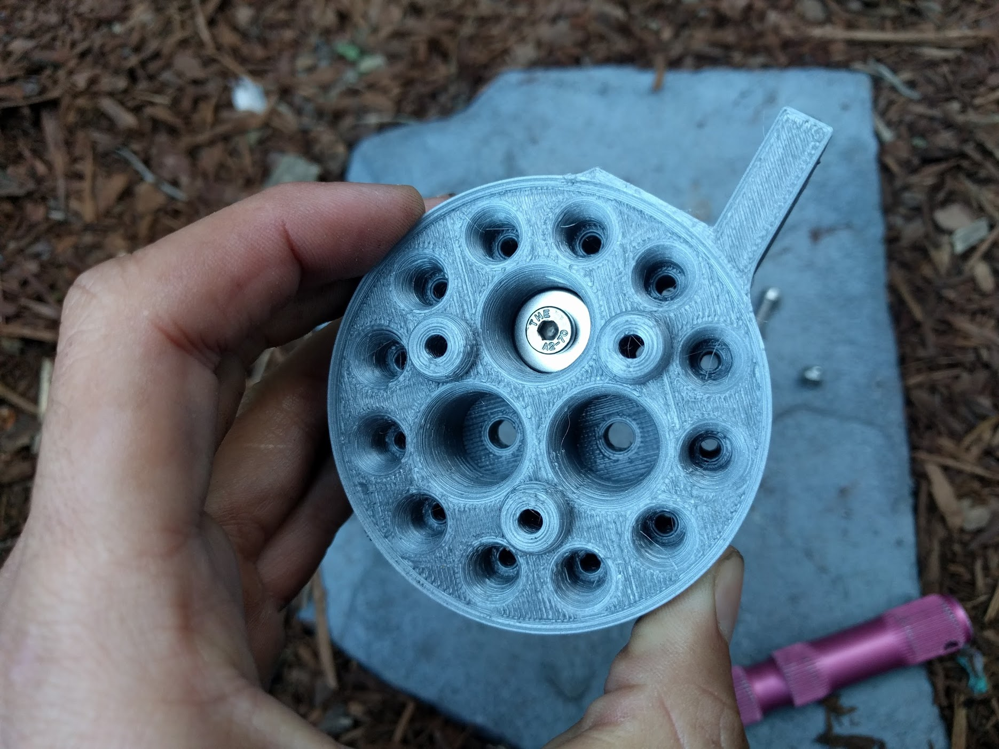

Insert the magnet/screw combo into the **UTM** and  use the **3mm hex driver** and the **8mm wrench** to tighten an **M5 locknut** and **M5 washer** onto the screw.

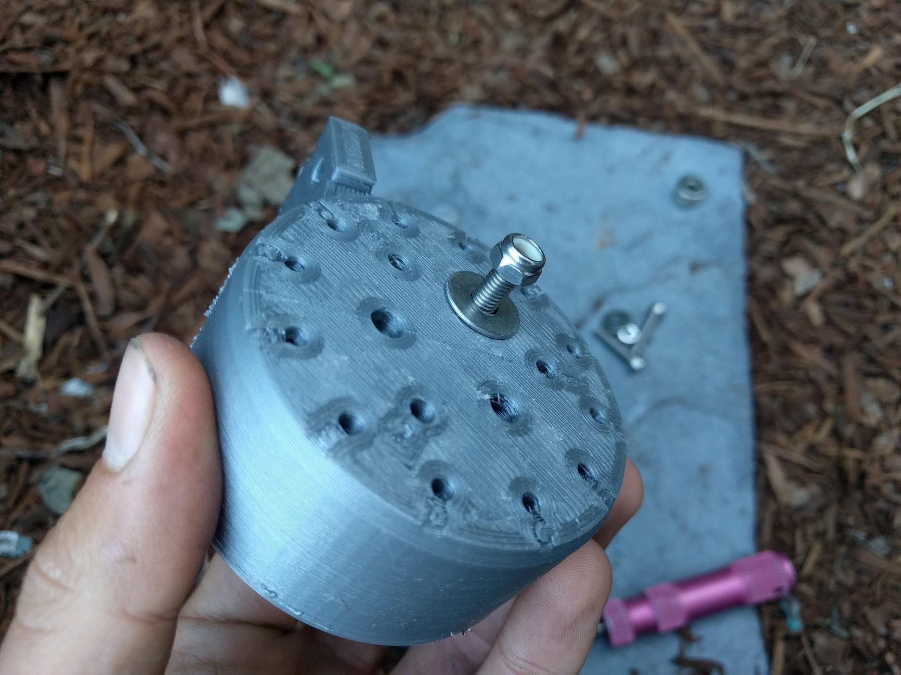

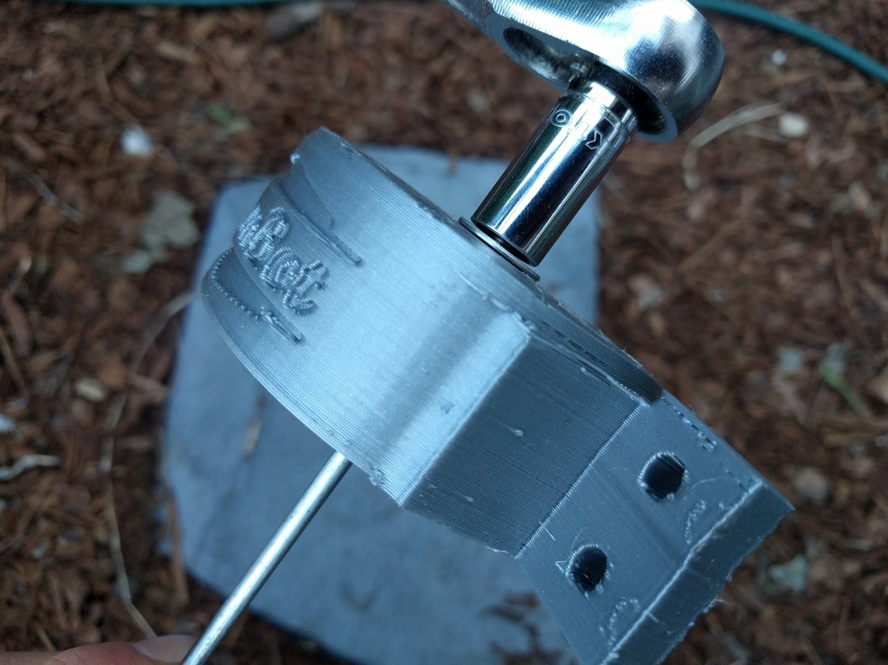

Repeat the process above for the two remaining UTM magnets.



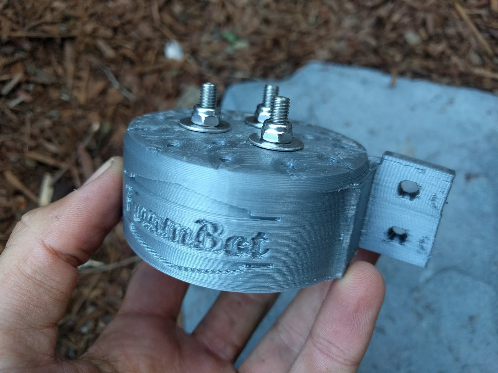

# Step 3: Install the Barbs
Use the **8mm wrench** to screw in the three **barbs** to the **UTM**. The barbs should be inserted in the holes labelled 1, 2, and 3.

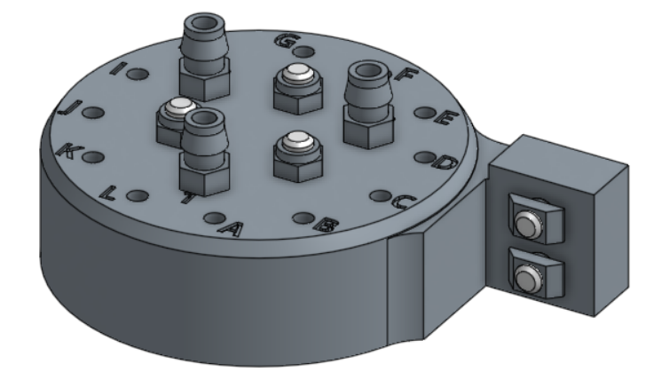

# Step 4: Install the o-rings
Slide three **o-rings** onto the **UTM** 1, 2, and 3 port cones. Each o-ring should be "seated" in the recess at the base of the port cone.

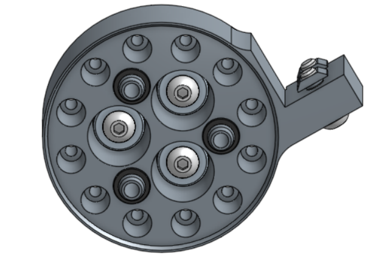

# Step 5: Install the electronic contact screws
Place a **spring** on an **M3 x 40mm screw**, and then insert the screw into a lettered hole in the **UTM**.

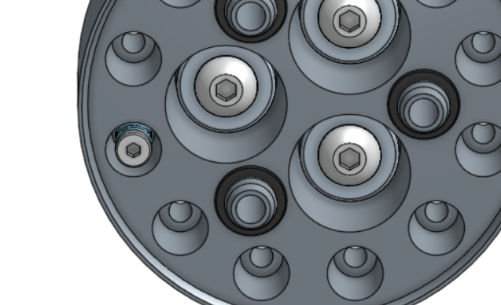

Using the **2mm hex driver** and the **6mm wrench**, attach an **M3 locknut** onto the screw. Tighten the locknut until the spring is slightly compressed.

Repeat for all holes **A** through **L**.

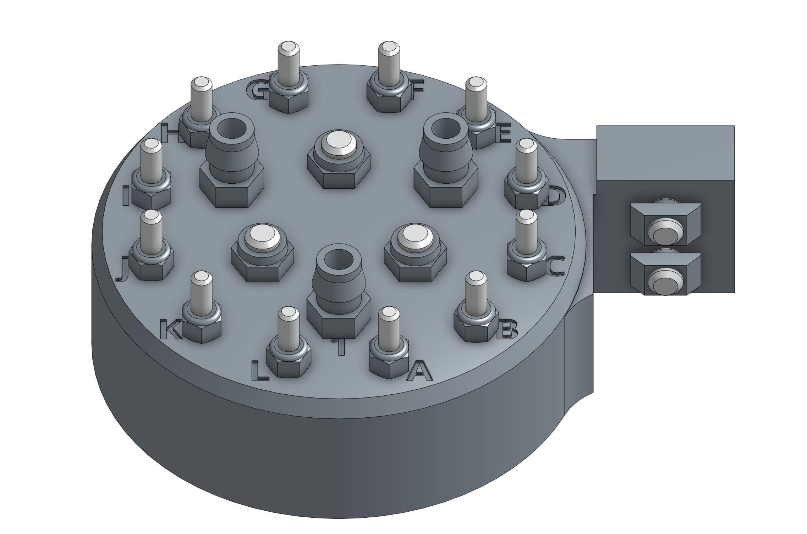

# Step 6: Prepare the UTM Cover
Insert four **rubber seals** into the **UTM cover**.

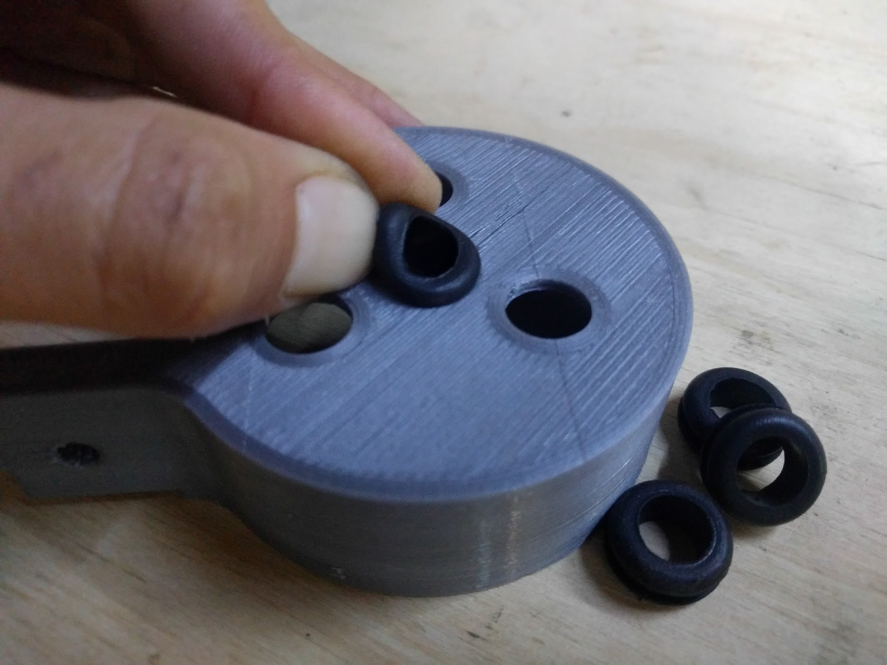

 Ensure that the seal flanges are not folded or caught under themselves.

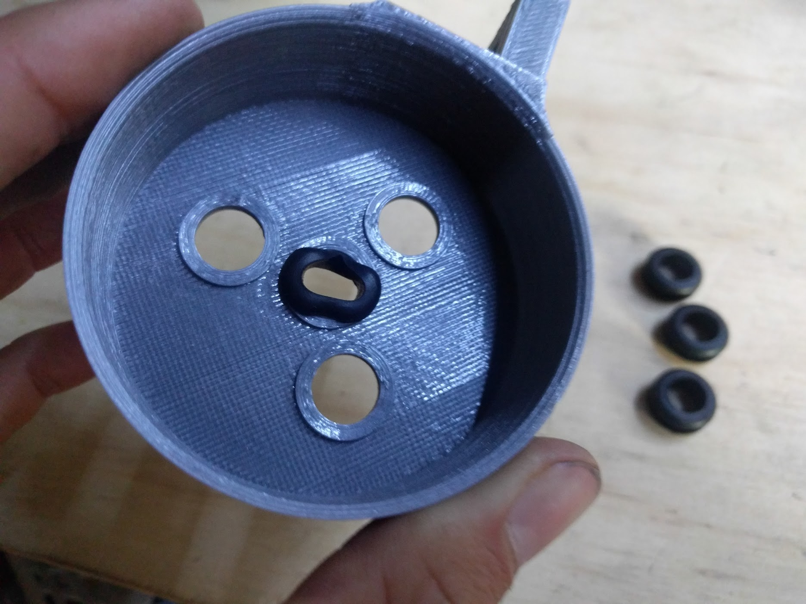

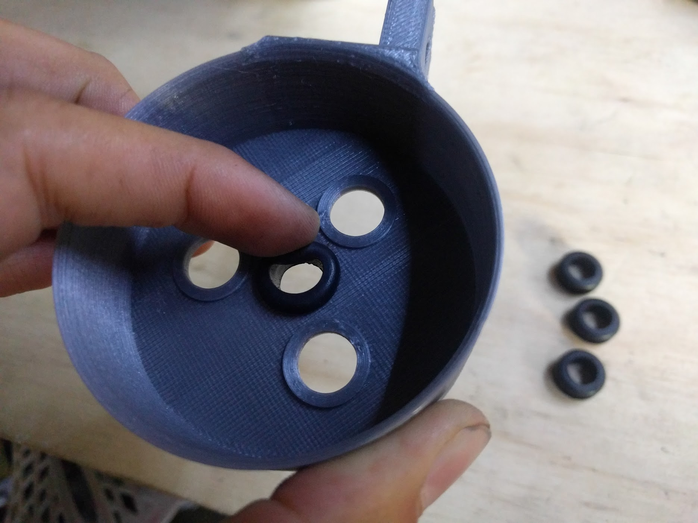

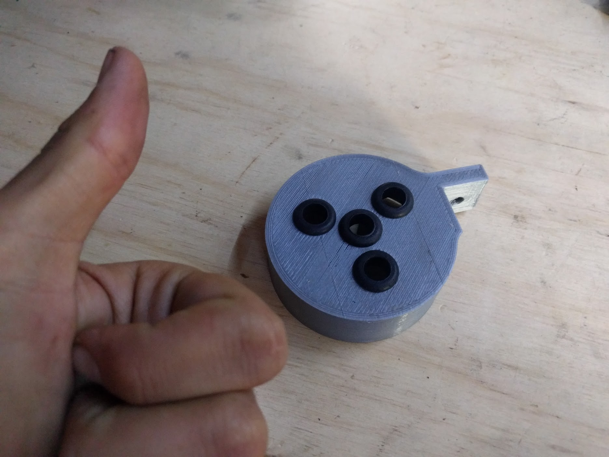

