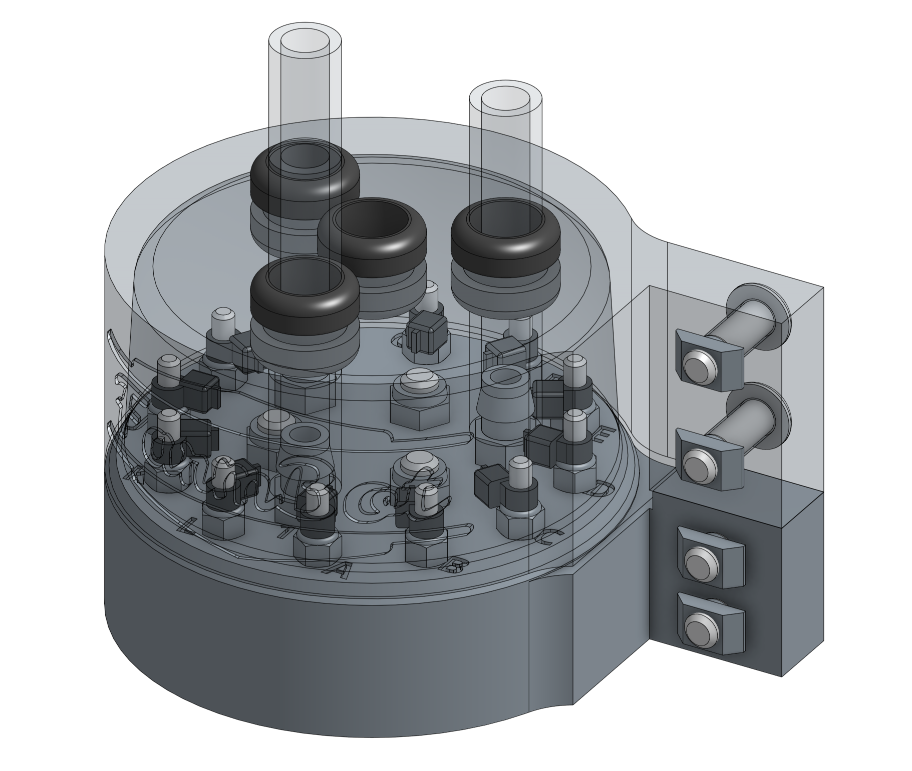
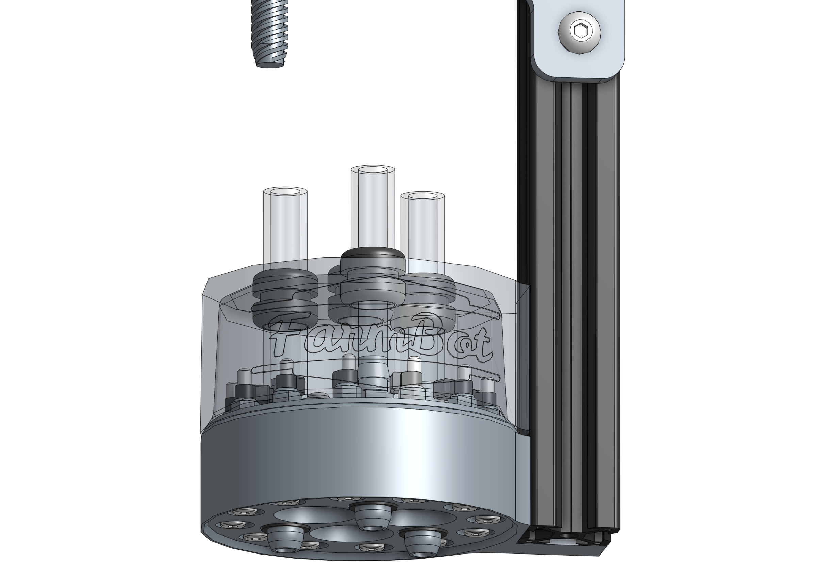

* toc
{:toc}

# Step 1: Feed the Tubes and Cable
Push the **UTM cable** through the center hole in the **UTM cover** so that there is about 10cm of cabling beneath the cover. It may be difficult to do this because of the friction and tight seal created between the rubber seal and the cable. Be gentle and take your time. Some soapy water can facilitate the cable to slide through more easily, and will dry up within a day.

Push the **vacuum tube** through *port 1* on the **UTM cover** so that there is about 10cm of tubing beneath the cover.

Push the **extra peripheral tube** through *port 2* on the **UTM cover** so that there is about 10cm of tubing beneath the cover.

Push the **water tube** through *port 3* on the **UTM cover** so that there is about 10cm of tubing beneath the cover.

# Step 2: Wire up the UTM
Use the **exacto blade** to remove 5cm of the **UTM cable** outer rubber insulation.



Each small wire of the **UTM cable** is numbered with small white text. Fan out the wires and arrange them in order from 1 to 12.

 Use the **wire strippers** to remove 0.5 to 1cm of insulation from each small wire.

Use a **zip-tie** to secure each wire to an **M3 screw** on top of the **UTM** according to the pin mapping table below.

## Pin Mapping



|UTM Pin/UTM Wire              |is connected to               |and used for                  |
|------------------------------|------------------------------|------------------------------|
|A/1                           |Ground (0V) on Arduino/RAMPS  |Ground
|B/2                           |+5V on Arduino/RAMPS          |Tool verification
|C/3                           |Pin D16 on Arduino/RAMPS - Digital-In|Tool verification
|D/4                           |Pin A13 on Arduino/RAMPS - Analog-In|Soil sensor and other analog signal tools
|E/5                           |Your choice                   |Anything you want
|F/6                           |Your choice                   |Anything you want
|G/7                           |Your choice                   |Anything you want
|H/8                           |Your choice                   |Anything you want
|I/9                           |Your choice                   |Anything you want
|J/10                          |Your choice                   |Anything you want
|K/11                          |Your choice                   |Anything you want
|L/12                          |Your choice                   |Anything you want

# Step 3: Install the UTM and Cover onto the Z-Axis
Slide the **vacuum tube** onto the *port 1* **barb**, the **extra tube** onto the *port 2* barb, and the **water tube** onto the *port 3* barb.

Slide the **UTM cover** down the tubes and cable until it sits flush against the top of the UTM.



Insert two **M5 x 10mm screws** through the **UTM cover** mounting holes and then lightly thread an **M5 tee nut** onto each. Repeat for the **UTM**.

Slide the **UTM cover** and **UTM** onto the **z-axis** extrusion. The plastic brackets should be positioned on the backside of the extrusion. The bottom of the UTM should be flush with the bottom of the extrusion, and the bottom of the UTM cover should be flush with the top of the UTM.

Tighten all four **M5 screws** with the **3mm hex driver**.



