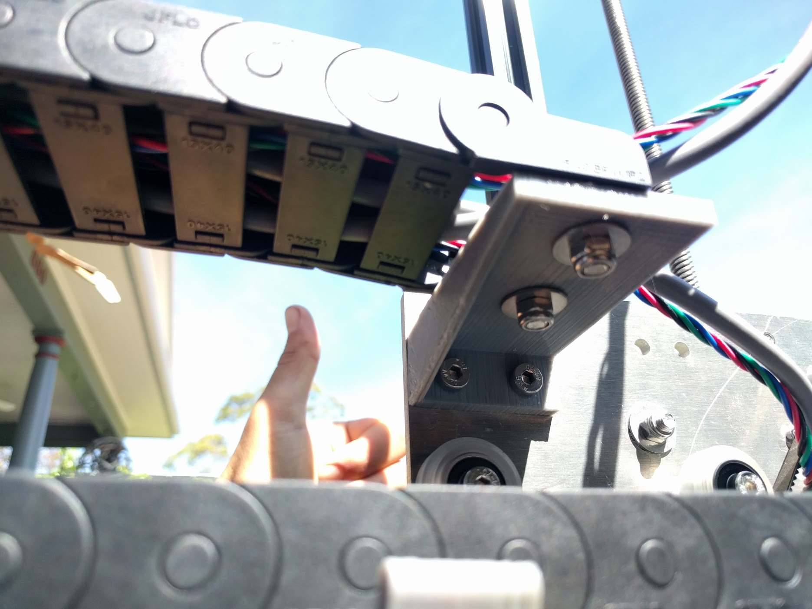
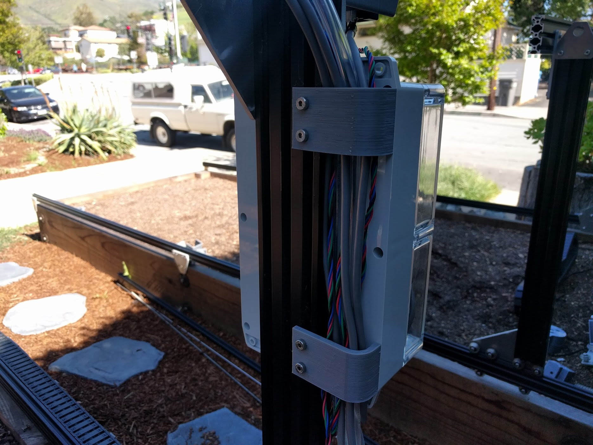

* toc
{:toc}

# Step 1: Feed the x-axis cable carrier
Feed the three **liquid/gas tubes**, two **RAMPS power cables**, **solenoid valve cable**, and **vacuum pump cable** through the **x-axis cable carrier**. Leave about 50cm of tubing and cable sticking out one of the ends for later attaching to the power supply and peripherals.



# Step 2: Mount the x-axis cable carrier
Use two **M5 x 16mm screws**, **M5 washers**, and **M5 locknuts** to attach the **x-axis cable carrier** to the single **cable carrier support** on the left-side **gantry column**.

Repeat to attach the other end of the **x-axis cable carrier** to the **cable carrier support** just behind the **track joining plate**.

# Step 3: Feed the y-axis cable carrier
Feed the **UTM cable**, all three **liquid/gas tubes**, and the **y- and z-axis motor/encoder cables** through the **y-axis cable carrier**.

# Step 4: Mount the y-axis cable carrier
Use two **M5 x 16mm screws**, **M5 washers**, and **M5 locknuts** to attach the **y-axis cable carrier** to the left-most **cable carrier support** on the **gantry main beam**.

Repeat to attach the other end of the **y-axis cable carrier** to the **long cable carrier support** on the **cross-slide**.

# Step 5: Feed the z-axis cable carrier
Feed the **UTM cable**, three **liquid/gas tubes**, and **z-axis motor/encoder cables** through the **z-axis cable carrier**.

# Step 6: Mount the z-axis cable carrier
Attach the **z-axis cable carrier** to the **cross-slide plate** using two **M5 x 16mm screws**, **M5 washers**, and **M5 locknuts**.

Repeat to attach the other end of the **z-axis cable carrier** to the **z-axis cable carrier mounting plate**.

# Step 7: Attach the cable clips
Attach the two **cable clips** to the left-side **gantry column** using four **M5 x 10mm screws** and **M5 tee nuts**.

# What's next?

 * [Universal Tool Mount](universal-tool-mount.md)
