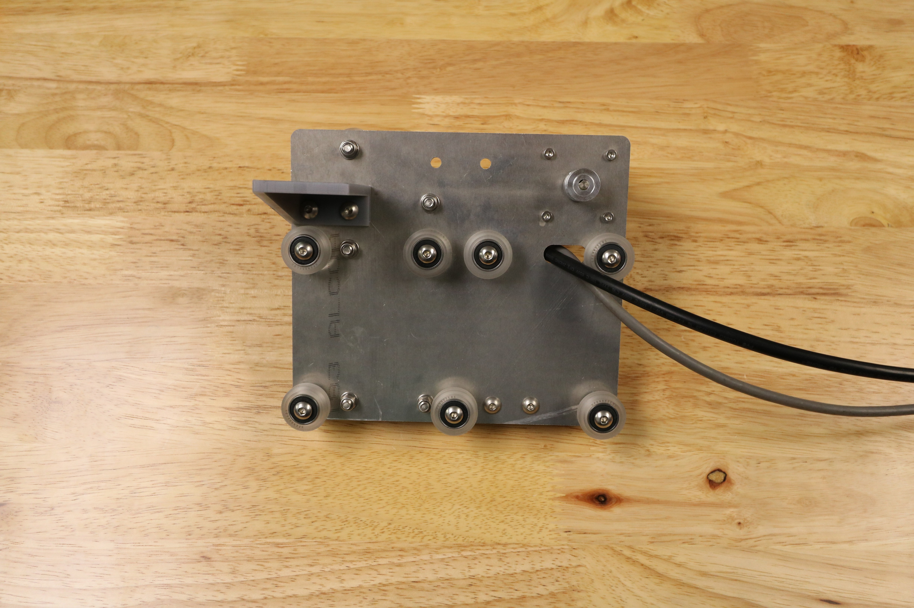
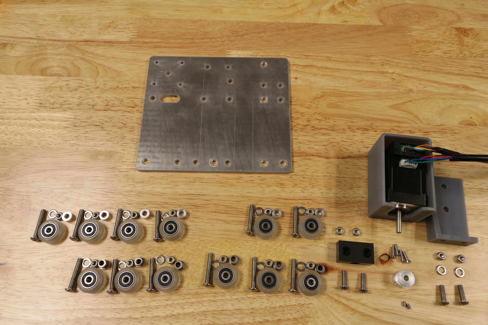

* toc
{:toc}

# Component List

To prepare for assembly, gather all the components from the table below and lay them out in a logical manner. To complete the assembly in the next pages, you will also need the following tools:
* 3mm hex (allen) wrench
* 8mm wrench

_Note: Not all required parts are shown in this image._

|Qty.                          |Component                     |
|------------------------------|------------------------------|
|1                             |Cross-Slide Plate
|2                             |M3 x 5mm Setscrews
|4                             |M5 x 16mm Screws
|12                            |M5 x 30mm Screws
|6                             |M5 x 6mm Spacers
|6                             |6mm Eccentric Spacers
|14                            |M5 Washers
|16                            |M5 Locknuts
|1                             |Horizontal Motor Housing
|1                             |Long Cable Carrier Mount
|12                            |Complete V-Wheels (one polycarbonate wheel, two 16 x 5 x 5mm ball bearings, and one 10 x 5 x 1mm shim)
|1                             |Leadscrew Block
|1                             |NEMA 17 Stepper Motor and Rotary Encoder with 2500mm length cables
|1                             |20 tooth GT2 Pulley
|2                             |Belt Clip Plates
|1                             |Y-Axis Belt
|2                             |M3 x 10mm Screws

# What's next?

 * [Cross-Slide Assembly](../FarmBot-Genesis-V1.1/cross-slide/cross-slide-assembly.md)
