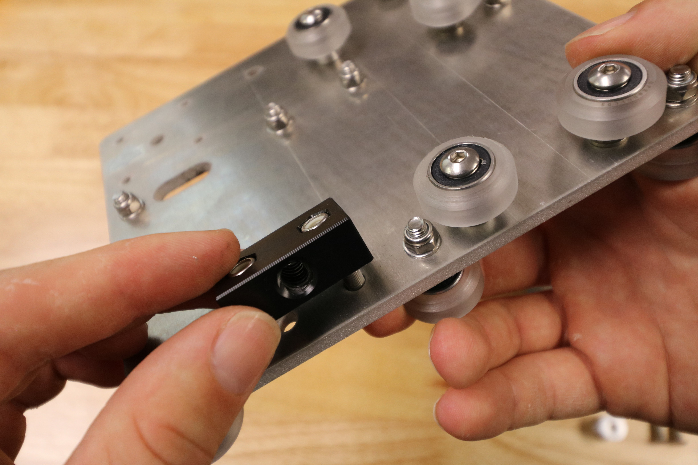



# Step 1: Add the Gantry V-Wheels

Using **M5 x 30mm screws**, **M5 washers**, and **M5 locknuts**, attach four **V-wheels** with **normal 6mm spacers** to the holes shown with normal spacers.



Add three **V-wheels** with **eccentric 6mm spacers** to the holes shown with eccentric spacers.



Cross-slide gantry V-wheels are now attached.

# Step 2: Add the Z-Axis V-Wheels

Flip the cross-slide over so that all of the components you have added so far are facing away from you.

Add **V-wheels** with **eccentric 6mm spacers** to the holes shown. The V-wheels should be secured with an **M5 washer** and an **M5 locknut** on the other side.

Using **M5 x 30mm screws**, attach two **V-wheels** with **normal 6mm spacers** to the holes shown above with normal spacers. Secure these wheels with an **M5 washer** and an **M5 locknut** on the other side of the plate.

# Step 3: Attach the Delrin Leadscrew Block
Use two **M5 x 16mm screws** and two **M5 locknuts** to attach the **delrin leadscrew block** to the **cross-slide plate**.





# Step 4: Attach the Stepper Motor
Feed the **motor and encoder cables** through the wide slot on the **cross-slide plate**. The motor should be on the side opposite the seven gantry main beam V-wheels.

Insert the **motor and encoder** into the **horizontal motor housing**.

Use four **M3x10mm screws** to attach the **stepper motor** and **motor housing** to the **cross-slide plate**. Make sure the motor and housing are on the same side of the cross-slide plate as the delrin leadscrew block, and that the motor's wiring and the motor housing's open side is facing down towards the delrin leadscrew block.

Slide a **GT2 pulley** onto the **stepper motor** shaft. Make sure that one of the setscrews is lined up with the flat spot of the motor shaft and then tighten the setscrews with the **2mm driver**.

# Step 5: Add the Cable Carrier Mounting Bracket
Use two **M5 x 16mm screws**, **M5 washers**, and **M5 locknuts** to secure the 3D printed **cable carrier mounting bracket** to the **cross-slide plate**. The bracket should be on the opposite side of the plate as the motor.



# What's next?

 * [Install the Cross-Slide on the Gantry](install-the-cross-slide-on-the-gantry.md)
