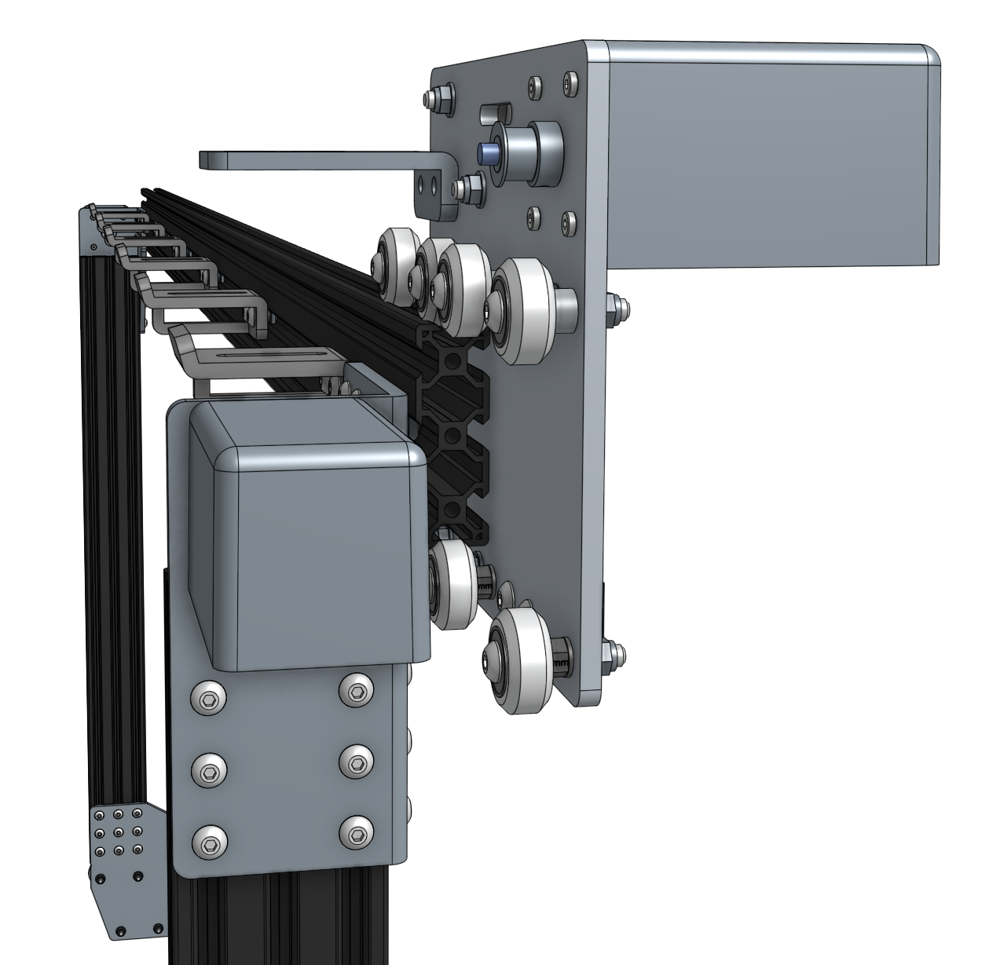
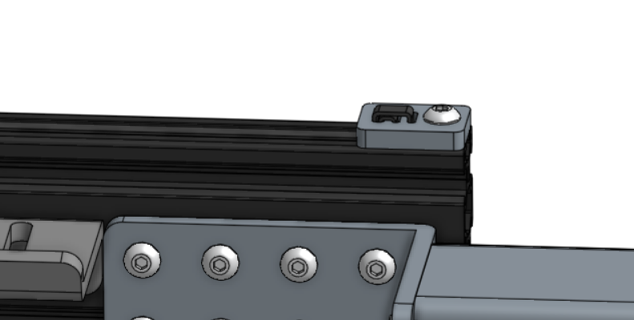
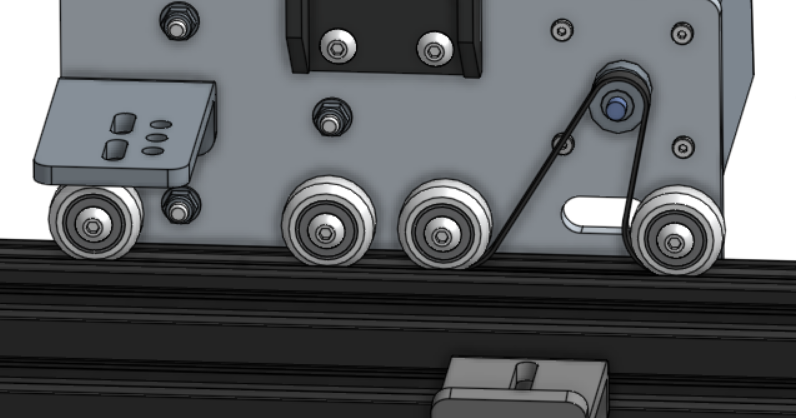

* toc
{:toc}

# Step 1: Slide the cross-slide onto the gantry main beam

# Step 2: Feed and Secure the Belts
Secure one end of the belt to a side of the gantry main beam by using a **belt clip plate**, **M5 x 10mm screw**, and **M5 tee nut**. The belt must be wrapped through the clip as outlined in [Belt Clip Installation](../../Reference-Docs/belt-clip-installation.md). Secure belt clip by tightening the M5 screw.

Grab the end of the GT2 belt and feed it under the end V-wheel of your cross-slide plate, then over the motor pulley and under the remaining three V-Wheels. The flat side of the belt should be in contact with your V-wheels.

Take the back half of the belt and feed it along the gantry beam extrusion.

Secure the belt at the other end of the gantry with another belt clip, M5 x 10mm screw, and M5 tee nut. Put a small amount of tension on the belt as you tighten the M5 screw.

# What's next?

 * [Z-Axis](../../FarmBot-Genesis-V1.1/z-axis.md)
