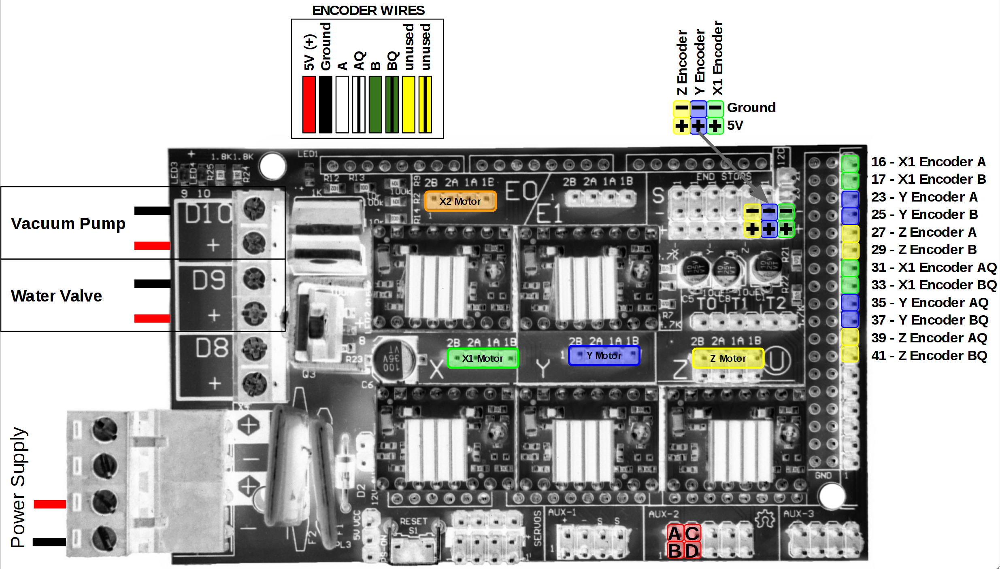

# Step 1: Attach the RAMPS Shield to the Power Supply
Attach the wire from the negative/ground input on the RAMPS shield to the ground output of the power supply, and the wire from the positive input on the RAMPS shield other wire to the +12V output of the power supply.

# Step 2: Plug in the Stepper Motors and Rotary Encoders
Plug in the **motor and encoder cables** to the **RAMPS shield** according to the following diagram.

# Step 4: Plug in the UTM Cable's Connectors
Plug in the UTM's wires to the RAMPS shield according to the [pin mapping table](../universal-tool-mount/wire-up-the-utm.md)

# Step 5: Connect the peripherals
Connect the **solenoid valve cable** to the positive and negative terminals labelled **D9** on the **RAMPS shield**.

Connect the **vacuump pump cable** to the positive and negative terminals labelled **D10** on the **RAMPS shield**.

# Step 6: Add a Power Cord to your Power Supply

Attach the **three pronged power plug** to the **power supply**.

# Step 7: Plug in the Power Supply





# What's next?

 * [Tools](../tools.md)
