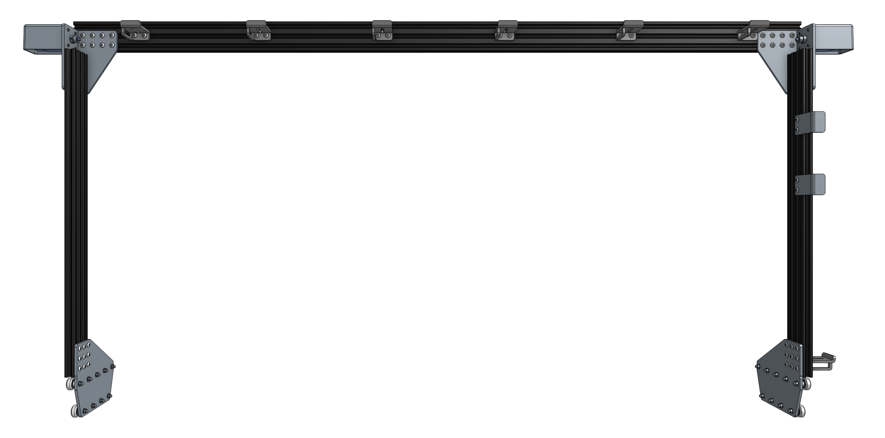

* toc
{:toc}

# Component List

To prepare for assembly, gather all the components from the table below and lay them out in a logical manner. To complete the assembly in the next pages, you will also need the following tools:
* 3mm allen (hex) wrench
* 8mm wrench



|Qty.                          |Component                     |
|------------------------------|------------------------------|
|1                             |Gantry Main Beam (20 x 60 x 1500mm aluminum extrusion)
|2                             |Gantry Columns (20 x 60 x 650mm aluminum extrusion)
|2                             |Gantry Wheel Plates
|2                             |Gantry Corner Brackets
|4                             |Belt Clip Plates
|8                             |M3 x 10mm Screws
|4                             |M3 x 5mm Setscrew
|48                            |M5 x 10mm Screws
|28                            |M5 x 30mm Screws
|10                            |M5 x 6mm Spacers
|8                             |M5 x 6mm Eccentric Spacers
|22                            |M5 Washers
|48                            |M5 Tee Nuts
|22                            |M5 Locknuts
|2                             |Horizontal Motor Housing
|6                             |Cable Carrier Supports
|18                            |Complete V-Wheels (one polycarbonate wheel, two 16 x 5 x 5mm rubber sealed ball bearings, and one M5 shim)
|1                             |NEMA 17 Stepper Motor and Rotary Encoder with 750mm length cables
|1                             |NEMA 17 Stepper Motor and Rotary Encoder with 2800mm length cables
|2                             |20 tooth GT2 Pulleys
|1                             |2m GT2 Timing Belt

# What's next?

 * [Assemble the Gantry Wheel Plates](gantry/assemble-the-gantry-wheel-plates.md)
