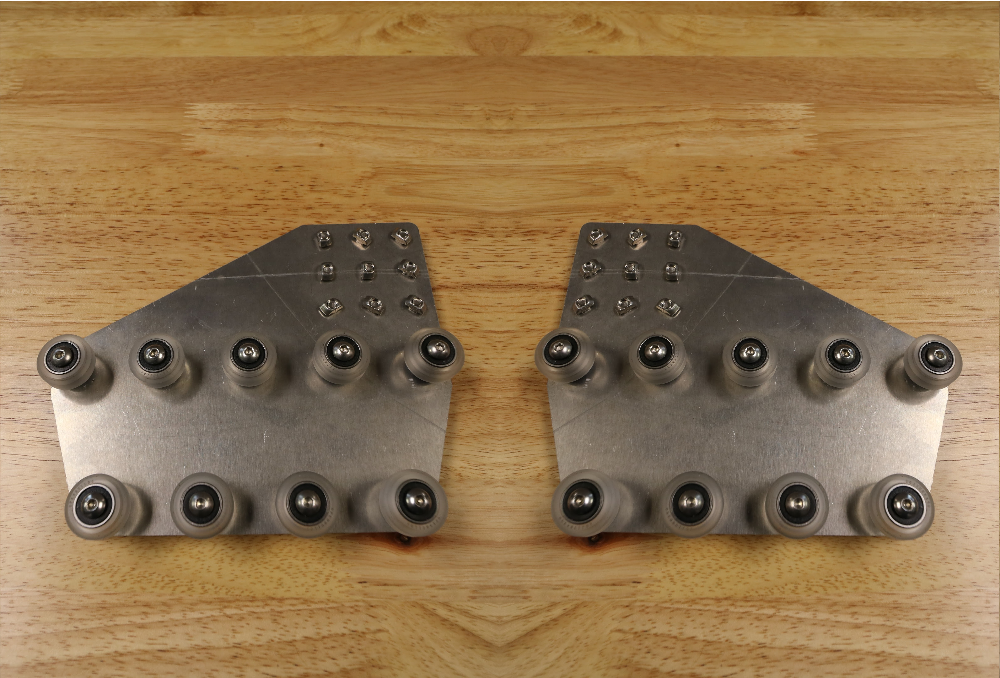
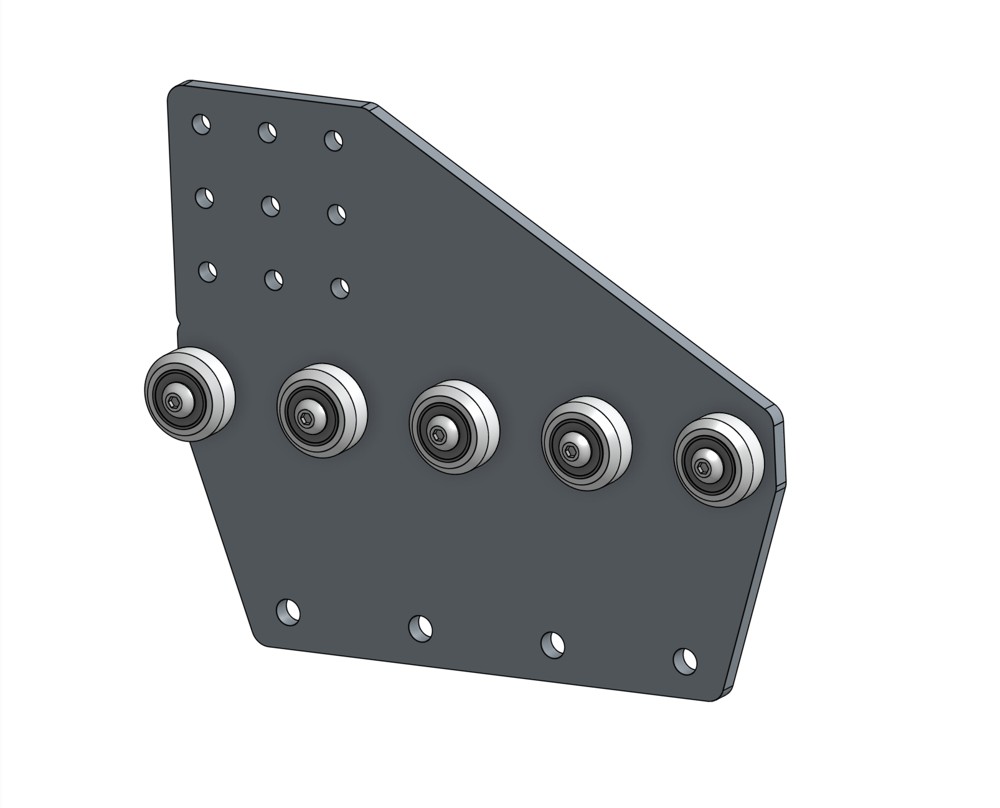
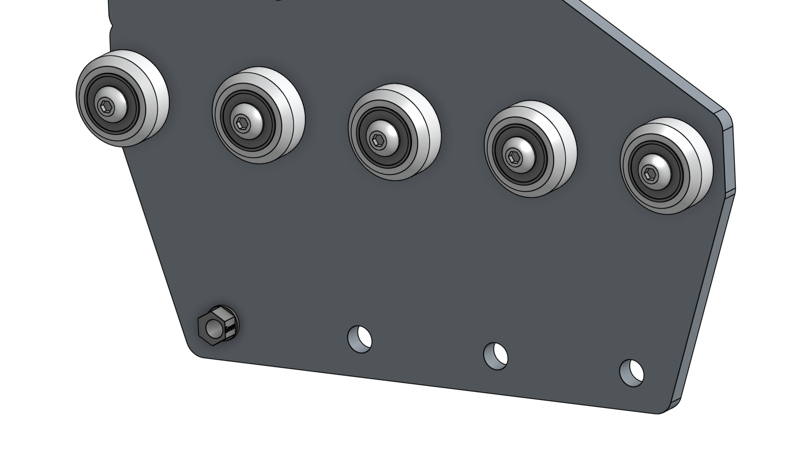
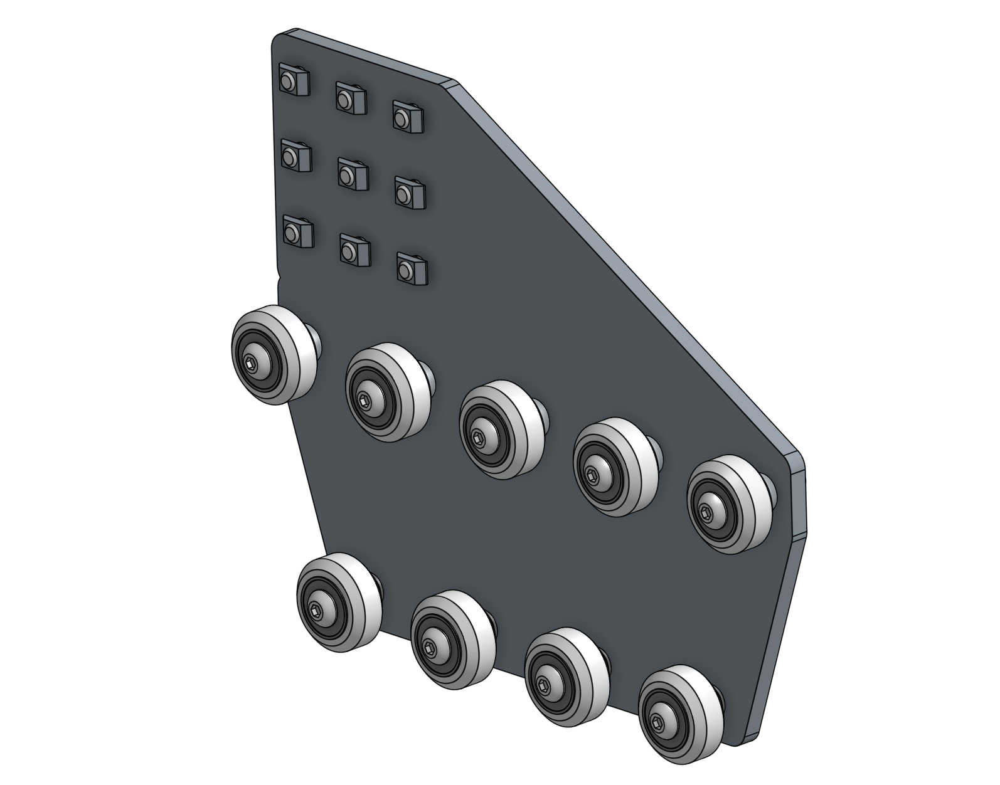
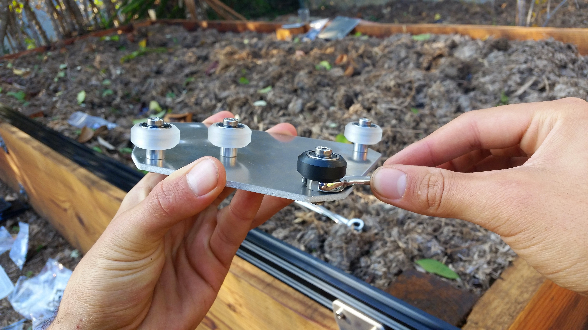

* toc
{:toc}

Before we start assembly, know that each completed gantry wheel plate will have nine wheel assemblies attached to it that allow it to slide along the tracks. The five wheels that ride on the top of the tracks will be attached to the plates with **standard spacers**. The four wheels that ride underneath the tracks will be attached to the plates with **eccentric spacers**. The eccentric spacers will be used to finely adjust the spacing between the top and the bottom wheels such that the gantry will roll smoothly and snuggly along the tracks.



# Step 1: Attach the upper V-wheels
Insert an **M5 x 30mm screw** through a **V-wheel** and a **standard 6mm spacer**. Then insert this into the **gantry wheel plate** as shown.

On the opposite side of the **gantry wheel plate**, add an **M5 washer** and an **M5 locknut** to the **M5 x 30mm screw**. Tighten the wheel assembly using the **3mm hex wrench** and the **8mm wrench**.

Repeat the above process for the remaining four V-wheels with standard spacers. All five of these wheels should be positioned on the plate in a straight line.

# Step 2: Attach the lower V-wheels
Insert an **eccentric spacer** into the **gantry wheel plate**.



Then insert an **M5 x 30mm screw** with a **V-wheel** through the spacer and tighten with an **M5 washer** and an **M5 locknut** on the other side of the plate.

Repeat the above steps for the remaining V-wheels attached with the eccentric spacers.

# Step 3: Attach the Plate/Column Mounting Screws

Insert nine **M5 x 10mm screws** into the **gantry wheel plate** and loosely attach **M5 tee nuts** onto the screws. The tee nuts should reside on the same side of the plate as the V-wheels.

You should end up with one completed gantry wheel plate assembly.

# Step 4: Repeat
Repeat the above steps for the second gantry wheel plate assembly. You should end up with two gantry wheel plate assemblies that are mirror images of each other.

# Step 5: Adjust the V-wheel spacing

The eccentric spacers on the lower wheels of each gantry wheel plate assembly are used for making fine adjustments to the spacing between the lower wheels and the upper wheels. Adjusting this spacing is the key to having your gantry move smoothly and wobble-free across the tracks.

If the spacing is too little, then the gantry will not fit onto the tracks at all or be tough to move. If the spacing is too great, then the gantry will be wobbly and loose. Let's adjust our eccentric spacing to be just right.

## Fit test
First, see if your gantry wheel plate will easily slide onto the tracks. It will very likely either be too loose and wobble, or too tight and not fit at all.



## Adjusting the eccentric spacer
1. Remove the gantry wheel plate from the tracks.
2. Using a **8mm wrench**, turn the **eccentric spacer** about 1/32 of a turn. Depending on the direction you turn the spacer, and the current orientation of the spacer, the spacing between the upper and lower V-wheels will either increase or decrease. Your goal is to adjust the spacer in the direction you need. The notch in the side of the eccentric spacer indicates the shortest distance, so moving the notch towards the upper wheels will decrease the spacing between the wheels.
3. Once you have adjusted the spacer 1/32 of a turn, do another fit test.
4. Continue the steps above for all eccentric spacers until your gantry wheel plate glides smoothly and wobble free across your tracks.
5. Then complete the steps above for the second gantry wheel plate.

{%
include callout.html
type="success"
title="The perfect fit"
content="The perfect fit is subjective and you'll need to play around to get it just right. Here is our best tip: Adjust your wheel spacing so that it is as large as possible without inducing wobbling or rattling. This will ensure you are not over tightening your wheels and risking damage.

You would rather have a wobbly wheel that you can tighten than damaged components.

Don't expect your Gantry to roll like a ball down a hill. A well fitted gantry will have a little bit of friction. Again, just play around with the spacing and use your best judgement."
%}

