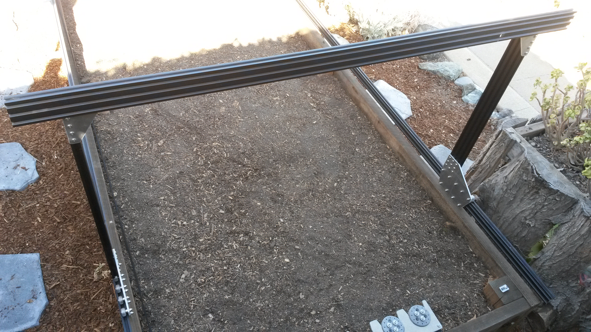

* toc
{:toc}

# Step 1: Attach the plates to the columns
For this part of the assembly you will need:
* The two gantry wheel plate assemblies
* Two 20mm x 60mm x 650mm aluminum extrusions
* A 3mm allen (hex) driver

Position the **gantry column** onto the **gantry wheel plate assembly**. The extrusion should reside on the same side of the plate as the V-wheels and the end of the extrusion should be aligned with the notch in the plate. Tighten the **M5 x 10mm screws** using a **3mm allen wrench**.

Repeat the above steps for the second gantry wheel plate and aluminum extrusion.

# Step 2: Attach the gantry corner brackets

For this step you will need:
* The two gantry wheel plate/column assemblies
* Two gantry corner plates
* 20 M5 x 10mm screws
* 20 M5 tee nuts
* A 3mm allen wrench

Lightly screw together 10 **M5 x 10mm screws** and **M5 tee nuts** on the **left-side gantry corner bracket** as shown.

Position the gantry column/plate assembly onto the corner bracket. Pay special attention to the orientation of the bracket, extrusion, and wheel plate. Then tighten the **M5 x 10mm screws** with the **3mm allen wrench**.

# Step 3: Repeat
Repeat the above steps for the second corner bracket and column. You should end up with two assemblies that are mirror images of each other. Inspect these images closely to ensure your corner brackets are attached to the columns in the correct orientation.

# Step 4: Attach the main beam to the columns

Slide the **gantry columns** onto the **tracks**.

Insert eight **M5 x 10mm screws** and **M5 tee nuts** into the front face of each of the gantry corner brackets. The tee nuts should be facing the front of FarmBot.



Lift up the **gantry main beam** and position it onto the front of the **gantry corner brackets**. The tee nuts should fit into the lower two extrusion slots of the main beam such that the top face of the main beam is 20mm above the top faces of the gantry corner brackets.

_Note that this image is from the backside of FarmBot_

Ensure that the gantry columns are vertical and then tighten the 16 **M5 x 10mm screws**. Depending on the spacing of your tracks, the gantry main beam may extend beyond the corner brackets. This is ok.

_Example gantry where the main beam extends beyond the corner brackets_

# What's next?

 * [Attach the Drivetrain](../gantry/attach-the-drivetrain.md)
