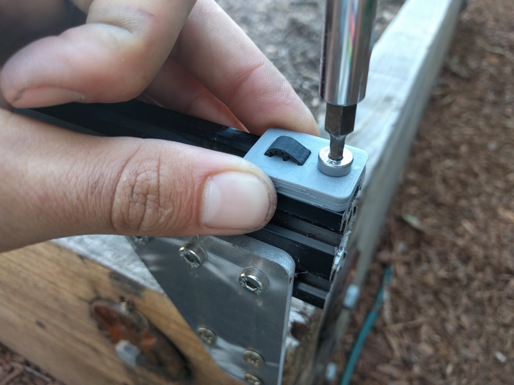
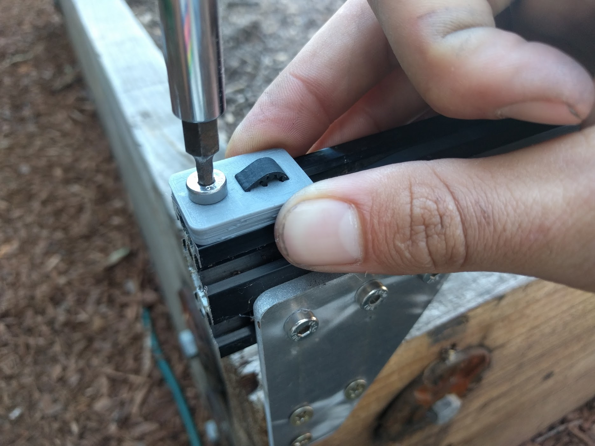

# Step 1: Feed the Belts
Feed GT2 timing belt down the center of your gantry column, ensuring the orientation is correct so that the belt teeth will engage the motor pulley properly.

Grab the end of the GT2 belt and feed it under the middle V-wheel of your gantry wheel plate,then forward along the track extrusion, and then under the front V-wheel. The flat side of the belt should be in contact with your V-wheels.





# Step 2: Secure the Belts
Secure the end of your belt to the front end of your tracks by using a **belt clip plate**, **M5 x 10mm screw**, and **M5 tee nut**.

The belt must be wrapped through the clip as outlined in [Belt Clip Installation](../../Reference-Docs/belt-clip-installation.md).

Secure belt clip by tightening the M5 screw.

Take the back half of the belt and feed it over the motor pulley, down through the extrusion, under the back V-wheel on the gantry wheel plate, and back along the track extrusions.

Secure the belt at the other end of the tracks with another **belt clip**, **M5 x 10mm screw**, and **M5 tee nut**. Put a small amount of tension on the belt as you tighten the M5 screw.

Repeat the above steps for the second belt on the other side of the gantry.

# Step 3: Equalize the Gantry
An **equalized gantry** is one that is exactly perpendicular to the **tracks** such that it is not crooked, and so that it is not being torqued. A crooked or torqued gantry can cause creaking, extra wear on the v-wheels, and introduce a high amount of friction into the system. It also just looks bad.

To equalize the gantry, gently push or pull on the gantry **from the middle of the main beam** such that it moves slowly along the tracks about 30cm. This process will remove any torque on the gantry, and ensure it is not crooked. If you push or pull the gantry from one of the gantry columns, or anywhere that is not the middle of the main beam, then you will torque the gantry and make it crooked. Don't do that.



# What's next?

 * [Cross-Slide](../cross-slide.md)
