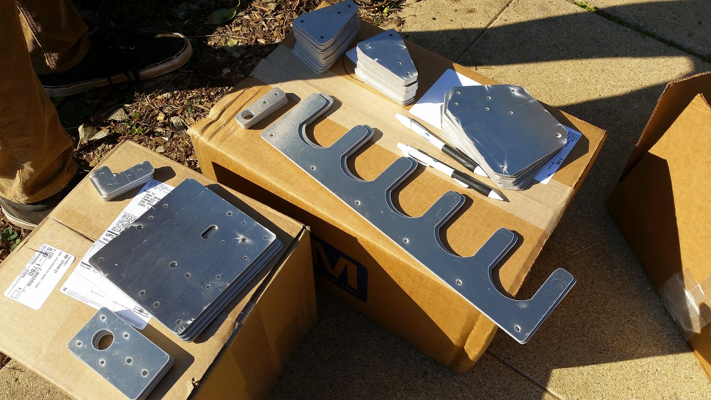

* toc
{:toc}

In order to shorten the time it takes for you to assemble your FarmBot hardware, follow these preliminary steps.



# Organize your Parts

When you first open up your FarmBot hardware package, pull out all of the component bags so that you develop a full idea for what's included, and so that you can place them on a table or the floor in locations that make sense to you.

For many, grouping parts by type helps with locating them quickly later on. For example: place all your screws in one area, all your plates in another, all your electronics in another, etc.



# What's next?

 * [Tracks](../tracks.md)
