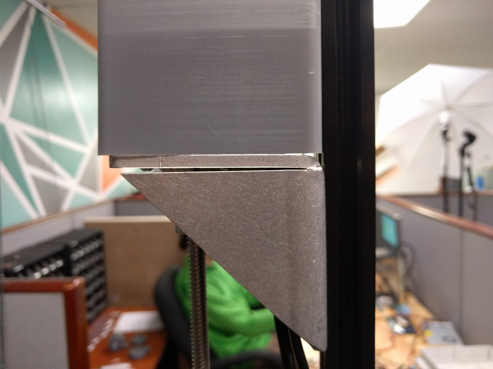
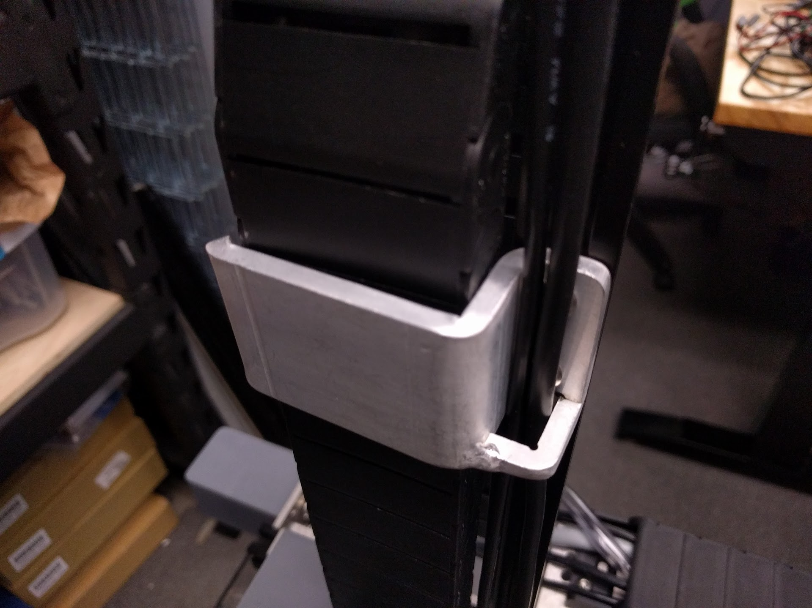
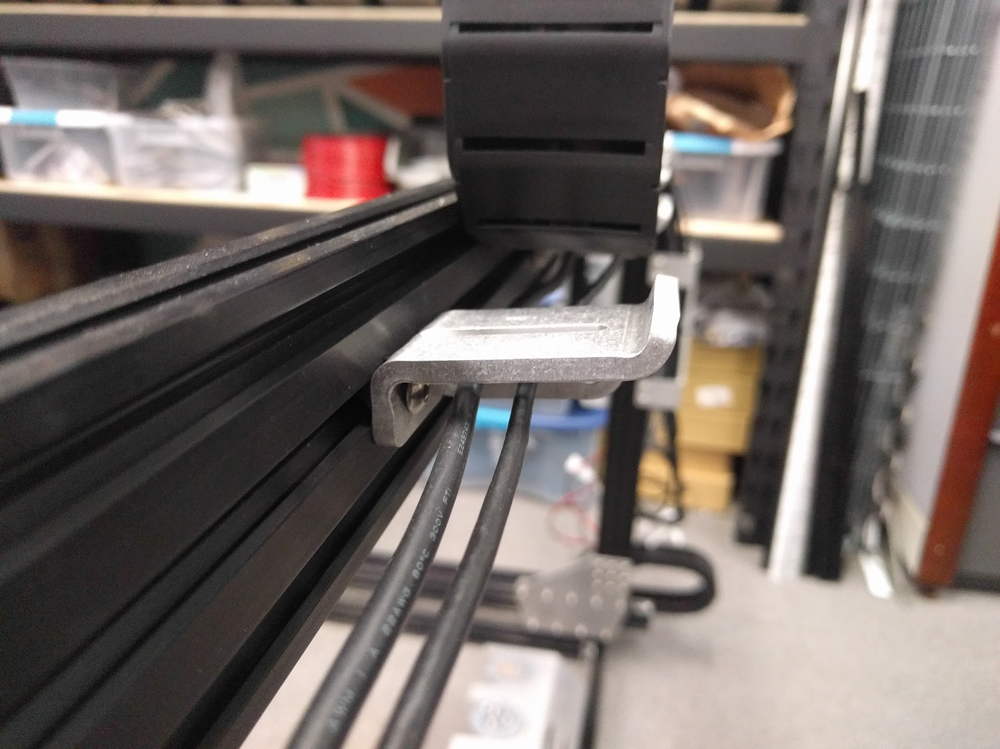
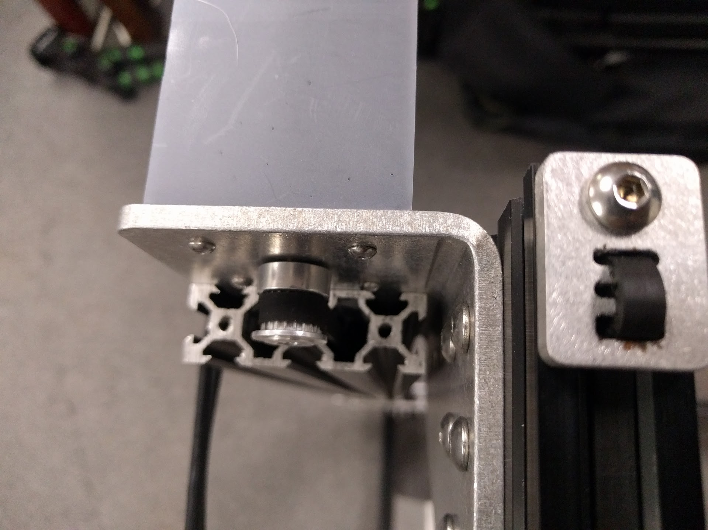

* toc
{:toc}

# Removed the driveshaft
We removed the driveshaft and replaced its functionality with a second x-axis motor mounted to the second gantry column. This change allowed us to remove the driveshaft, 5mm to 5mm flex coupling, 5mm lock collar, the driveshaft bearings, and the driveshaft bearing plate. This change makes assembly easier, and also makes available double the torque to move the gantry along the tracks. This will be important for people who want to modify their FarmBots to have longer tracks or a wider gantry - both of which increase the mass that must be pulled/moved by the x-axis motors.

# New cable carrier supports
By removing the driveshaft, we were also able to remove the driveshaft and cable carrier support components and instead use more of the normal cable carrier supports for the y-axis cable carrier. We also added an M5 slot into all of the cable carrier supports which allows any of them to be used as the short cable carrier mount, which is also now deprecated. Last, the gusset below the cable carrier supports has been changed to also function as a place to route cables, tubing, LED lights, etc.

# Camera experimentation
We're experimenting with using the Raspberry Pi camera as FarmBot's main downward facing camera. This is because most borescopes are designed to be focused at very short distances (10cm or less) while the Raspberry Pi camera can easily focus at the distances we need. Initial thoughts are that the camera affords much higher resolution photos and videos, it is physically large and requires an expensive and complicated mounting plate and cover, its bulkiness is an eyesore, and its ribbon cable is difficult and/or infeasible to connect to the pi through the 2.5+ meters of cable carrier.

# New Tool Bay
The new tool bay is a single bent piece of aluminum that gives it greater strength and reduces the number of unique and total parts in FarmBot.

# New Gantry Corner Brackets
The new gantry corner brackets are single bent pieces of aluminum that combine the functionality of the previous version's gantry corner plates, motor mount plate, and driveshaft bearing plate. The new design significantly increases the rigidity of the conenction between the gantry main beam and the gantry columns particularly against forces exerted in the x-direction on an extended z-axis (such as during tool mounting and dismounting).

# Metal Belt Clips
The first iteration of the belt clip component introduced in v1.0 was made of 3D printed plastic. However when the component was exposed to medium belt tensions and heat from the sun, it deformed and the belts became loose. The v1.1 belt clips are made of aluminum to mitigate this problem.

# Metal Cable Clips
We're testing out a version of the cable clip that is a bent metal plate. This may be unnecessarily expensive considering what the component is used for and the small loads it must endure.

# Cross-Slide
 * Changed the Z-axis cable carrier mount from two holes to a slot to allow for fine adjustments and the use of alternative cable carriers.
 * Testing a verion of the long drag chain mount as a bent metal plate.

# Z-Axis
 * We're testing out an all metal version of the Z-axis motor mount which is a single metal plate folded up and welded. This might prove to be unnecessarily expensive/overbuilt considering the expected load this component must handle.
 * Added Z-axis drag chain guides, allowing the standoffs for the drag chain mount on the Z-axis to be removed
 * Changed the drag chain mounting plate mount from two holes to a slot

# Electronics
 * Switched to motor and encoder units with removable cables
 * Now using standoffs to separate the circuit boards from the mounting plate
 * Now using a shorter, 6" USB cable
 * Switched back to using the A4988 stepper drivers after experiencing unreliable movements with the DVR8825 due to a lack of support in the firmware for adusting steps/mm. We may move back to the DVR8825 drivers in the future after steps/mm is implemented.

# Watering Nozzle
 * Added internal support structures for better SLA printing

# Bent Plate Experimentation
In this version of FarmBot Genesis we experimented a lot with bent metal plates, particularly for the z-axis motor mount, the cable carrier supports and mounts, the tool bay, the cable clips, the gantry corner brackets, and the z-axis cable carrier guides. Some of the prototypes we had made were excellent, while others were less impressive. The main problems we had were as follows:
* The parts with multiple bends (z-axis motor mount, cable carrier guides and supports) had poor dimensional tolerance and required welding in some cases. Machining will be a more reliable way to manufacture these parts, or reducing the need for multiple bends/welding.

* The components that needed a flat mounting surface (cable carrier supports) had a bend that prevented them from sitting flush and square with the part they were mounted to. These rounded corners should not be bent, but instead will need to be machined.

_Bent back edge does not sit well against the extrusion_

* Some of the gantry corner brackets did not have a tight enough inside bend corner. This prevented them from mounting flush to both the gantry column surfaces.

 * The Z-axis motor mount needed to be welded together for the gussets to actually add strength to it because of the direction of the forces from the z-axis extrusion and leadscrew. However, welding this component was difficult because of the geometry, thickness, and need to prevent the component from warping.

# What's next?

 * [Assembly Preparation](../intro/assembly-preparation.md)
