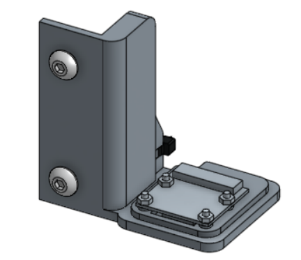
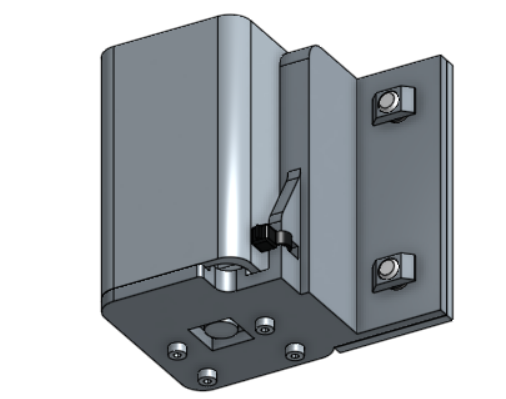

* toc
{:toc}

The camera is not a typical FarmBot tool in the sense that it does not mount onto the universal tool mount and it is not stored in the tool bay. Instead, it remains fixed in place on the z-axis next to the UTM and can be used at any time, even when other tools are mounted.

The camera itself is the [v2 Raspberry Pi Camera](https://www.raspberrypi.org/products/camera-module-v2/). It is connected directly to the raspberry pi and can take photos for weed detection, [time lapse photography](../../FarmBot-Genesis-V1.1/mods-and-add-ons/take-time-lapse-plant-photography.md) of your plants growing, and video for live streaming what is happening at the UTM.

_Simulation of weed detection software_

_Idea for how you could use the camera to make time lapses of your plants growing_

# Assembly Instructions

## Step 1: Gather the Parts and Tools
Gather all the camera parts from the table below and lay them out in a logical manner. To complete the assembly, you will also need the following tools:

  * 3mm hex (allen) driver

|Qty                           |Component                     |
|------------------------------|------------------------------|
|1                             |Raspberry Pi Camera
|1                             |Camera Mount
|1                             |Camera Cover
|2                             |Ribbon Cable to HDMI Cable Adapter
|1                             |HDMI Cable
|2                             |Ribbon Cable
|4                             |M2 Screws
|4                             |M2 Nuts
|1                             |Cable Tie
|2                             |M5 x 16mm Screws
|2                             |M5 Tee Nuts

## Step 2: Attach the Camera to the Mount
Use the four **M2 screws** and **M2 nuts** to attach the **Raspberry Pi camera** to the **camera mount**.

## Step 3: Wire it up
Insert a **ribbon cable** into the **camera** and one of the **ribbon cable to HDMI adapters**.

Insert the **HDMI cable** into the **ribbon cable to HDMI adapter**.

Insert the other end of the **HDMI cable** into the other **ribbon cable to HDMI adapter**, and then the other **ribbon cable** into that adapter too.

Plug the remaining **ribbon cable** end into the **Raspberry Pi**.

## Step 4: Mount Everything to the Z-Axis
Align the **camera cover** and the **camera mount**.

Use two **M5 x 10mm screws** and **M5 tee nuts** to attach the **camera cover** and **camera mount** to the **Z-axis extrusion**

