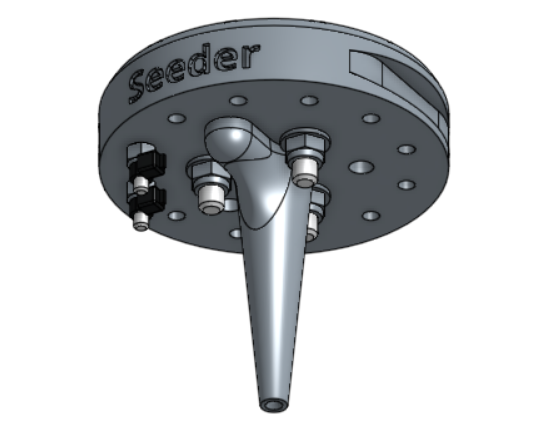

* toc
{:toc}

The seed injector works by using a strong vacuum pump to suction-hold a single seed onto the plastic tip. It is made of a single 3D printed plastic piece with a few other components screwed onto it for magnetic coupling and electronic verification with the UTM.

# Assembly Instructions



## Step 1: Gather the parts and tools
Gather all the seed injector parts from the table below and lay them out in a logical manner. To complete the assembly, you will also need the following tools:
* 2mm hex (allen) driver
* 3mm hex (allen) driver
* 6mm wrench
* 8mm wrench
* Wire strippers
* Scissors

|Qty.                          |Component                     |
|------------------------------|------------------------------|
|1                             |Seed Injector Base
|2                             |M3 x 16mm Screws
|2                             |M3 Locknuts
|3                             |M5 x 25mm Screws
|3                             |M5 Locknuts
|3                             |15 x 15 x 5mm Ring Magnets
|1                             |Jumper Wire (18 guage, 25mm length)
|2                             |Zipties

## Step 2: Install the Magnets



Secure the three **ring magnets** to the top of the **seed injector base** using three **M5 x 25mm** screws and **M5 locknuts**. The screw head should be on the magnet side of the seed injector base. Use the **3mm hex driver** and **8mm wrench** to tighten the components.

## Step 3: Install the Electrical Screws
Use the **2mm hex driver** and **6mm wrench** to attach two **M3 x 16mm screws** and **M3 locknuts** into the holes labelled 2 and 3 on the **seed injector base**. The screw heads should be on the same side of the base as the magnets.

## Step 4: Add the Jumper Wire
Use **scissors** to cut 25mm worth of **jumper wire**. Then use **wire strippers** to remove 5mm of rubber insulation from both ends of the **jumper wire**.

Attach the **jumper wire** to the bottom of each of the **M3 screws** using the two **zipties**.

# Seed Containers

We offer the following types of seed containers, each optimized for different purposes. The **seed puck** has 16 small areas for holding seeds. It is best used when planting many different crops, and when the number of seeds per hole needs to be strictly controlled.

## Seed Bins
The **seed bin** is for holding large amounts of one type of seed. This is best used when planting many plants of the same crop, for example: when growing microgreens. To use a seed bin, simply slide it into the **tool bay** and fill it with seeds. Then run a planting sequence from the web app with the corresponding seed bin sequence and location.

If desired, you can mix a variety of seed types into one seed bin and have FarmBot plant whatever it happens to grab. Keep in mind though that FarmBot will have no way of knowing which seeds it grabs, so only use this technique when you will be taking care of all those plants identically. An example for this again might be when growing microgreens - you can grow three different types in the same area at the same time, all in the same way, without having to do three planting sequences or otherwise treat them differently.

## Seed Trays
A solution to control seed quantities is to separate seeds into smaller bins, with each bin holding the appropriate number of seeds for one "trip" of the seeder. The **seed puck ** holds 16 different seed groups in mini bins (or small cups) arranged in a grid. The seeds in each cup are to be planted in a single hole. The 16 cups may hold the same seeds (for 16 of the same plant) or different seeds (for up to 16 unique plants). Multiple seed pucks may be used for larger plots or varieties. FarmBot keeps track of the plant type for each cup in each seed puck.

## Coming soon: Seed Canisters
How cool would it be if you could use the FarmBot web app to design your garden for up to a year in advance, and then purchase the seeds needed for that garden right from the app? This is the concept behind the seed canister - a year's supply of seeds based on your garden design, delivered to your door.

The seed canister would simply be many seed pucks stacked inside a canister. Each puck would have a unique ID, be filled with various types of seeds according to your design, and be sealed with plastic on top to ensure vitality. When needed, FarmBot would message you to load in a new seed puck. Or, there may be an included tool that can allow FarmBot to automatically pull out the next puck from the canister on its own!
