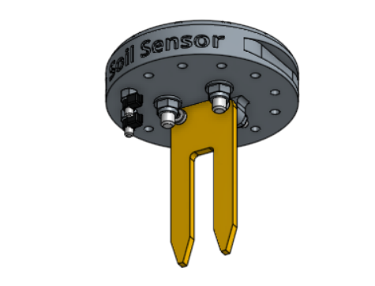

* toc
{:toc}

This single 3D printable component magnetically mounts onto FarmBot's UTM like any other tool. It works by driving the tool vertically into the soil so that the soil properties can be accurately read.

<iframe class="embedly-embed" src="//cdn.embedly.com/widgets/media.html?src=https%3A%2F%2Fsketchfab.com%2Fmodels%2Fea1104dce75f4a84b5986a6c48ae46e9%2Fembed&url=https%3A%2F%2Fsketchfab.com%2Fmodels%2Fea1104dce75f4a84b5986a6c48ae46e9&image=https%3A%2F%2Fd35krx4ujqgbcr.cloudfront.net%2Furls%2Fea1104dce75f4a84b5986a6c48ae46e9%2Fdist%2Fthumbnails%2Fbecc82bb06254aa5a683d8e982ebe49e%2Fblob.jpeg&key=02466f963b9b4bb8845a05b53d3235d7&type=text%2Fhtml&schema=sketchfab" width="640" height="360" scrolling="no" frameborder="0" allowfullscreen></iframe>

# Assembly Instructions



## Step 1: Gather the parts and tools
Gather all the soil sensor parts from the table below and lay them out in a logical manner. To complete the assembly, you will also need the following tools:
* 2mm hex (allen) driver
* 3mm hex (allen) driver
* 6mm wrench
* 8mm wrench
* Wire strippers

|Qty.                          |Component                     |
|------------------------------|------------------------------|
|1                             |Soil Sensor Base
|1                             |Moisture Sensor
|3                             |Ring Magnets (15 x 15 x 5mm)
|3                             |M5 x 25mm Screws
|3                             |M5 Locknuts
|2                             |M3 x 10mm Screws
|4                             |M3 x 16mm Screws
|6                             |M3 Locknuts
|1                             |Jumper Wire (18 guage, 30mm length)
|4                             |Zipties

## Step 2: Install the moisture sensor
Attach the **moisture sensor** to the **soil sensor base** using two **M3 x 10mm screws** and **M3 locknuts**. The sensor should be on the front side of the base's mounting tabs. The heads of the screws should be on the sensor (front) side while the locknuts should be on the mounting tabs (back) side. Do not overtighten the screws as this could damage the soil sensor circuit board.

## Step 3: Install the Magnets



Secure the three **ring magnets** to the top of the **soil sensor base** using three **M5 x 25mm** screws and **M5 locknuts**. The screw head should be on the magnet side of the soil sensor base. Use the **3mm hex driver** and **8mm wrench** to tighten the components.

## Step 4: Install the Electrical Screws
Use the **2mm hex driver** and **6mm wrench** to attach two **M3 x 16mm screws** and **M3 locknuts** into the holes labelled 2 and 3 on the **soil sensor base**. The screw heads should be on the same side of the base as the magnets.

## Step 5: Add the Jumper Wire
Use **wire strippers** to remove 5mm of insulation from both ends of the **jumper wire**.

Attach the **jumper wire** to the **M3 screws** using two **zipties**.

