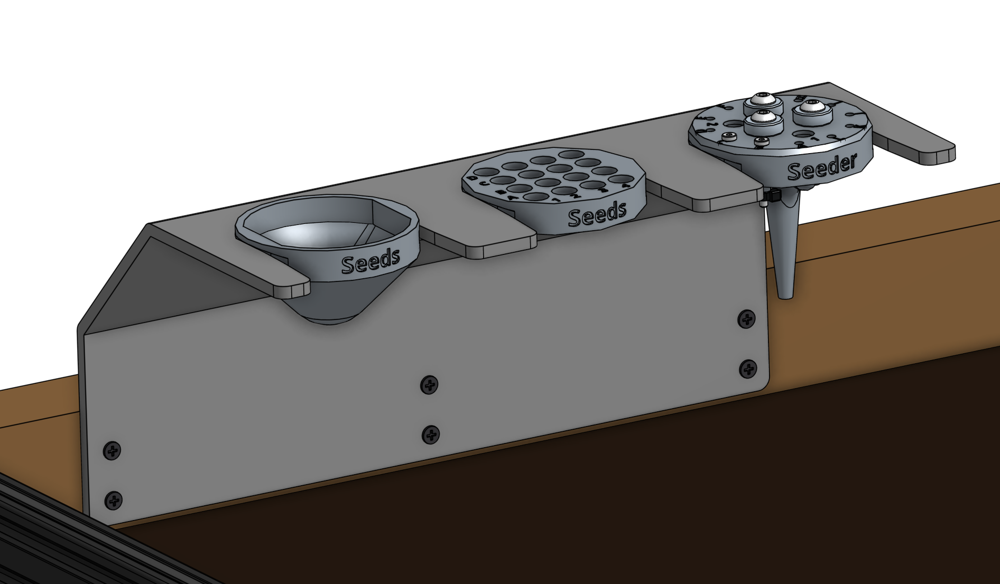

FarmBot Genesis comes with two tool bays. These simple hardware components act as holsters for your tools and are shaped in such a way that FarmBot can automatically mount and dismount tools from the bay.

# Installation Instructions



## Step 1: Gather the parts and tools
Gather necessary parts from the table below and lay them out in a logical manner. To complete the assembly, you will also need the following tools:

* Drill with a #2 phillips driver bit or a #2 phillips screwdriver

|Qty.                          |Component                     |
|------------------------------|------------------------------|
|2                             |Tool Bays
|12                            |25cm Wood Screws

## Step 2: Attach a tool bay to your supporting infrastructure
Position and attach a **tool bay** to your **supporting infrastructure** using six **25cm wood screws**.

{%
include callout.html
type="warning"
title="Orientation matters"
content="Keep in mind that FarmBot's tools are designed to be mounted by the UTM in only one orientation so that the electrical pins and magnets match up. The text on the front of the tools should line up with the FarmBot logo on the front of the UTM. Because tools can only slot into the tool bay in two orientations, **you must orient your tool bay with the longer edge parallel to the gantry main beam**.

Note: It is possible to orient the long edge parallel with the tracks, though that would require changing the orientation of the UTM by 90 degrees as well."
%}

{%
include callout.html
type="success"
title="Within reach and squared up"
content="Ensure that you mount the tool bay in a location that FarmBot's UTM can get to. Keep in mind that the UTM needs to be able to slide tools **all the way into the bay**, **all the way out**, and be able to mount and dismount tools **from above**. Make sure you verify this for each of the tool bay's slots.

The tool bay plate must be **square** with the rest of FarmBot (all three axes) in order for tools to be properly mounted and dismounted. Use shims or extra washers to make fine adjustments to the angle of your tool bay."
%}

## Step 3: Repeat
Repeat Step 2 with the second tool bay.



