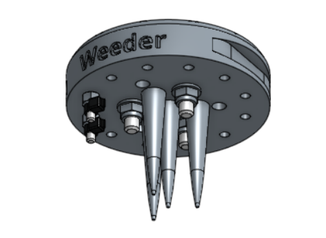

* toc
{:toc}

The weeding tool is a single 3D printable component magnetically mounts onto FarmBot's UTM like any other tool. It works by driving the tool vertically into the soil in order to push any small weeds under the soil, and disrupt their young fragile root systems.

<iframe class="embedly-embed" src="//cdn.embedly.com/widgets/media.html?src=https%3A%2F%2Fsketchfab.com%2Fmodels%2Fec9a1a4b27a743d98c51bc78307937e0%2Fembed&url=https%3A%2F%2Fsketchfab.com%2Fmodels%2Fec9a1a4b27a743d98c51bc78307937e0&image=https%3A%2F%2Fd35krx4ujqgbcr.cloudfront.net%2Furls%2Fec9a1a4b27a743d98c51bc78307937e0%2Fdist%2Fthumbnails%2F16a6dad6cc7f48b0b01cbff5d6b09a98%2F640x360.jpeg&key=02466f963b9b4bb8845a05b53d3235d7&type=text%2Fhtml&schema=sketchfab" width="640" height="360" scrolling="no" frameborder="0" allowfullscreen></iframe>

{%
include callout.html
type="success"
title="Weeding early and often"
content="This tool, and FarmBot in general, is designed for removing weeds early and often such that the weeds are always **small, young, and fragile**, and therefore easily removed.

What makes this possible is FarmBot's diligence. FarmBot has 24 hours a day to maintain your garden meticulously. It can be configured to remove weeds every single day that a human would never waste their time with. This prevents weeds from even having a chance at becoming a real problem.

If you configure FarmBot well, you will never even notice weeds in your garden because they will never have a chance to survive beyond germination. Over time, the number of weed seeds in your growing area will approach zero."
%}



# Assembly Instructions



## Step 1: Gather the parts and tools
Gather all the weeding tool parts from the table below and lay them out in a logical manner. To complete the assembly, you will also need the following tools:
* 2mm hex (allen) driver
* 3mm hex (allen) driver
* 6mm wrench
* 8mm wrench
* Wire strippers

|Qty.                          |Component                     |
|------------------------------|------------------------------|
|1                             |Weeder Base
|2                             |M3 x 16mm Screws
|2                             |M3 Locknuts
|3                             |M5 x 25mm Screws
|3                             |M5 Locknuts
|3                             |15 x 15 x 5mm Ring Magnets
|1                             |18 guage x 5cm Jumper Wire
|2                             |Zipties

## Step 2: Install the Magnets



Secure the three **ring magnets** to the top of the **weeder base** using three **M5 x 25mm** screws and **M5 locknuts**. The screw head should be on the magnet side of the weed suppressor base. Use the **3mm hex driver** and **8mm wrench** to tighten the components.

## Step 3: Install the Electrical Screws
Use the **2mm hex driver** and **6mm wrench** to attach two **M3 x 16mm screws** and **M3 locknuts** into the holes labelled 2 and 3 on the **weeder base**. The screw heads should be on the same side of the base as the magnets.

## Step 4: Add the Jumper Wire
Use **wire strippers** to remove 1cm of insulation from both ends of the **jumper wire**.

Attach the **jumper wire** to the **M3 screws** using two **zipties**.

