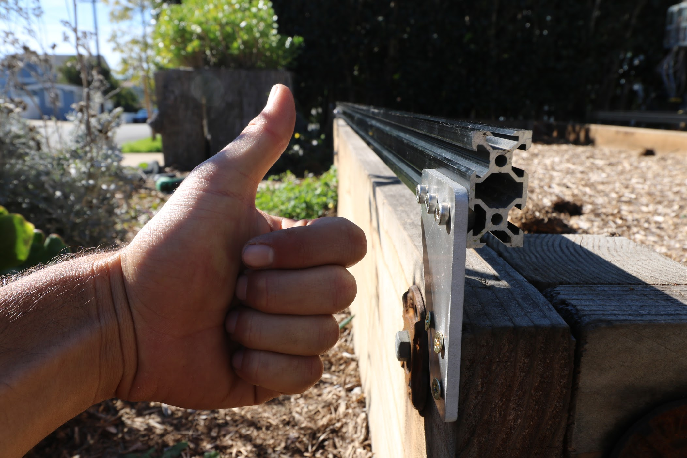

* toc
{:toc}

FarmBot's tracks allow the gantry to move precisely along the x-axis. The tracks are designed to attach to a raised bed or similar supporting infrastructure. Standard tracks are 3m in length, though one could extend them with additional extrusions, connecting plates, cable carrier supports, and hardware, as well as longer x-axis cable carrier, belt, wiring, and tubing.

<iframe width="100%" height="480" src="https://sketchfab.com/models/813d7caf919541beb15721d5ae51b164/embed?ui_controls=0&amp;ui_infos=0&amp;ui_related=0" frameborder="0" allowfullscreen mozallowfullscreen="true" webkitallowfullscreen="true" onmousewheel=""></iframe>

# Supporting Infrastructure

FarmBot's tracks need to be attached to supporting infrastructure. Where you decide to install your FarmBot will determine how you setup your tracks and therefore what type of supporting infrastructure you need. You might attach your track plates to 2x4 wood posts, aluminum extrusion posts, or to existing infrastructure such as a raised bed or greenhouse walls. The choice is up to you how you set this up.



# What's next?

 * [Building a Raised Bed](../FarmBot-Genesis-V1.1/tracks/building-a-raised-bed.md)
 * [Setting up Wooden Posts Only](../FarmBot-Genesis-V1.1/tracks/setting-up-wooden-posts-only.md)
