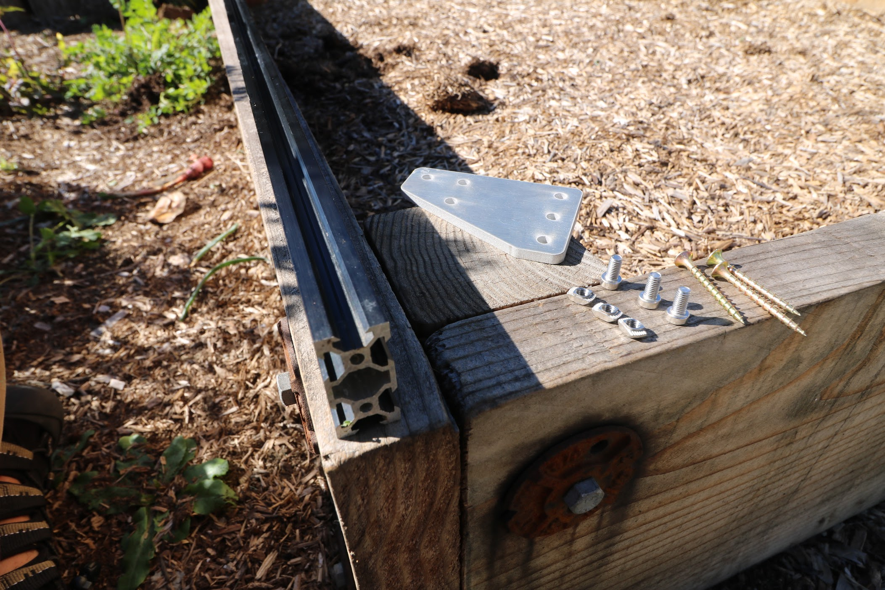
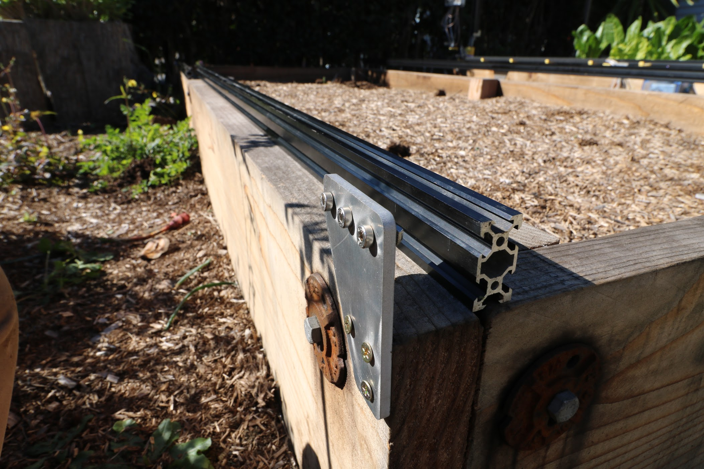
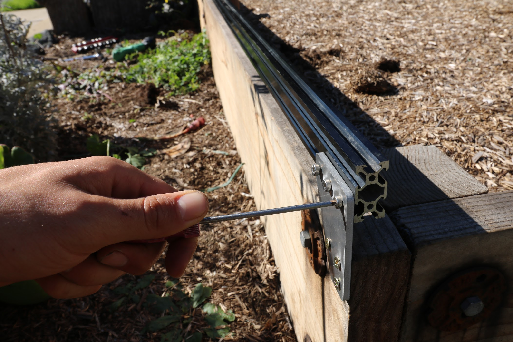
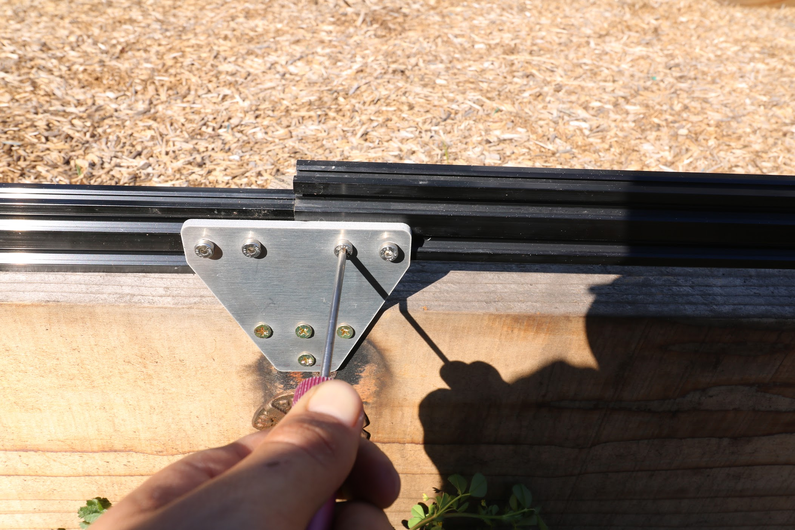
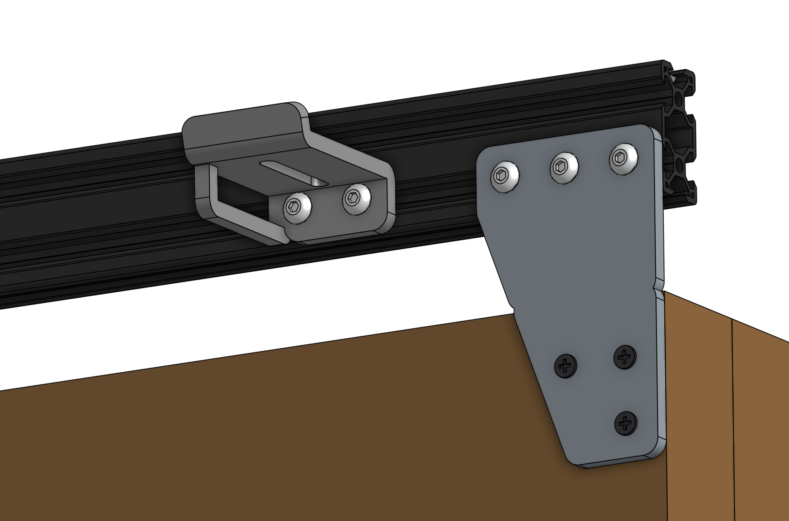
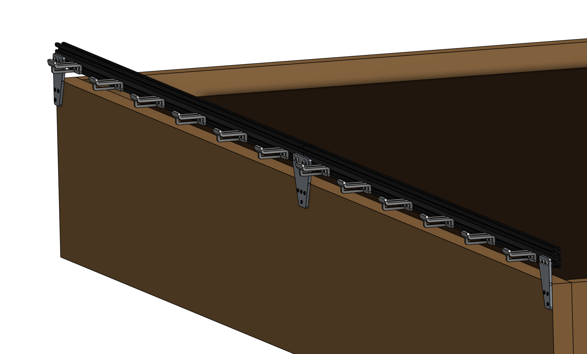





# Step 1: Gather the Parts and Tools
Gather all the parts from the table below and lay them out in a logical manner. To complete the assembly, you will also need the following tools:
* 3mm allen (hex) wrench
* Number 2 phillips screwdriver *or* electric drill with a Number 2 phillips driver bit

|Qty.                          |Component                     |
|------------------------------|------------------------------|
|4                             |Track Extrusions (20 x 40 x 1500mm)
|4                             |Track End Plates
|2                             |Track Joining Plates
|20                            |25cm Wood Screws
|48                            |M5 x 10mm Screws
|48                            |M5 Tee Nuts
|12                            |Cable Carrier Supports

# Step 2: Layout the Track Extrusions
Lay out all of the **track extrusions** in the location that you want to attach them to your **supporting infrastructure**. Make sure that extrusions are fully butted against each other. This will help you attach the plates in the correct location.



# Step 3: Attach a Track End Plate

Position a **track end plate** as shown below and screw it into the **supporting infrastructure** with three **wood screws**.

{%
include callout.html
type="success"
title="Vertically aligned"
content="All of the track extrusions must be the same height and aligned along their length so that the gantry can move across the tracks smoothly. This means that all of the track end plates and track joining plates need to be **vertically aligned**.

We've added small **notches** into the track end plates and track joining plates so that you can position the plates with perfect vertical alignment with respect to your supporting infrastructure and each other. *You should only use these notches if the top edge of your supporting infrastructure is level and straight.*

If the top edge of your supporting infrastructure is *not* level or straight, then you will need to manually ensure that your track plates are vertically aligned with other means. Because the gantry has wheels that ride on the bottom face of the track extrusions, you need to ensure that the bottom of the track extrusion will be at least 25mm away from the top of the supporting infrastructure so that the wheels have adequate clearance."
%}

Lightly screw three **M5 x 10mm** screws and **tee nuts** to the **track end plate**. Orient the tee nuts horizontally.



# Step 4: Attach a Track Joining Plate
Position a **track joining plate** such that one half of it will be able to attach to each **track extrusion** and so that it is vertically aligned with the first **track end plate**. Screw the plate into the **supporting infrastructure** with four **wood screws**.

Lightly screw four **M5 x 10mm** screws and **tee nuts** to the **track joining plate**. Orient the tee nuts horizontally.

# Step 5: Attach the first Track Extrusion
Lift the **track extrusion** and position the lower V-slot onto the **tee nuts** of the **track end plate**.



Lightly tighten one of the **M5 x 10mm screws** using the **3mm hex driver** to prevent the extrusion from falling off, while still allowing it to move loosely.

Lift the other end of the **track extrusion** and position the lower V-slot onto the **tee nuts** of the **track joining plate**. Verify that the track extrusion is positioned correctly, and then tighten all five of the **M5 x 10mm screws** that hold it in place.



# Step 6: Attach the second Track End Plate and Extrusion
Follow the instructions in Steps 3 and 5 to attach the second **track end plate** and second **track extrusion**.



_See the gap in the track extrusions? You don't want that!_

_Perfectly aligned track extrusions are key to smooth gantry movements!_

# Step 7: Install the other track
Repeat steps 3 thru 6 for the other track. Ensure that the tracks are parallel to each other prevent the gantry from binding.

# Step 8: Add the cable carrier supports
Insert two **M5 x 10mm screws** into a **cable carrier support** and lightly screw on two **M5 tee nuts**. Place the assembly into the lower slot of the left side **track**, near the end of the track. Use the **3mm driver** to tighten the screws.

Add 11 more **cable carrier supports** evenly along the left side track so that there are 12 total installed. There should be six supports per **track extrusion**.



# What's next?

 * [Gantry](../gantry.md)
