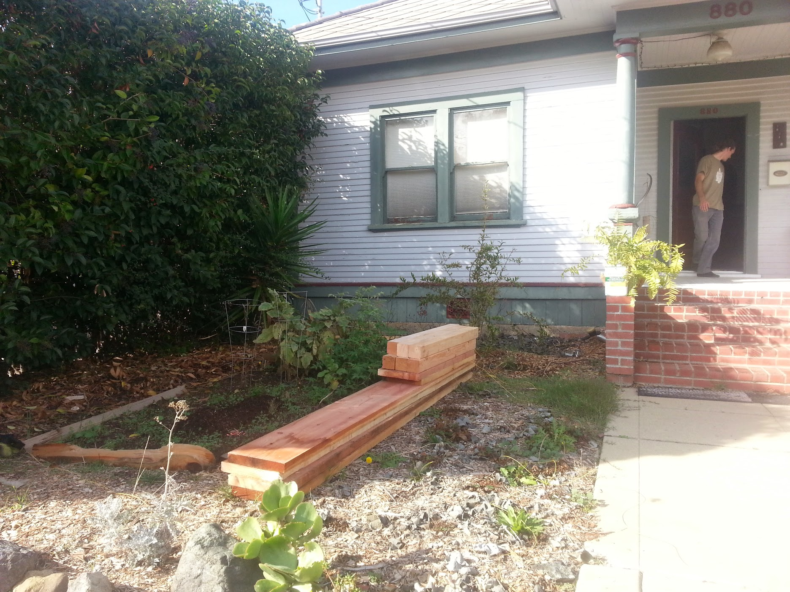
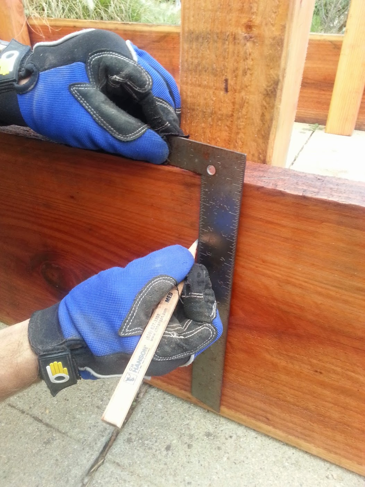

* toc
{:toc}

Building a raised bed is the recommended method for installing a FarmBot. In these instructions we show you how to build a simple but sturdy raised bed suited for FarmBot Genesis. This design will fit into most yards, look great, and last a lifetime.

<iframe width="100%" height="480" src="https://sketchfab.com/models/5002768ae94f4013a7dad664bdfc42ad/embed?ui_controls=0&amp;ui_infos=0&amp;ui_related=0" frameborder="0" allowfullscreen mozallowfullscreen="true" webkitallowfullscreen="true" onmousewheel=""></iframe>

## Notes from above 3D tour:
1. **3 x 1.5m** Recommended maximum outer dimensions of the raised bed
2. **Reinforced** Prevent bowing of your bed and your tracks by reinforcing the bed walls every 1.5m with a 4x4 post buried in the ground.
3. **Hefty** Heavy duty (1.5 to 4 inch) walls will last a lifetime and resist bowing under soil expansion pressures.
4. **Filled to the brim** Fill your bed with rich, soft soil and compost. Leave out rocks and branches.

_Dimensions are in mm. Dimensions are approximate.
Posts and hardware not shown._



# Step 1: Acquire Materials
  * Purchase some high quality wood from your local lumber yard. Preferably you will use thicker wood (1-2 inches thick) so that it does not warp easily. This is important because your tracks will need to be very straight for FarmBot to work reliably, and your tracks will be directly attached to the raised bed. When soil becomes wet and when plants grow, this can cause tremendous force on the wood walls of the bed, forcing them outwards. Thicker wood and extra posts are preferred. This example uses 2x12" nominal redwood, and 4x4" nominal wood posts spaced roughly every 5 feet, or one 1.5m extrusion length.
  * You'll also need to pick up some hardware for fastening your raised bed together. For example, 3/8" x 3" lag bolts and some rustic looking washers.
  * Depending on your climate, you'll likely want to put some type of sealer, stain, or polyurethane on your wood to protect its color and water resistance like Thompson's water sealer.

# Step 2: Dig Post Holes
Set up your lumber roughly where your bed will be so that you may find out where to dig your post holes.

Dig your post holes. A post hole digger and pick axe can help greatly.

# Step 3: Prepare Your Materials
Sand your wood to remove any weird markings and splinters.

Stain your wood.

Setup your lumber upside down on a flat surface. We'll drill holes and screw together our bed in this orientation and then flip it over and position it in our holes.

# Step 4: Assemble Your Raised Bed
Measure out and mark where your posts will be. Remember this must correspond to where you dug your post holes!

Clamp your posts into place, making sure they are square with the bed sides.

Mark locations where you will drill holes and fasten your boards to your posts. This example uses 2 lag bolts and washers per board/post interface.



Pre-drill the holes for your lag bolts.

Use a ratcheting socket wrench to quickly screw in your lag bolts.



Notice how the corner bolts are staggered so that they do not hit each other, and the washers are oriented the same way.

# Step 5: Install Your Raised Bed
* Once your bed is assembled, flip it over and position it in your holes. You may need to pull it out and dig out some of your holes a little more. Use a level to make sure the bed is level.
* Fill it with a mix of soil and compost.

.jpg)



