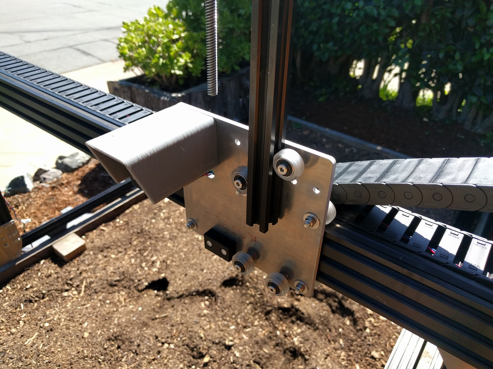
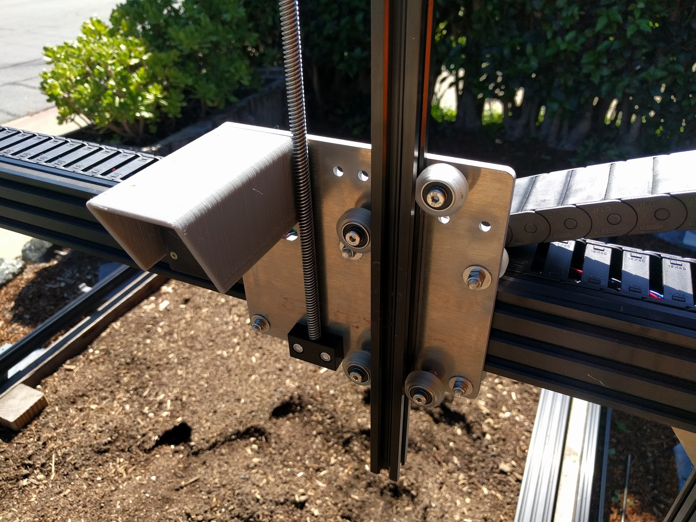
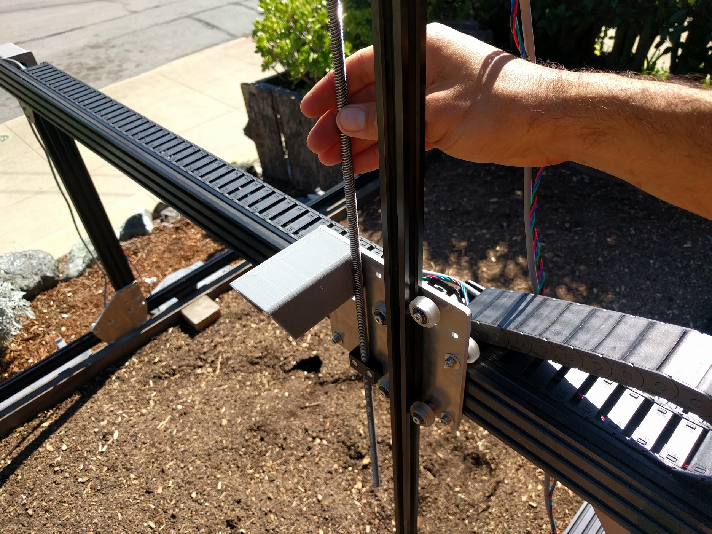

* toc
{:toc}

# Step 1: Attach the z-axis to the cross-slide
Slide the **z-axis extrusion** through the wheels on the **cross-slide** until the **leadscrew** is resting on the **leadscrew block**.



# Step 2: Screw the screw
Hand rotate the **leadscrew** clockwise so that it threads into the **leadscrew block**.

# What's next?

 * [Cables and Tubing](../cables-and-tubing.md)
