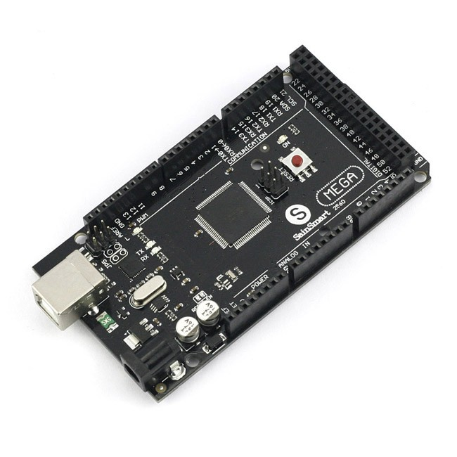
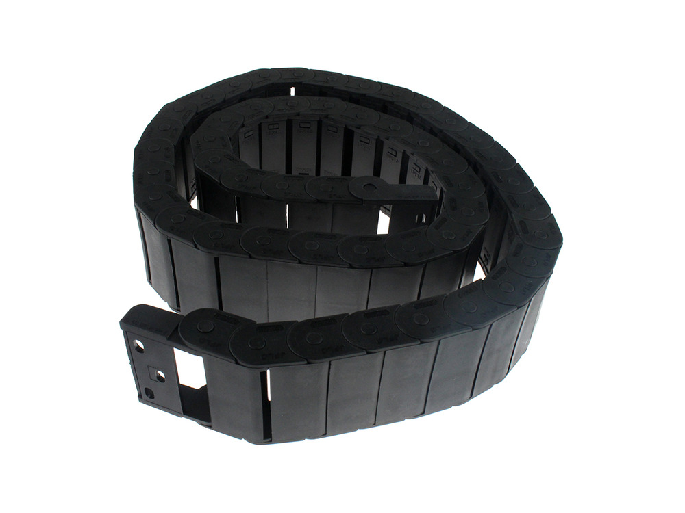
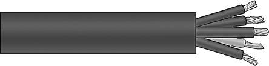

* toc
{:toc}

|Qty.                          |Component                     |$/Unit                        |Subtotal                      |
|------------------------------|------------------------------|------------------------------|------------------------------|
|1                             |[Electronics Housing](#electronics-housing)|$32.34                        |$32.34
|1                             |[Power Supply](#power-supply)|$35.00                        |$35.00
|1                             |[5V Power Adapter](#5v-power-adapter)|$9.95                         |$9.95
|1                             |[Raspberry Pi 3](#raspberry-pi-3)|$40.00                        |$40.00
|1                             |[Arduino Mega, RAMPS shield, Stepper Drivers, and USB cable](#arduino-mega-2560)|$49.00                        |$49.00
|4                             |[NEMA 17 Stepper Motors, Rotary Encoders, and Cables](#nema-17-stepper-motors)|$70                           |$280.00
|4                             |[15 x 40 x 1000mm Cable Carrier](#cable-carrier)|$25.45                        |$101.80
|1                             |[Universal Tool Mount Cable](#universal-tool-mount-cable)|$19.20                        |$19.20
|1                             |[Soil Sensor](#soil-sensor)|                              |
|1                             |[Solenoid Valve](#solenoid-valve)|$7.95                         |$7.95
|1                             |[Vacuum Pump](#vacuum-pump)|$45.58                        |$45.58
|2                             |[Peripheral Cable](#peripheral-cable)|$3.00                         |$6.00
|2                             |[Jumper Wire](#jumper-wire)|$0.50                         |$1.00
|**19**                        |**TOTALS**                    |                              |**$627.82**

# Electronics Housing
This waterproof housing protects FarmBot's electronics from rain and debris. It has a clear front cover and keeps water out with a rubber gasket.

|                              |                              |
|------------------------------|------------------------------|
|**Material**                  |Polycarbonate
|**Waterproof?**               |Yes
|**Cover Color**               |Clear
|**Height**                    |8.75"
|**Width**                     |5.75"
|**Depth**                     |3"
|**Cover Type**                |Lift off, screw mounted
|**Recommended Supplier**      |McMaster Carr - [Part Number 1037N9](http://www.mcmaster.com/#1037n9)
|**Price**                     |$32.44
|**Quantity Needed**           |1

# Power Supply

|                              |                              |
|------------------------------|------------------------------|
|**Output**                    |12 volt, 30 amp DC
|**Input**                     |110 or 220 volt AC
|**Dimensions**                |--
|**Recommended Supplier**      |[OpenBuilds](http://openbuildspartstore.com/12v-30a-power-supply/)
|**Price**                     |$35
|**Quantity Needed**           |1

# 5V Power Adapter

|                              |                              |
|------------------------------|------------------------------|
|**Trade Name**                |UBEC DC/DC Step-Down (Buck) Converter
|**Input Voltage**             |6-23V
|**Output Voltage**            |5V (+-5%)
|**Output Current**            |3A continuous, 5A peak
|**Recommended Supplier**      |[Adafruit](https://www.adafruit.com/products/1385)
|**Price**                     |$9.95
|**Quantity Needed**           |1

# Raspberry Pi 3

|                              |                              |
|------------------------------|------------------------------|
|**CPU**                       |1.2Ghz Quad Core Broadcom BCM2837 64-bit ARMv8 processor
|**RAM**                       |1GB LPDDR2 (900 MHz)
|**WiFi**                      |2.4GHz 802.11n wireless, BCM43143 chip
|**Bluetooth**                 |Bluetooth 4.1 Classic, Bluetooth low energy (BLE)
|**Ethernet**                  |Built-in 10/100 Ethernet
|**USB**                       |4x USB 2.0 ports
|**Storage**                   |MicroSD
|**GPIO**                      |40-pin header
|**Recommended Supplier**      |[Adafruit](https://www.adafruit.com/products/3055)
|**Other Suppliers**           |Amazon, Radio Shack, Spark Fun, Element14
|**Price**                     |$39.95
|**Quantity Needed**           |1

# Arduino Mega 2560
This is the microcontroller that powers FarmBot. It receives G-code commands from the Raspberry Pi and then sends signals to move motors, read sensors, activate peripherals, and more.

|                              |                              |
|------------------------------|------------------------------|
|**Microcontroller**           |ATmega2560
|**Operating Voltage**         |5V
|**Input Voltage**             |7-12V recommended, 60-20V limts
|**Digital I/O Pins**          |54 (15 provide PWM output)
|**Analog Input Pins**         |16
|**DC Current per I/O Pin**    |40 mA
|**DC Current for 3.3V Pin**   |50 mA
|**Flash Memory**              |256 KB (8 KB used by bootloader)
|**SRAM**                      |8 KB
|**EEPROM**                    |4 KB
|**Clock Speed**               |16 MHz
|**Recommended Supplier**      |[Sainsmart](http://www.sainsmart.com/arduino/control-boards/sainsmart-mega2560-r3-development-board-compatible-with-arduino-mega2560-r3.html)
|**Other Suppliers**           |Arduino, Amazon, Adafruit, Spark Fun
|**Price**                     |$11.83
|**Quantity Needed**           |1

# RAMPS Shield

|                              |                              |
|------------------------------|------------------------------|
|**Recommended Supplier**      |[SainsSmart](http://www.sainsmart.com/sainsmart-3d-printer-control-board-ramps-1-4-for-arduino-reprap-mendel-prusa.html)
|**Other Suppliers**           |Amazon, Spark Fun, Adafruit
|**Price**                     |$12.82
|**Quantity Needed**           |1

# Stepper Drivers

|                              |                              |
|------------------------------|------------------------------|
|**Trade Name**                |A4988 Stepper Motor Driver Carrier (Header Pins Soldered)
|**Microstepping**             |full-step, half-step, 1/4-step, 1/8-step, and 1/16-step
|**Output Current**            |1.5 A per phase without a heat sink or forced air flow (rated for up to 2.0 A per coil with sufficient additional cooling)
|**Protections**               |Over-temperature thermal shutdown, crossover-current protection, and under-voltage lockout, short-to-ground, and shorted-load
|**Adjustable?**               |Current control lets you set the maximum current output with a potentiometer, which lets you use voltages above your stepper motor’s rated voltage to achieve higher step rates
|**Connectors**                |0.1″ male header pins
|**Recommended Supplier**      |[Pololu](https://www.pololu.com/product/1182)
|**Other Suppliers**           |Amazon
|**Price**                     |$5.95/each
|**Quantity Needed**           |4

# USB Cable

Connects the Raspberry Pi to the Arduino.

|                              |                              |
|------------------------------|------------------------------|
|**Connector 1**               |USB 2.0 Type A Male
|**Connector 2**               |USB 2.0 Type B Male
|**Length**                    |6 inches
|**Recommended Supplier**      |[Belkin/Amazon](https://smile.amazon.com/Belkin-Components-Device-Daisy-Chain/dp/B000067RMY/ref=pd_sim_sbs_147_2?ie=UTF8&dpID=31G1lSlmR0L&dpSrc=sims&preST=_AC_UL320_SR320%2C320_&refRID=7P8Q2GQ8SQ8N2NM6EEH9)
|**Other Suppliers**           |Monoprice, Best Buy, Fry's Electronics
|**Price**                     |$4.85
|**Quantity Needed**           |1

# NEMA 17 Stepper Motors

|                              |                              |
|------------------------------|------------------------------|
|**Resolution**                |200 steps/revolution (1.8 deg/step)
|**Winding Type**              |Bipolar
|**Voltage**                   |
|**Current Draw**              |1.68A
|**Wiring**                    |4 wire
|**Primary Shaft**             |5mm diameter, ___ length
|**Secondary Shaft**           |5mm diameter, ___length
|**Mount Hole Pattern**        |4x M3 holes, standard NEMA 17 pattern
|**Cable Length**              |1m, 3m, and 5m
|**Cable Connector 1 (motor)** |
|**Cable Connector 2 (RAMPS)** |2.54mm pitch 4 pin dupont connector
|**Recommended Supplier**      |Alibaba
|**Price**                     |* 1m - $20.00 * 3m - $25.00 * 5m - $30.00
|**Quantity Needed**           |* 1m - 1 * 3m - 2 * 5m - 1

# Rotary Encoders

|                              |                              |
|------------------------------|------------------------------|
|**Resolution**                |200 lines/revolution
|**Bore**                      |5mm
|**Output Type**               |Differential
|**Cable Lengths**             |1m, 3m, and 5m
|**Cable Connector 1 (encoder)**|MIC 6
|**Cable Connector 2 (RAMPS)** |None
|**Recommended Supplier**      |[US Digital](http://www.usdigital.com/) * Encoder Part Number: E4T-200-197-D-H-M-B * 1m Cable Part Number: CA-MIC6-SH-NC-3 * 3m Cable Part Number: CA-MIC6-SH-NC-9 * 5m Cable Part Number: CA-MIC6-SH-NC-15
|**Prices**                    |* Encoder: $54.21 * 1m Cable: $12.46 * 3m Cable: $18.46 * 5m Cable: $24.46
|**Quantity Needed**           |* Encoders - 3 * 1m cable - 1 * 3m cable - 1 * 5m cable - 1

# Cable Carrier
These hollow plastic chains are used throughout FarmBot to manage cables and tubing.

|                              |                              |
|------------------------------|------------------------------|
|**Material**                  |Nylon PA66
|**Length**                    |1m
|**Inside Height**             |15mm
|**Inside Width**              |40mm
|**Outside Height**            |20mm
|**Outside Width**             |48.2mm
|**Pitch**                     |20mm
|**Bending Radius**            |28mm
|**Number of Links**           |50
|**Recommended Supplier**      |[Inventables](https://www.inventables.com/technologies/drag-chain)
|**Price**                     |$25.45
|**Quantity Needed**           |4

# Universal Tool Mount Cable

|                              |                              |
|------------------------------|------------------------------|
|**Number of Wires**           |12
|**Wire Markings**             |Numbered wires with black insulation and a ground wire with green/yellow insulation
|**Shielded?**                 |No
|**Wire Gauge**                |20
|**Length**                    |3m
|**Outer Diameter**            |0.37"
|**Amps**                      |6
|**Color**                     |Gray
|**Recommended Supplier**      |McMaster Carr - Part Number [8082K14](http://www.mcmaster.com/#8082k14)
|**Price**                     |$19.20
|**Quantity Needed**           |1

# Soil Sensor
The Soil Moisture Sensor is a simple breakout for measuring the moisture in soil and similar materials. The soil moisture sensor is pretty straight forward to use. The two large exposed pads function as probes for the sensor, together acting as a variable resistor. The more water that is in the soil means the better the conductivity between the pads will be and will result in a lower resistance, and a higher SIG out.

|                              |                              |
|------------------------------|------------------------------|
|**Sensor Type**               |Capacitive
|**Input Voltage**             |--
|**Input Current**             |--
|**Output Type**               |Analog
|**Recommended Supplier**      |[SparkFun](https://www.sparkfun.com/products/13322)
|**Price**                     |$4.95
|**Quantity Needed**           |1

# Solenoid Valve

|                              |                              |
|------------------------------|------------------------------|
|**Inlet**                     |3/4"
|**Outlet**                    |3/4"
|**Operation**                 |Normally closed
|**Working Pressure Range**    |0.02 to 0.8 Mpa (3 to 116 PSI)
|**Flow Direction**            |One-way
|**Input Voltage**             |12V
|**Current Draw**              |320mA
|**Recommended Supplier**      |[Adafruit](https://www.sparkfun.com/products/10456)
|**Price**                     |$7.95
|**Quantity Needed**           |1

# Vacuum

|                              |                              |
|------------------------------|------------------------------|
|**Input Voltage**             |12V DC
|**Current Draw**              |??
|**Recommended Supplier**      |[Amazon](https://smile.amazon.com/gp/product/B004GN3A2M/ref=oh_aui_search_detailpage?ie=UTF8&psc=1)
|**Price**                     |$25.99
|**Quantity Needed**           |1

# Power Supply Cable

|                              |                              |
|------------------------------|------------------------------|
|**Plug Type**                 |Standard US 120V plug
|**Grounded?**                 |Yes
|**Rated Voltage**             |--
|**Max Current**               |--
|**Gauge**                     |--
|**Wire Type**                 |Stranded Copper
|**Number of Wires**           |3
|**Price**                     |--
|**Quantity Needed**           |1

# Peripheral Cable

|                              |                              |
|------------------------------|------------------------------|
|**Length**                    |6m
|**Gauge**                     |18
|**Wire Type**                 |Stranded copper
|**Number of Wires**           |2
|**Rated Voltage**             |12V DC
|**Color**                     |One red and one black wire
|**Width**                     |0.21"
|**Thickness**                 |0.1"
|**Temperature Range**         |40° to 175° F
|**Insulation**                |PVC
|**RoHS**                      |Compliant
|**Recommended Supplier**      |McMaster Carr - Part Number [9697T2](http://www.mcmaster.com/#9697t2/)
|**Price**                     |$1.02/m
|**Quantity Needed**           |6m

# Jumper Wire

|                              |                              |
|------------------------------|------------------------------|
|**Length**                    |1m
|**Guage**                     |18
|**Wire Type**                 |Stranded Copper
|**Number of Wires**           |1
|**Rated Voltage**             |12V DC
|**Color**                     |Black
|**Width**                     |0.21"
|**Thickness**                 |0.1"
|**Temperature Range**         |40° to 175° F
|**RoHS**                      |Compliant
|**Recommended Supplier**      |McMaster Carr - Part Number [9697T2](http://www.mcmaster.com/#9697t2/)
|**Price**                     |$1.02/m
|**Quantity Needed**           |1m

