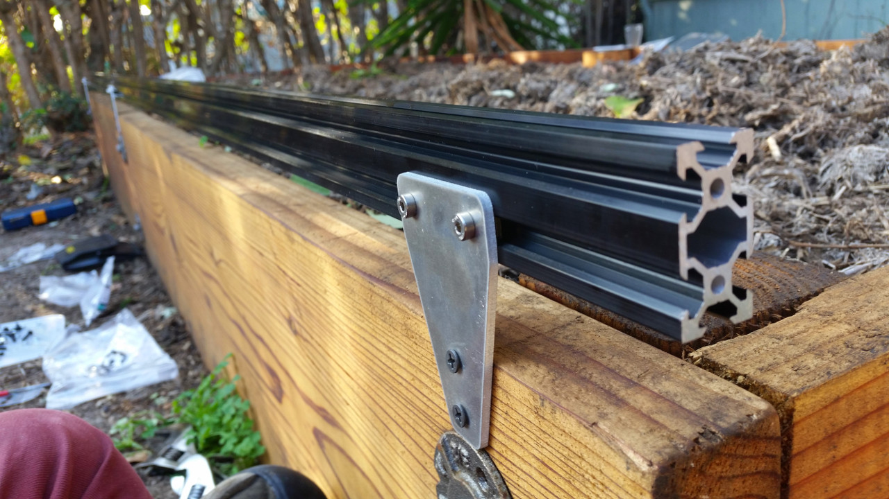
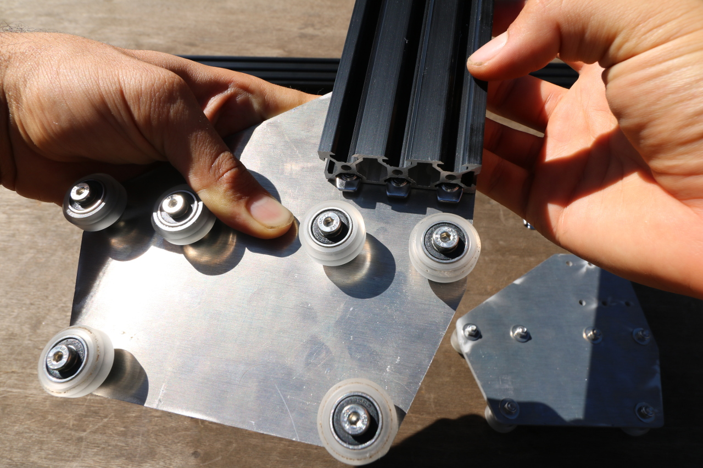
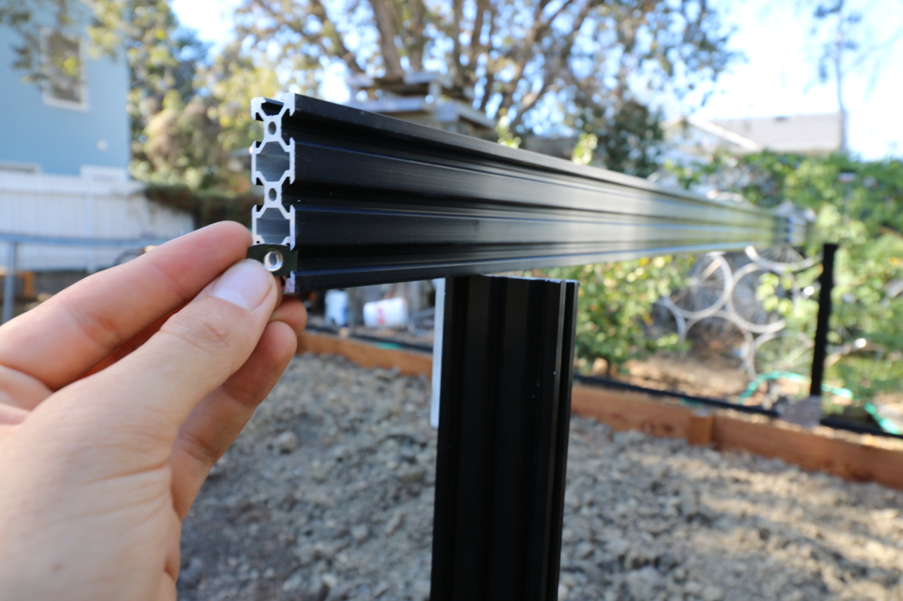
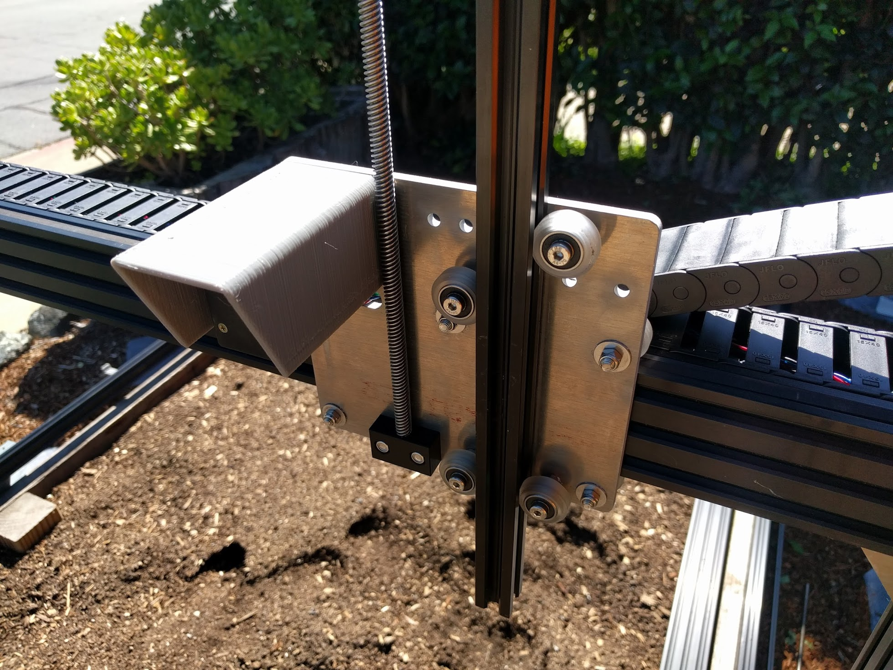

* toc
{:toc}

|Qty.                          |Component                     |kg/Unit                       |kg Subtotal                   |$/Unit                        |$ Subtotal                    |
|------------------------------|------------------------------|------------------------------|------------------------------|------------------------------|------------------------------|
|4                             |[Track Extrusions](#track-extrusions)|1.103                         |4.412                         |$21.45                        |$85.80
|2                             |[Gantry Columns](#gantry-columns)|0.742                         |1.484                         |$12.65                        |$25.30
|1                             |[Gantry Main Beam](#gantry-main-beam)|1.711                         |1.711                         |$25.30                        |$25.30
|1                             |[Z-Axis Extrusion](#z-axis-extrusion)|0.417                         |0.417                         |$11.00                        |$11.00
|**8**                         |**TOTALS**                    |                              |**8.024**                     |                              |**$147.40**

# Track Extrusions
Track extrusions are the primary structural component of the tracks sub-assembly. They can be combined end-to-end in order to create longer tracks. The gantry v-wheels roll along the track extrusions, allowing FarmBot to move in the x-direction.

<iframe class="embedly-embed" src="//cdn.embedly.com/widgets/media.html?src=https%3A%2F%2Fsketchfab.com%2Fmodels%2F4e5c58043d084583afdfd299fce2615c%2Fembed&url=https%3A%2F%2Fsketchfab.com%2Fmodels%2F4e5c58043d084583afdfd299fce2615c&image=https%3A%2F%2Fdg5bepmjyhz9h.cloudfront.net%2Furls%2F4e5c58043d084583afdfd299fce2615c%2Fdist%2Fthumbnails%2Fe7a6c9b832f041afa3dbf51887a378a7%2F640x360.jpeg&key=02466f963b9b4bb8845a05b53d3235d7&type=text%2Fhtml&schema=sketchfab" width="640" height="360" scrolling="no" frameborder="0" allowfullscreen></iframe>

|                              |                              |
|------------------------------|------------------------------|
|**Length**                    |1500mm
|**Profile**                   |20mm x 40mm V-Slot
|**Material**                  |6063-T5 Aluminum
|**Finish**                    |Black anodization
|**Mass**                      |1.103kg
|**Volume**                    |405.5cm3
|**Recommended Suppliers**     |[OpenBuilds](http://openbuildspartstore.com) (United States) [Ooznest](http://ooznest.co.uk/Openbuilds) (United Kingdom) [Maker Store](http://www.makerstore.com.au/) (Australia)
|**Price**                     |$21.45/extrusion
|**Quantity Needed**           |4

# Gantry Columns
The gantry columns are made from aluminum extrusions. They can be scaled to be taller or shorter to satisfy your needs. The two large spaces inside the columns are used to conceal and protect the GT2 timing belts that run along the tracks and up to the gantry pulleys.

<iframe class="embedly-embed" src="//cdn.embedly.com/widgets/media.html?src=https%3A%2F%2Fsketchfab.com%2Fmodels%2Fe3dec9e6ade84adfb87ba2f91337ae4c%2Fembed&url=https%3A%2F%2Fsketchfab.com%2Fmodels%2Fe3dec9e6ade84adfb87ba2f91337ae4c&image=https%3A%2F%2Fdg5bepmjyhz9h.cloudfront.net%2Furls%2Fe3dec9e6ade84adfb87ba2f91337ae4c%2Fdist%2Fthumbnails%2Ff3ec31d709ba425998e2d84cfc1224e2%2F640x360.jpeg&key=02466f963b9b4bb8845a05b53d3235d7&type=text%2Fhtml&schema=sketchfab" width="640" height="360" scrolling="no" frameborder="0" allowfullscreen></iframe>

|                              |                              |
|------------------------------|------------------------------|
|**Length**                    |650mm
|**Profile**                   |20mm x 60mm V-Slot
|**Material**                  |6063-T5 Aluminum
|**Finish**                    |Black anodization
|**Mass**                      |0.742kg
|**Volume**                    |272.6cm3
|**Recommended Suppliers**     |[OpenBuilds](http://openbuildspartstore.com) (United States) [Ooznest](http://ooznest.co.uk/Openbuilds) (United Kingdom) [Maker Store](http://www.makerstore.com.au/) (Australia)
|**Price**                     |$12.65/column (Two columns can be cut from a single 1500mm length extrusion which costs $25.30)
|**Quantity Needed**           |2

# Gantry Main Beam
This aluminum extrusion serves as the gantry's primary structural element. The cross-slide's v-wheels move across this extrusion, allowing FarmBot to move in the y-direction. It is possible to make this extrusion longer or shorter to suit your needs.

<iframe class="embedly-embed" src="//cdn.embedly.com/widgets/media.html?src=https%3A%2F%2Fsketchfab.com%2Fmodels%2F56572d93daaa4573b8f7b4ed06d8f89f%2Fembed&url=https%3A%2F%2Fsketchfab.com%2Fmodels%2F56572d93daaa4573b8f7b4ed06d8f89f&image=https%3A%2F%2Fdg5bepmjyhz9h.cloudfront.net%2Furls%2F56572d93daaa4573b8f7b4ed06d8f89f%2Fdist%2Fthumbnails%2F9d6a51b35bc646b489c76da64016d082%2F640x360.jpeg&key=02466f963b9b4bb8845a05b53d3235d7&type=text%2Fhtml&schema=sketchfab" width="640" height="360" scrolling="no" frameborder="0" allowfullscreen></iframe>

|                              |                              |
|------------------------------|------------------------------|
|**Length**                    |1500mm
|**Profile**                   |20mm x 60mm V-Slot
|**Material**                  |6063-T5 Aluminum
|**Finish**                    |Black Anodization
|**Mass**                      |1.711kg
|**Volume**                    |629.2cm3
|**Recommended Suppliers**     |[OpenBuilds](http://openbuildspartstore.com) (United States) [Ooznest](http://ooznest.co.uk/Openbuilds) (United Kingdom) [Maker Store](http://www.makerstore.com.au/) (Australia)
|**Price**                     |$25.30/extrusion
|**Quantity Needed**           |1

# Z-Axis Extrusion
The aluminum extrusion allows FarmBot to accurately position the UTM and tools in the z-direction. It slides through the vertically aligned wheels on the front of the cross-slide.

<iframe class="embedly-embed" src="//cdn.embedly.com/widgets/media.html?src=https%3A%2F%2Fsketchfab.com%2Fmodels%2F3d37d3554efe47f0a181a765cefb09e4%2Fembed&url=https%3A%2F%2Fsketchfab.com%2Fmodels%2F3d37d3554efe47f0a181a765cefb09e4&image=https%3A%2F%2Fdg5bepmjyhz9h.cloudfront.net%2Furls%2F3d37d3554efe47f0a181a765cefb09e4%2Fdist%2Fthumbnails%2F9d5f28dfcd204268b2382480a876b12d%2F640x360.jpeg&key=02466f963b9b4bb8845a05b53d3235d7&type=text%2Fhtml&schema=sketchfab" width="640" height="360" scrolling="no" frameborder="0" allowfullscreen></iframe>

|                              |                              |
|------------------------------|------------------------------|
|**Length**                    |1000mm
|**Profile**                   |20mm x 20mm V-Slot
|**Material**                  |6063-T5 Aluminum
|**Finish**                    |Black Anodization
|**Mass**                      |0.417kg
|**Volume**                    |153.5cm3
|**Recommended Suppliers**     |[OpenBuilds](http://openbuildspartstore.com) (United States) [Ooznest](http://ooznest.co.uk/Openbuilds) (United Kingdom) [Maker Store](http://www.makerstore.com.au/) (Australia)
|**Price**                     |$11.00/extrusion
|**Quantity Needed**           |1

