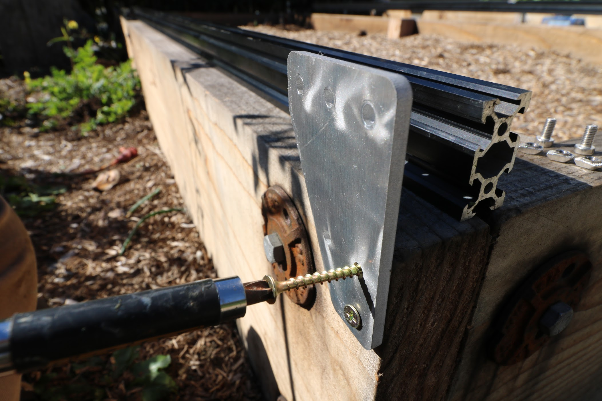
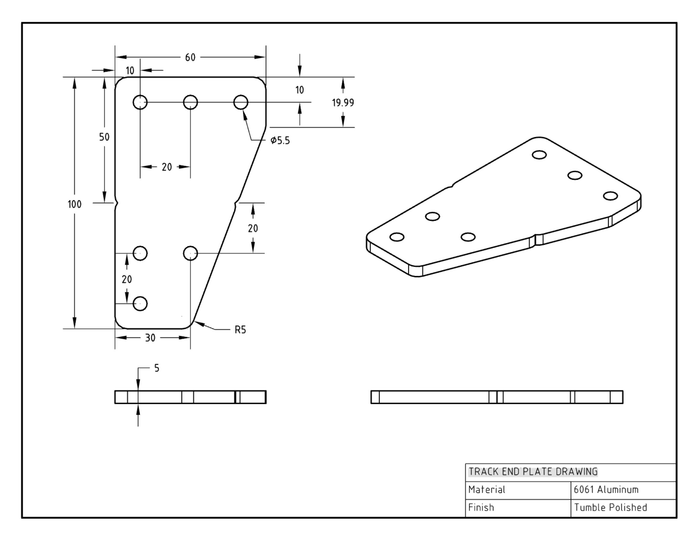
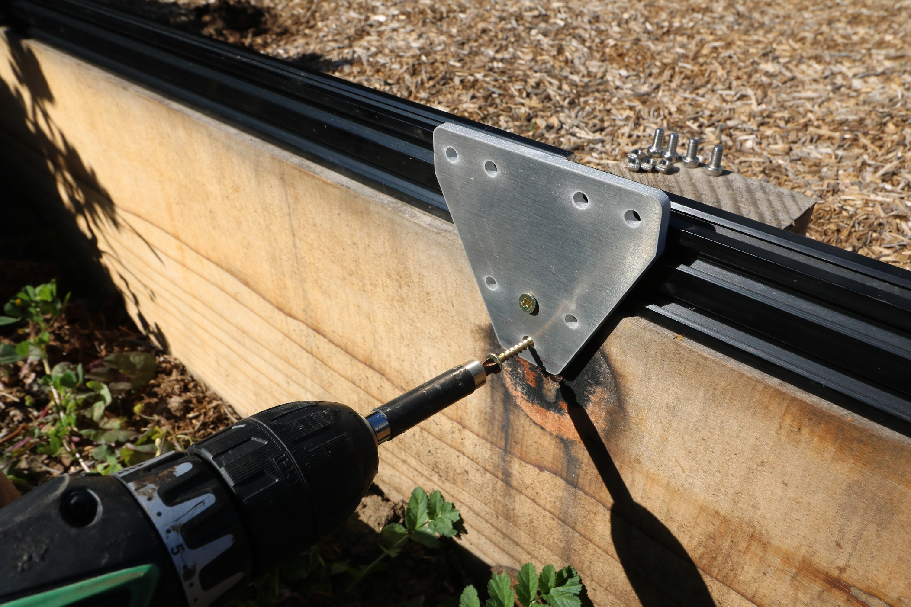
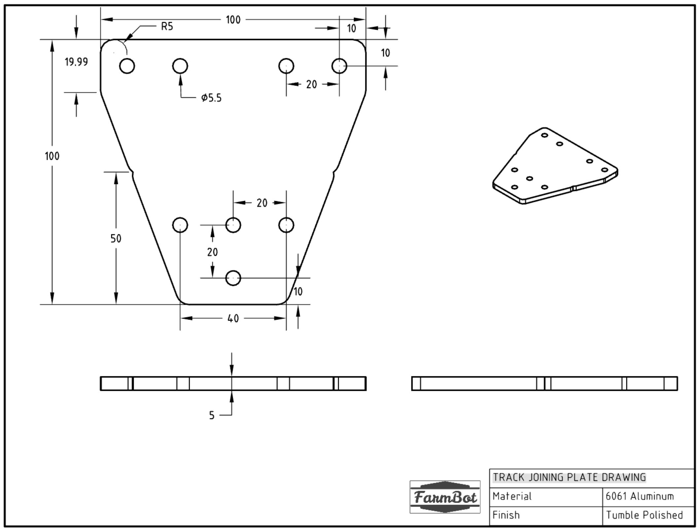
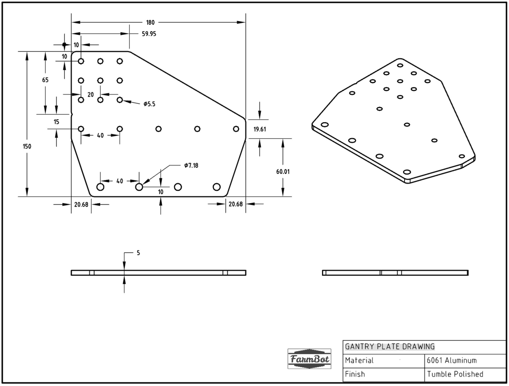
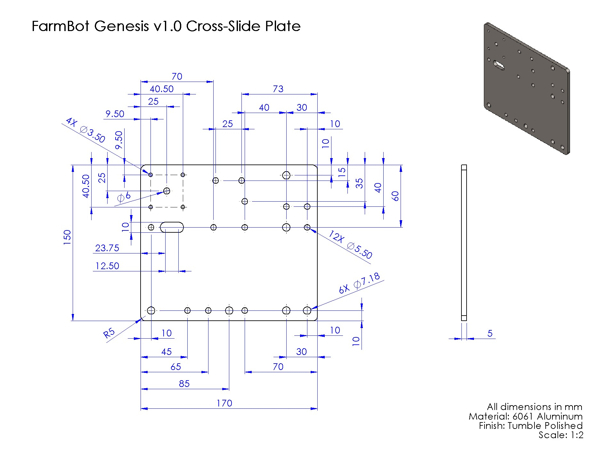
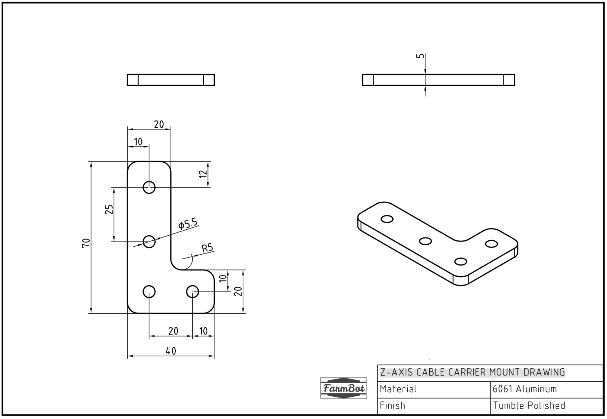
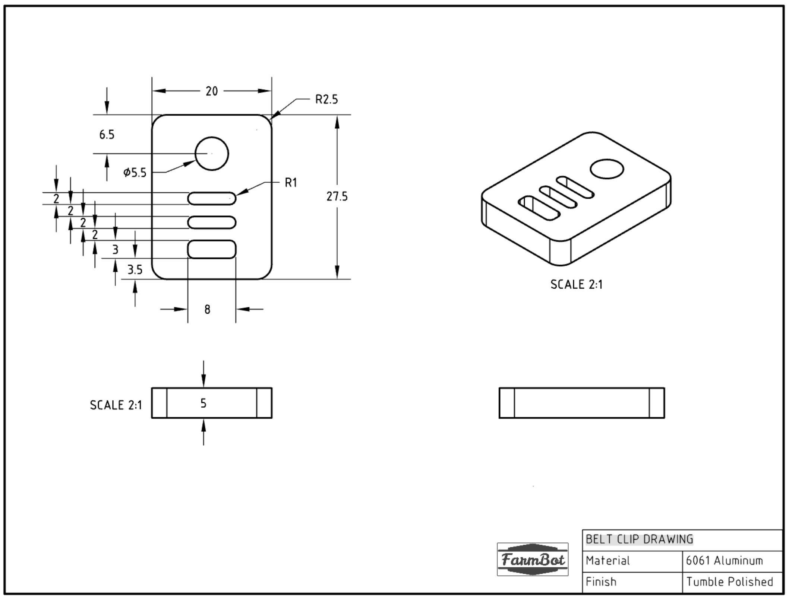

* toc
{:toc}

|Qty.                          |Component                     |kg/Unit                       |kg Subtotal                   |$/Unit                        |$ Subtotal                    |
|------------------------------|------------------------------|------------------------------|------------------------------|------------------------------|------------------------------|
|4                             |[Track End Plates](#track-end-plates)|0.063                         |0.252                         |$5.00                         |$20.00
|2                             |[Track Joining Plates](#track-joining-plates)|0.101                         |0.202                         |$5.00                         |$10.00
|2                             |[Gantry Wheel Plates](#gantry-wheel-plates)|0.287                         |0.574                         |$15.00                        |$30.00
|2                             |[Gantry Corner Brackets](#gantry-corner-brackets)|--                            |--                            |$5.00                         |$5.00
|1                             |[Cross-Slide Plate](#cross-slide-plate)|0.334                         |0.334                         |$20.00                        |$20.00
|1                             |[Z-Axis Cable Carrier Mount](#z-axis-cable-carrier-mount)|0.023                         |0.023                         |$5.00                         |$5.00
|2                             |[Tool Bays](#tool-bays)|--                            |--                            |$20.00                        |$40.00
|6                             |[Belt Clips](#belt-clips)|0.006                         |0.036                         |$3.00                         |$18.00
|**20**                        |**TOTALS**                    |                              |**1.421**                     |                              |**$148.00**

# Track End Plates

<iframe class="embedly-embed" src="//cdn.embedly.com/widgets/media.html?src=https%3A%2F%2Fsketchfab.com%2Fmodels%2Fb73c9435bb474af28469b027f6b1928b%2Fembed&url=https%3A%2F%2Fsketchfab.com%2Fmodels%2Fb73c9435bb474af28469b027f6b1928b&image=https%3A%2F%2Fd35krx4ujqgbcr.cloudfront.net%2Furls%2Fb73c9435bb474af28469b027f6b1928b%2Fdist%2Fthumbnails%2Fc78be442bbcb4d5c96a5b5c025bcb1bf%2F640x360.jpeg&key=02466f963b9b4bb8845a05b53d3235d7&type=text%2Fhtml&schema=sketchfab" width="640" height="360" scrolling="no" frameborder="0" allowfullscreen></iframe>

|                              |                              |
|------------------------------|------------------------------|
|**Thickness**                 |5mm
|**Material**                  |6061 Aluminum
|**Finish**                    |Tumble Polished
|**Mass**                      |0.063kg
|**Volume**                    |23.2cm3
|**Recommended Manufacturer**  |[Big Blue Saw](https://www.bigbluesaw.com/) (United States)

# Track Joining Plates

<iframe class="embedly-embed" src="//cdn.embedly.com/widgets/media.html?src=https%3A%2F%2Fsketchfab.com%2Fmodels%2Fa5f596b51da0408f87d2de4b1e45813c%2Fembed&url=https%3A%2F%2Fsketchfab.com%2Fmodels%2Fa5f596b51da0408f87d2de4b1e45813c&image=https%3A%2F%2Fd35krx4ujqgbcr.cloudfront.net%2Furls%2Fa5f596b51da0408f87d2de4b1e45813c%2Fdist%2Fthumbnails%2Fbc48fc34bf85458794916c8e2142b80f%2F640x360.jpeg&key=02466f963b9b4bb8845a05b53d3235d7&type=text%2Fhtml&schema=sketchfab" width="640" height="360" scrolling="no" frameborder="0" allowfullscreen></iframe>

|                              |                              |
|------------------------------|------------------------------|
|**Thickness**                 |5mm
|**Material**                  |6061 Aluminum
|**Finish**                    |Tumble Polished
|**Mass**                      |0.101kg
|**Volume**                    |37.0cm3
|**Recommended Manufacturer**  |[Big Blue Saw](https://www.bigbluesaw.com/) (United States)

# Gantry Wheel Plates

<iframe class="embedly-embed" src="//cdn.embedly.com/widgets/media.html?src=https%3A%2F%2Fsketchfab.com%2Fmodels%2F4be8d7391c68423dbf99af04b520eb29%2Fembed&url=https%3A%2F%2Fsketchfab.com%2Fmodels%2F4be8d7391c68423dbf99af04b520eb29&image=https%3A%2F%2Fd35krx4ujqgbcr.cloudfront.net%2Furls%2F4be8d7391c68423dbf99af04b520eb29%2Fdist%2Fthumbnails%2Fb0712e3fcade4bd384cbb034f8810a2f%2F640x360.jpeg&key=02466f963b9b4bb8845a05b53d3235d7&type=text%2Fhtml&schema=sketchfab" width="640" height="360" scrolling="no" frameborder="0" allowfullscreen></iframe>

|                              |                              |
|------------------------------|------------------------------|
|**Thickness**                 |5mm
|**Material**                  |6061 Aluminum
|**Finish**                    |Tumble Polished
|**Mass**                      |0.287kg
|**Volume**                    |105.5cm3
|**Recommended Manufacturer**  |[Big Blue Saw](https://www.bigbluesaw.com/) (United States)

# Gantry Corner Brackets

<iframe class="embedly-embed" src="//cdn.embedly.com/widgets/media.html?src=https%3A%2F%2Fsketchfab.com%2Fmodels%2F037dde2dae7f4d11906ddade16c79c00%2Fembed&url=https%3A%2F%2Fsketchfab.com%2Fmodels%2F037dde2dae7f4d11906ddade16c79c00&image=https%3A%2F%2Fd35krx4ujqgbcr.cloudfront.net%2Furls%2F037dde2dae7f4d11906ddade16c79c00%2Fdist%2Fthumbnails%2F9718891003864a509e27c5d170ba8595%2F640x360.jpeg&key=02466f963b9b4bb8845a05b53d3235d7&type=text%2Fhtml&schema=sketchfab" width="640" height="360" scrolling="no" frameborder="0" allowfullscreen></iframe>

|                              |                              |
|------------------------------|------------------------------|
|**Thickness**                 |5mm
|**Material**                  |5052 Aluminum
|**Finish**                    |Tumble Polished
|**Mass**                      |--
|**Volume**                    |--
|**Recommended Manufacturer**  |Lasernut (United States)

# Cross-Slide Plate

<iframe class="embedly-embed" src="//cdn.embedly.com/widgets/media.html?src=https%3A%2F%2Fsketchfab.com%2Fmodels%2F6d8f5f0c2b874e49a7956e150c43f038%2Fembed&url=https%3A%2F%2Fsketchfab.com%2Fmodels%2F6d8f5f0c2b874e49a7956e150c43f038&image=https%3A%2F%2Fd35krx4ujqgbcr.cloudfront.net%2Fthumbnails%2F4c57687b657445e1b46c83b35e494ad4%2F640.jpg&key=02466f963b9b4bb8845a05b53d3235d7&type=text%2Fhtml&schema=sketchfab" width="640" height="360" scrolling="no" frameborder="0" allowfullscreen></iframe>

|                              |                              |
|------------------------------|------------------------------|
|**Thickness**                 |5mm
|**Material**                  |6061 Aluminum
|**Finish**                    |Tumble Polished
|**Mass**                      |0.334kg
|**Volume**                    |122.7cm3
|**Recommended Manufacturer**  |[Big Blue Saw](https://www.bigbluesaw.com/) (United States)

# Z-Axis Cable Carrier Mount

<iframe class="embedly-embed" src="//cdn.embedly.com/widgets/media.html?src=https%3A%2F%2Fsketchfab.com%2Fmodels%2Fccf94da8b16646848201e156a74e2f1d%2Fembed&url=https%3A%2F%2Fsketchfab.com%2Fmodels%2Fccf94da8b16646848201e156a74e2f1d&image=https%3A%2F%2Fd35krx4ujqgbcr.cloudfront.net%2Furls%2Fccf94da8b16646848201e156a74e2f1d%2Fdist%2Fthumbnails%2Fa6c27c935c744ebea7d5d634c108cb76%2F640x360.jpeg&key=02466f963b9b4bb8845a05b53d3235d7&type=text%2Fhtml&schema=sketchfab" width="640" height="360" scrolling="no" frameborder="0" allowfullscreen></iframe>

|                              |                              |
|------------------------------|------------------------------|
|**Thickness**                 |5mm
|**Material**                  |6061 Aluminum
|**Finish**                    |Tumble Polished
|**Mass**                      |0.023kg
|**Volume**                    |8.42cm3
|**Recommended Manufacturer**  |[Big Blue Saw](https://www.bigbluesaw.com/) (United States)

# Tool Bays

<iframe class="embedly-embed" src="//cdn.embedly.com/widgets/media.html?src=https%3A%2F%2Fsketchfab.com%2Fmodels%2F3e0493ab95f34f1d86dfd4c82f50e41b%2Fembed&url=https%3A%2F%2Fsketchfab.com%2Fmodels%2F3e0493ab95f34f1d86dfd4c82f50e41b&image=https%3A%2F%2Fd35krx4ujqgbcr.cloudfront.net%2Furls%2F3e0493ab95f34f1d86dfd4c82f50e41b%2Fdist%2Fthumbnails%2F48e74edf8f98408bacb971e2233518cf%2F640x360.jpeg&key=02466f963b9b4bb8845a05b53d3235d7&type=text%2Fhtml&schema=sketchfab" width="640" height="360" scrolling="no" frameborder="0" allowfullscreen></iframe>

|                              |                              |
|------------------------------|------------------------------|
|**Thickness**                 |5mm
|**Material**                  |5052 Aluminum
|**Finish**                    |Tumble Polished
|**Mass**                      |--
|**Volume**                    |--
|**Recommended Manufacturer**  |Lasernut (US)

# Belt Clips

<iframe class="embedly-embed" src="//cdn.embedly.com/widgets/media.html?src=https%3A%2F%2Fsketchfab.com%2Fmodels%2Fd161ea9c417e45888b4097c62829b6d2%2Fembed&url=https%3A%2F%2Fsketchfab.com%2Fmodels%2Fd161ea9c417e45888b4097c62829b6d2&image=https%3A%2F%2Fd35krx4ujqgbcr.cloudfront.net%2Furls%2Fd161ea9c417e45888b4097c62829b6d2%2Fdist%2Fthumbnails%2F7c3a3855696b4ec086b59da367eccd70%2F640x360.jpeg&key=02466f963b9b4bb8845a05b53d3235d7&type=text%2Fhtml&schema=sketchfab" width="640" height="360" scrolling="no" frameborder="0" allowfullscreen></iframe>

|                              |                              |
|------------------------------|------------------------------|
|**Thickness**                 |5mm
|**Material**                  |6061 Aluminum
|**Finish**                    |Tumble Polished
|**Mass**                      |0.006kg
|**Volume**                    |2.34cm3
|**Recommended Manufacturer**  |[Big Blue Saw](https://www.bigbluesaw.com/) (United States)

