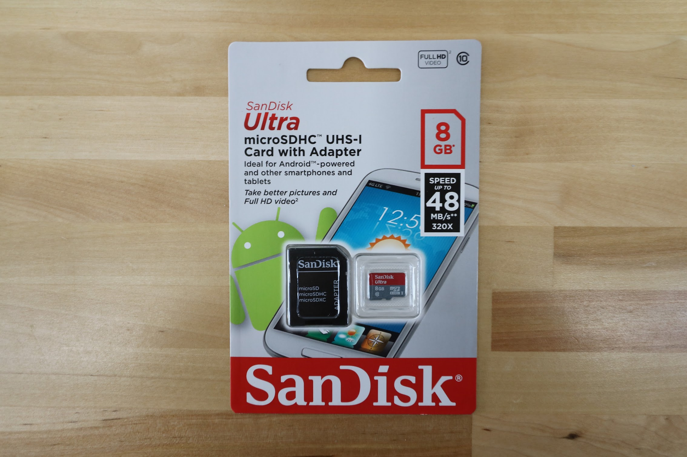
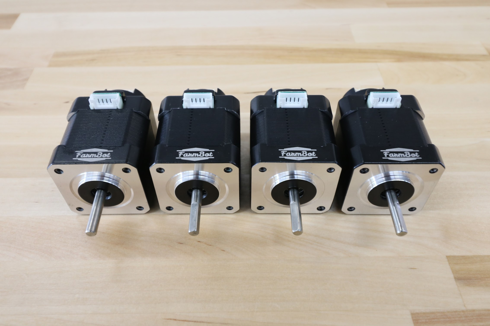
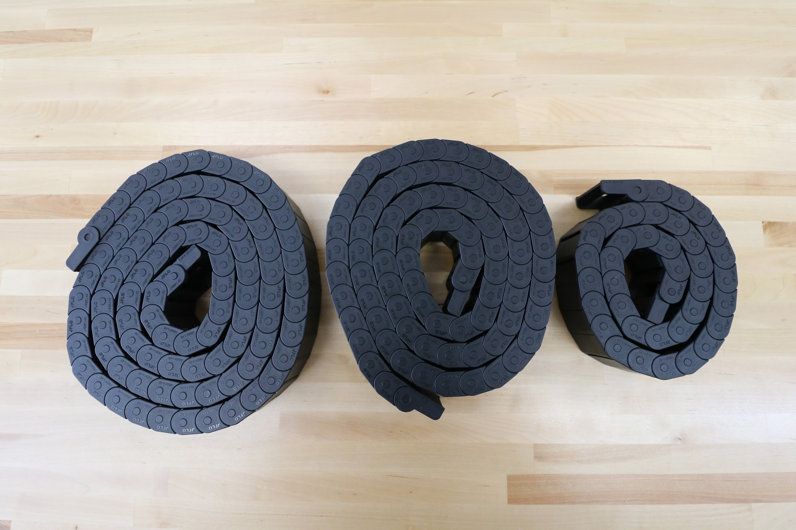
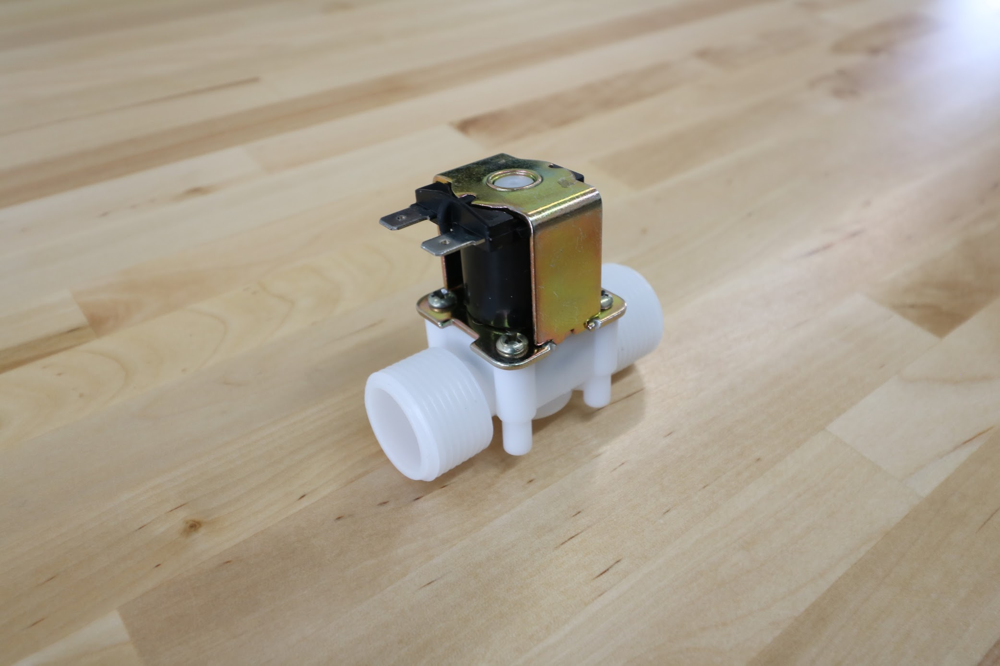
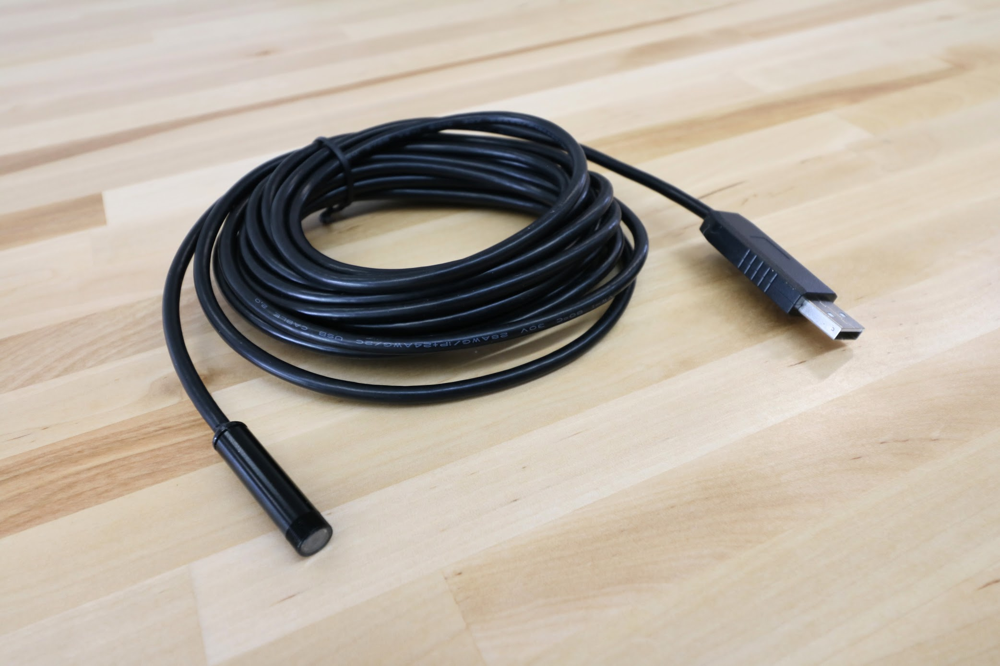

|Qty.                          |Component                     |$/Unit                        |Subtotal                      |
|------------------------------|------------------------------|------------------------------|------------------------------|
|1                             |[Electronics Housing](#electronics-housing)|$35.00                        |$35.00
|1                             |[Power Supply](#power-supply)|$35.00                        |$35.00
|1                             |[5V Power Adapter](#5v-power-adapter)|$10.00                        |$10.00
|2                             |[Wire Nuts](#wire-nuts)|$0.50                         |$1.00
|1                             |[Raspberry Pi 3](#raspberry-pi-3)|$40.00                        |$40.00
|1                             |[MicroSD Card](#microsd-card)|$15.00                        |$15.00
|1                             |[Arduino Mega](#arduino-mega-2560)|$15.00                        |$15.00
|1                             |[RAMPS shield](#ramps-shield)|$15.00                        |$15.00
|4                             |[Stepper Drivers](#stepper-drivers)|$6.00                         |$24.00
|1                             |[USB Cable](#usb-cable)|$5.00                         |$5.00
|4                             |[NEMA 17 Stepper Motors, Rotary Encoders, and Cables](#nema-17-stepper-motors-with-rotary-encoders)|$70.00                        |$280.00
|3                             |[Cable Carriers](#cable-carrier)|$35.00                        |$105.00
|1                             |[Universal Tool Mount Cable](#universal-tool-mount-cable)|$35.00                        |$35.00
|1                             |[Soil Sensor](#soil-sensor)|$5.00                         |$5.00
|1                             |[Solenoid Valve](#solenoid-valve)|$8.00                         |$8.00
|1                             |[Vacuum Pump](#vacuum-pump)|$15.00                        |$15.00
|1                             |[FarmBot Power Cable](#farmbot-power-cable)|$10.00                        |$10.00
|2                             |[RAMPS Supply Cables](#ramps-power-cables)|$10.00                        |$20.00
|1                             |[Raspberry Pi Power Cable](#raspberry-pi-power-cable)|$10.00                        |$10.00
|1                             |[Vacuum Pump Cable](#vacuum-pump-cable)|$10.00                        |$10.00
|1                             |[Solenoid Valve Cable](#solenoid-valve-cable)|$10.00                        |$10.00
|1                             |[Borescope Camera](#borescope-camera)|$35.00                        |$35.00
|1                             |[Sockit Box](#sockit-box)|$25.00                        |$25.00
|4                             |[Jumper Links](#jumper-links)|$0.25                         |$1.00
|**37**                        |**TOTALS**                    |                              |**$764.00**

# Electronics Housing
This waterproof housing protects FarmBot's electronics from rain and debris. It has a clear front cover and keeps water out with a rubber gasket.

<iframe class="embedly-embed" src="//cdn.embedly.com/widgets/media.html?src=https%3A%2F%2Fwww.youtube.com%2Fembed%2FLrLksBXHVEs%3Ffeature%3Doembed&url=http%3A%2F%2Fwww.youtube.com%2Fwatch%3Fv%3DLrLksBXHVEs&image=https%3A%2F%2Fi.ytimg.com%2Fvi%2FLrLksBXHVEs%2Fhqdefault.jpg&key=02466f963b9b4bb8845a05b53d3235d7&type=text%2Fhtml&schema=youtube" width="854" height="480" scrolling="no" frameborder="0" allowfullscreen></iframe>



|                              |                              |
|------------------------------|------------------------------|
|**Material**                  |Polycarbonate
|**Rainproof?**                |Yes
|**Cover Color**               |Clear
|**Height**                    |8.75"
|**Width**                     |5.75"
|**Depth**                     |3"
|**Cover Type**                |Lift off, screw mounted
|**Recommended Supplier**      |McMaster Carr - [Part Number 1037N9](http://www.mcmaster.com/#1037n9)
|**Price**                     |$35.00
|**Quantity**                  |1

# Power Supply

<iframe class="embedly-embed" src="//cdn.embedly.com/widgets/media.html?src=https%3A%2F%2Fwww.youtube.com%2Fembed%2F2NoRMaThvPM%3Ffeature%3Doembed&url=http%3A%2F%2Fwww.youtube.com%2Fwatch%3Fv%3D2NoRMaThvPM&image=https%3A%2F%2Fi.ytimg.com%2Fvi%2F2NoRMaThvPM%2Fhqdefault.jpg&key=02466f963b9b4bb8845a05b53d3235d7&type=text%2Fhtml&schema=youtube" width="854" height="480" scrolling="no" frameborder="0" allowfullscreen></iframe>



_The power supply works with both 110V and 220V AC power._

|                              |                              |
|------------------------------|------------------------------|
|**Output**                    |12 volt, 29 amp DC
|**Input**                     |110 or 220 volt AC
|**Brand**                     |Meanwell
|**Dimensions**                |--
|**Recommended Supplier**      |[OpenBuilds](http://openbuildspartstore.com/12v-30a-power-supply/)
|**Price**                     |$35.00
|**Quantity**                  |1

# 5V Power Adapter

|                              |                              |
|------------------------------|------------------------------|
|**Trade Name**                |UBEC DC/DC Step-Down (Buck) Converter
|**Input Voltage**             |6-23V
|**Output Voltage**            |5V (+-5%)
|**Output Current**            |3A continuous, 5A peak
|**Recommended Supplier**      |[Adafruit](https://www.adafruit.com/products/1385)
|**Price**                     |$10.00
|**Quantity**                  |1

# Wire Nuts

|                              |                              |
|------------------------------|------------------------------|
|**Price**                     |$0.50
|**Quantity**                  |2

# Raspberry Pi 3

<iframe class="embedly-embed" src="//cdn.embedly.com/widgets/media.html?src=https%3A%2F%2Fwww.youtube.com%2Fembed%2FjF8q6WAS-rU%3Ffeature%3Doembed&url=http%3A%2F%2Fwww.youtube.com%2Fwatch%3Fv%3DjF8q6WAS-rU&image=https%3A%2F%2Fi.ytimg.com%2Fvi%2FjF8q6WAS-rU%2Fhqdefault.jpg&key=02466f963b9b4bb8845a05b53d3235d7&type=text%2Fhtml&schema=youtube" width="854" height="480" scrolling="no" frameborder="0" allowfullscreen></iframe>



|                              |                              |
|------------------------------|------------------------------|
|**CPU**                       |1.2Ghz Quad Core Broadcom BCM2837 64-bit ARMv8 processor
|**RAM**                       |1GB LPDDR2 (900 MHz)
|**WiFi**                      |2.4GHz 802.11n wireless, BCM43143 chip
|**Bluetooth**                 |Bluetooth 4.1 Classic, Bluetooth low energy (BLE)
|**Ethernet**                  |Built-in 10/100 Ethernet
|**USB**                       |4x USB 2.0 ports
|**Storage**                   |MicroSD
|**GPIO**                      |40-pin header
|**Recommended Suppliers**     |[Adafruit](https://www.adafruit.com/products/3055) Amazon Spark Fun Element14
|**Price**                     |$40.00
|**Quantity**                  |1

# MicroSD Card

|                              |                              |
|------------------------------|------------------------------|
|**Form Factor**               |MicroSD
|**Capacity**                  |8GB
|**Price**                     |$15.00
|**Quantity**                  |1

# Arduino Mega 2560
This is the microcontroller that powers FarmBot. It receives G-code commands from the Raspberry Pi and then sends signals to move motors, read sensors, activate peripherals, and more.

<iframe class="embedly-embed" src="//cdn.embedly.com/widgets/media.html?src=https%3A%2F%2Fwww.youtube.com%2Fembed%2F3MYjZCa4tzo%3Ffeature%3Doembed&url=http%3A%2F%2Fwww.youtube.com%2Fwatch%3Fv%3D3MYjZCa4tzo&image=https%3A%2F%2Fi.ytimg.com%2Fvi%2F3MYjZCa4tzo%2Fhqdefault.jpg&key=02466f963b9b4bb8845a05b53d3235d7&type=text%2Fhtml&schema=youtube" width="854" height="480" scrolling="no" frameborder="0" allowfullscreen></iframe>

|                              |                              |
|------------------------------|------------------------------|
|**Microcontroller**           |ATmega2560
|**Operating Voltage**         |5V
|**Input Voltage**             |7-12V recommended, 60-20V limts
|**Digital I/O Pins**          |54 (15 provide PWM output)
|**Analog Input Pins**         |16
|**DC Current per I/O Pin**    |40 mA
|**DC Current for 3.3V Pin**   |50 mA
|**Flash Memory**              |256 KB (8 KB used by bootloader)
|**SRAM**                      |8 KB
|**EEPROM**                    |4 KB
|**Clock Speed**               |16 MHz
|**Recommended Suppliers**     |[Sainsmart](http://www.sainsmart.com/arduino/control-boards/sainsmart-mega2560-r3-development-board-compatible-with-arduino-mega2560-r3.html) Arduino Amazon Adafruit Spark Fun
|**Price**                     |$15.00
|**Quantity**                  |1

# RAMPS Shield



|                              |                              |
|------------------------------|------------------------------|
|**Recommended Suppliers**     |[SainsSmart](http://www.sainsmart.com/sainsmart-3d-printer-control-board-ramps-1-4-for-arduino-reprap-mendel-prusa.html) Amazon Spark Fun Adafruit
|**Price**                     |$15.00
|**Quantity**                  |1

# Stepper Drivers

|                              |                              |
|------------------------------|------------------------------|
|**Trade Name**                |A4988 Stepper Motor Driver Carrier (Header Pins Soldered)
|**Microstepping**             |full-step, half-step, 1/4-step, 1/8-step, and 1/16-step
|**Output Current**            |1.5 A per phase without a heat sink or forced air flow (rated for up to 2.0 A per coil with sufficient additional cooling)
|**Protections**               |Over-temperature thermal shutdown, crossover-current protection, and under-voltage lockout, short-to-ground, and shorted-load
|**Adjustable?**               |Current control lets you set the maximum current output with a potentiometer, which lets you use voltages above your stepper motor’s rated voltage to achieve higher step rates
|**Connectors**                |0.1″ male header pins
|**Recommended Suppliers**     |[Pololu](https://www.pololu.com/product/1182) Amazon
|**Price**                     |$6.00
|**Quantity**                  |4

# USB Cable
Connects the Raspberry Pi to the Arduino.

|                              |                              |
|------------------------------|------------------------------|
|**Connector 1**               |USB 2.0 Type A Male
|**Connector 2**               |USB 2.0 Type B Male
|**Length**                    |6 inches
|**Recommended Suppliers**     |[Belkin/Amazon](https://smile.amazon.com/Belkin-Components-Device-Daisy-Chain/dp/B000067RMY/ref=pd_sim_sbs_147_2?ie=UTF8&dpID=31G1lSlmR0L&dpSrc=sims&preST=_AC_UL320_SR320%2C320_&refRID=7P8Q2GQ8SQ8N2NM6EEH9) Monoprice Best Buy Fry's Electronics
|**Price**                     |$5.00
|**Quantity**                  |1

# NEMA 17 Stepper Motors with Rotary Encoders

<iframe class="embedly-embed" src="//cdn.embedly.com/widgets/media.html?src=https%3A%2F%2Fwww.youtube.com%2Fembed%2F_gMozmqbavk%3Ffeature%3Doembed&url=http%3A%2F%2Fwww.youtube.com%2Fwatch%3Fv%3D_gMozmqbavk&image=https%3A%2F%2Fi.ytimg.com%2Fvi%2F_gMozmqbavk%2Fhqdefault.jpg&key=02466f963b9b4bb8845a05b53d3235d7&type=text%2Fhtml&schema=youtube" width="854" height="480" scrolling="no" frameborder="0" allowfullscreen></iframe>



Download the [motor spec sheet](https://drive.google.com/file/d/1Ehqu20q84Lyycn1fOj6dvWKbrMLvoNv4/view?usp=sharing) and [encoder spec sheet](https://drive.google.com/file/d/15dSqr_hQTXAQGIvw-YeDLIOC6dB0Y26n/view?usp=sharing).

|Motor Specs                   |                              |
|------------------------------|------------------------------|
|**Motor Resolution**          |200 steps/revolution (1.8 deg/step)
|**Winding Type**              |Bipolar
|**Voltage**                   |12V
|**Current Draw**              |1.68A
|**Wiring**                    |4 wire
|**Shaft Diameter**            |5mm diameter
|**Mount Hole Pattern**        |4x M3 holes, standard NEMA 17 pattern
|**Cable Length**              |0.75m, 2.8m, and 4m
|**Cable Connector 1 (motor)** |
|**Cable Connector 2 (RAMPS)** |2.54mm pitch 4 pin dupont connector
|**Encoder Resolution**        |360 lines/revolution
|**Encoder Output**            |Differential
|**Price**                     |* 0.75m - $65.00 * 2.8m - $70.00 * 4.5m - $75.00
|**Quantity**                  |4 motors: * 0.75m - 1 * 2.8m - 2 * 4.5m - 1

_Motor cables_

_Encoder cables_

_Encoder cable connectors_

# Cable Carrier
These hollow plastic chains are used throughout FarmBot to manage cables and tubing.



|                              |                              |
|------------------------------|------------------------------|
|**Material**                  |Nylon PA66
|**Lengths**                   |X-Axis - 1.8m (90 links + end pieces) Y-Axis - 1.6m (80 links + end pieces) Z-Axis - 0.74m (37 links + end pieces)
|**Inside Height**             |15mm
|**Inside Width**              |40mm
|**Outside Height**            |20mm
|**Outside Width**             |48.2mm
|**Pitch**                     |20mm
|**Bending Radius**            |28mm
|**Recommended Supplier**      |[Inventables](https://www.inventables.com/technologies/drag-chain)
|**Price**                     |X-Axis - $42 Y-Axis - $38 Z-Axis - $25
|**Quantity**                  |1 for each axis

# Universal Tool Mount Cable

<iframe class="embedly-embed" src="//cdn.embedly.com/widgets/media.html?src=https%3A%2F%2Fwww.youtube.com%2Fembed%2Fh_3c8-A966E%3Ffeature%3Doembed&url=http%3A%2F%2Fwww.youtube.com%2Fwatch%3Fv%3Dh_3c8-A966E&image=https%3A%2F%2Fi.ytimg.com%2Fvi%2Fh_3c8-A966E%2Fhqdefault.jpg&key=02466f963b9b4bb8845a05b53d3235d7&type=text%2Fhtml&schema=youtube" width="854" height="480" scrolling="no" frameborder="0" allowfullscreen></iframe>



|                              |                              |
|------------------------------|------------------------------|
|**Number of Wires**           |12
|**Wire Markings**             |The 1st through 11th wires are black and labelled with small white text. The 12th wire has green/yellow insulation.
|**Shielded?**                 |No
|**Wire Gauge**                |20
|**Length**                    |3m
|**Outer Diameter**            |0.37"
|**Amps**                      |6
|**Color**                     |Gray
|**Recommended Supplier**      |McMaster Carr - Part Number [8082K14](http://www.mcmaster.com/#8082k14) IGUS
|**Price**                     |$35.00
|**Quantity**                  |1

# Soil Sensor
The Soil Moisture Sensor is a simple breakout for measuring the moisture in soil and similar materials. The soil moisture sensor is pretty straight forward to use. The two large exposed pads function as probes for the sensor, together acting as a variable resistor. The more water that is in the soil means the better the conductivity between the pads will be and will result in a lower resistance, and a higher SIG out.



|                              |                              |
|------------------------------|------------------------------|
|**Sensor Type**               |Capacitive
|**Input Voltage**             |--
|**Input Current**             |--
|**Output Type**               |Analog
|**Recommended Supplier**      |[SparkFun](https://www.sparkfun.com/products/13322)
|**Price**                     |$5.00
|**Quantity**                  |1

# Solenoid Valve

<iframe class="embedly-embed" src="//cdn.embedly.com/widgets/media.html?src=https%3A%2F%2Fwww.youtube.com%2Fembed%2FMkIYGSv_tdA%3Ffeature%3Doembed&url=http%3A%2F%2Fwww.youtube.com%2Fwatch%3Fv%3DMkIYGSv_tdA&image=https%3A%2F%2Fi.ytimg.com%2Fvi%2FMkIYGSv_tdA%2Fhqdefault.jpg&key=02466f963b9b4bb8845a05b53d3235d7&type=text%2Fhtml&schema=youtube" width="854" height="480" scrolling="no" frameborder="0" allowfullscreen></iframe>



|                              |                              |
|------------------------------|------------------------------|
|**Inlet**                     |3/4" NPT (National Pipe Thread)
|**Outlet**                    |3/4" NPT (National Pipe Thread)
|**Operation**                 |Normally closed
|**Working Pressure Range**    |0.02 to 0.8 Mpa (3 to 116 PSI)
|**Flow Direction**            |One-way, indicated by an arrow molded into the plastic
|**Input Voltage**             |12V
|**Current Draw**              |320mA
|**Power Consumption**         |3.84 Watts
|**Recommended Supplier**      |[Sparkfun](https://www.sparkfun.com/products/10456)
|**Price**                     |$8.00
|**Quantity**                  |1

# Vacuum Pump



|                              |                              |
|------------------------------|------------------------------|
|**Input Voltage**             |12V DC
|**Current Draw**              |1A
|**Recommended Supplier**      |[Spark Fun](https://www.sparkfun.com/products/10398)
|**Price**                     |$15.00
|**Quantity**                  |1

# RAMPS Power Cables



|                              |                              |
|------------------------------|------------------------------|
|**Length**                    |3m
|**Gauge**                     |
|**Wire Type**                 |Stranded copper
|**Number of Wires**           |2
|**Rated Voltage**             |12V DC
|**Inner Colors**              |Red and black
|**Outer Color**               |Black
|**Thickness**                 |
|**Recommended Supplier**      |McMaster Carr - Part Number [9697T2](http://www.mcmaster.com/#9697t2/)
|**Price**                     |$10.00
|**Quantity**                  |2

# Raspberry Pi Power Cable



|                              |                              |
|------------------------------|------------------------------|
|**Length**                    |3m
|**Gauge**                     |
|**Wire Type**                 |Stranded copper
|**Number of Wires**           |2
|**Rated Voltage**             |12V DC
|**Inner Colors**              |Red and black
|**Outer Color**               |Black
|**Thickness**                 |
|**Recommended Supplier**      |McMaster Carr - Part Number [9697T2](http://www.mcmaster.com/#9697t2/)
|**Price**                     |$10.00
|**Quantity**                  |1

# Vacuum Pump Cable



|                              |                              |
|------------------------------|------------------------------|
|**Length**                    |3m
|**Gauge**                     |
|**Wire Type**                 |Stranded copper
|**Number of Wires**           |2
|**Rated Voltage**             |12V DC
|**Inner Colors**              |Red and black
|**Outer Color**               |Black
|**Thickness**                 |
|**Recommended Supplier**      |McMaster Carr - Part Number [9697T2](http://www.mcmaster.com/#9697t2/)
|**Price**                     |$10.00
|**Quantity**                  |1

# Solenoid Valve Cable



|                              |                              |
|------------------------------|------------------------------|
|**Length**                    |3m
|**Gauge**                     |
|**Wire Type**                 |Stranded copper
|**Number of Wires**           |2
|**Rated Voltage**             |12V DC
|**Inner Colors**              |Red and black
|**Outer Color**               |Black
|**Width**                     |
|**Recommended Supplier**      |McMaster Carr - Part Number [9697T2](http://www.mcmaster.com/#9697t2/)
|**Price**                     |$10.00
|**Quantity**                  |1

# FarmBot Power Cable



|                              |                              |
|------------------------------|------------------------------|
|**Length**                    |0.5m
|**Gauge**                     |
|**Wire Type**                 |Stranded copper
|**Number of Wires**           |3
|**Rated Voltage**             |120V AC
|**Inner Colors**              |White, Green, and Black
|**Outer Color**               |Black
|**Thickness**                 |
|**Price**                     |$10.00
|**Quantity**                  |1

# Borescope Camera

<iframe class="embedly-embed" src="//cdn.embedly.com/widgets/media.html?src=https%3A%2F%2Fwww.youtube.com%2Fembed%2F-6rKclV82EQ%3Ffeature%3Doembed&url=http%3A%2F%2Fwww.youtube.com%2Fwatch%3Fv%3D-6rKclV82EQ&image=https%3A%2F%2Fi.ytimg.com%2Fvi%2F-6rKclV82EQ%2Fhqdefault.jpg&key=02466f963b9b4bb8845a05b53d3235d7&type=text%2Fhtml&schema=youtube" width="854" height="480" scrolling="no" frameborder="0" allowfullscreen></iframe>



|                              |                              |
|------------------------------|------------------------------|
|**Resolution**                |1024 x 768
|**Waterproof?**               |Yes
|**Focal Distance**            |1m
|**Outer Diameter**            |9mm
|**Camera Length**             |38mm
|**Cable Length**              |5m
|**Connection**                |USB
|**Price**                     |$35.00
|**Quantity**                  |1

# Sockit Box

This rainproof box stores the power supply and vacuum pump, keeping them dry.

<iframe class="embedly-embed" src="//cdn.embedly.com/widgets/media.html?src=https%3A%2F%2Fwww.youtube.com%2Fembed%2FIuA9l4ZGubw%3Ffeature%3Doembed&url=http%3A%2F%2Fwww.youtube.com%2Fwatch%3Fv%3DIuA9l4ZGubw&image=https%3A%2F%2Fi.ytimg.com%2Fvi%2FIuA9l4ZGubw%2Fhqdefault.jpg&key=02466f963b9b4bb8845a05b53d3235d7&type=text%2Fhtml&schema=youtube" width="854" height="480" scrolling="no" frameborder="0" allowfullscreen></iframe>



|                              |                              |
|------------------------------|------------------------------|
|**Rainproof?**                |Yes
|**Color**                     |Black
|**Price**                     |$25.00
|**Quantity**                  |1

# Jumper Links

|                              |                              |
|------------------------------|------------------------------|
|**Material**                  |Aluminum
|**Thickness**                 |1mm
|**Hole Sizes**                |M3
|**Price**                     |$0.25
|**Quantity**                  |4

