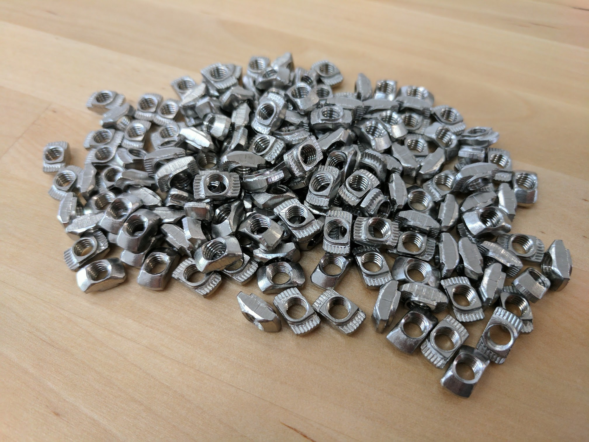

* toc
{:toc}

<iframe class="embedly-embed" src="//cdn.embedly.com/widgets/media.html?src=https%3A%2F%2Fwww.youtube.com%2Fembed%2FgKuVrxRZbPE%3Ffeature%3Doembed&url=http%3A%2F%2Fwww.youtube.com%2Fwatch%3Fv%3DgKuVrxRZbPE&image=https%3A%2F%2Fi.ytimg.com%2Fvi%2FgKuVrxRZbPE%2Fhqdefault.jpg&key=02466f963b9b4bb8845a05b53d3235d7&type=text%2Fhtml&schema=youtube" width="854" height="480" scrolling="no" frameborder="0" allowfullscreen></iframe>

|Qty.                          |Component                     |$/Unit                        |Subtotal                      |
|------------------------------|------------------------------|------------------------------|------------------------------|
|18                            |[M2.5 x 4mm Screws](#m2-5-screws)|$0.15                         |$2.70
|4                             |[M2.5 x 6mm Standoffs](#m2-5-standoffs)|$0.50                         |$2.00
|4                             |[M2.5 x 16mm Standoffs](#m2-5-standoffs)|$0.50                         |$2.00
|4                             |[M3 x 5mm Screws](#m3-screws)|$0.10                         |$0.40
|18                            |[M3 x 10mm Screws](#m3-screws)|$0.15                         |$2.70
|2                             |[M3 x 12mm Screws](#m3-screws)|$0.15                         |$0.30
|20                            |[M3 x 25mm Screws](#m3-screws)|$0.25                         |$5.00
|12                            |[M3 x 30mm Screws](#m3-screws)|$0.30                         |$3.60
|27                            |[M3 Locknuts](#m3-locknuts)|$0.10                         |$2.70
|6                             |[M4 x 16mm Screws](#m4-screws)|$0.25                         |$1.50
|2                             |[M5 x 6mm Screws](#m5-screws)|$0.40                         |$0.80
|175                           |[M5 x 10mm Screws](#m5-screws)|$0.15                         |$26.25
|25                            |[M5 x 16mm Screws](#m5-screws)|$0.20                         |$5.00
|50                            |[M5 x 30mm Screws](#m5-screws)|$0.30                         |$15.00
|2                             |[M5 x 45mm Screws](#m5-screws)|$0.50                         |$1.00
|70                            |[M5 Washers](#m5-washers)|$0.05                         |$3.50
|18                            |[M5 x 6mm Spacers](#m5-spacers)|$0.20                         |$3.60
|15                            |[M5 x 6mm Eccentric Spacers](#m5-x-6mm-eccentric-spacers)|$2.00                         |$30.00
|70                            |[M5 Locknuts](#m5-locknuts)|$0.10                         |$7.00
|175                           |[M5 Tee Nuts](#m5-tee-nuts)|$0.35                         |$61.25
|35                            |[25mm Wood Screws](#wood-screws)|$0.05                         |$1.75
|2                             |[Camera Mounts](#camera-mounts)|$1.50                         |$3.00
|**754**                       |**TOTALS**                    |                              |**$181.05**

# M2.5 Screws

|                              |                              |
|------------------------------|------------------------------|
|**Length**                    |4mm
|**Threads**                   |M2.5
|**Price**                     |$0.15
|**Quantity**                  |18

# M2.5 Standoffs
These standoffs are used to offset the Arduino and the Raspberry Pi from the electronics mounting plate.

_6mm length_

_16mm length_

|                              |                              |
|------------------------------|------------------------------|
|**Material**                  |Stainless steel
|**Lengths**                   |6mm
|**For Screw Size**            |M2.5
|**Price**                     |$0.50
|**Quantity**                  |4 - 6mm length 4 - 16mm length

# M3 Screws

_5mm length_

_10mm length_

_12mm length_

_25mm length_

_30mm length_

|                              |                              |
|------------------------------|------------------------------|
|**Trade Name**                |M3 Low-Profile Socket Head Cap Screw
|**Material**                  |18-8 Stainless Steel
|**Lengths**                   |5mm, 10mm, 12mm, 25mm, and 30mm
|**Threads**                   |M3 x 0.5mm
|**Head Height**               |2mm
|**Head Diameter**             |5.5mm
|**Socket Size**               |2mm Hex
|**Tensile Strength**          |70,000 psi
|**Recommended Supplier**      |[McMaster Carr](http://mcmaster.com) (United States)
|**Price**                     |5mm - $0.10 10mm - $0.15 12mm - $0.15 25mm - $0.25 30mm - $0.30
|**Quantity**                  |5mm - 4 10mm - 18 12mm - 2 25mm - 20 30mm - 12

# M3 Locknuts
Twelve of these locknuts are used to secure the UTM electronic pin screws in place. The nylon insert allows them to resist loosening when subjected to vibration.

|                              |                              |
|------------------------------|------------------------------|
|**Trade Name**                |Nylon-Insert Locknut
|**Threads**                   |M3 x 0.5mm
|**Height**                    |4mm
|**Width**                     |5.5mm
|**Material**                  |18-8 Stainless Steel
|**Recommended Supplier**      |McMaster Carr - [Part Number 93625A100](http://www.mcmaster.com/#93625A100) (United States)
|**Price**                     |$0.10
|**Quantity**                  |27

# M4 Screws
Six of these screws are used to secure the electronics box cover to its base.

|                              |                              |
|------------------------------|------------------------------|
|**Material**                  |18-8 Stainless Steel
|**Threads**                   |M4 x 0.7mm
|**Length**                    |16mm
|**Head Type**                 |3mm socket head cap
|**Price**                     |$0.25
|**Quantity**                  |6

# M5 Screws
M5 button-head screws of various lengths are used throughout FarmBot to attach plates and 3D printed parts to extrusions, V-wheels to plates, and other components together. They are usually used in combination with M5 washers, and terminated with an M5 tee nut or locknut. The button head provides a wide bearing surface, a low-profile head, and a finished appearance. Length is measured from under the head.

_6mm length_

_10mm length_

_16mm length_

_30mm length_

_45mm length_

|                              |                              |
|------------------------------|------------------------------|
|**Trade Name**                |Button-Head Socket Cap Screw
|**Material**                  |18-8 Stainless Steel
|**Tensile Strength**          |70,000psi
|**Lengths**                   |6, 10, 16, 30, and 45mm
|**Threads**                   |M5, 0.8 pitch
|**Head Type**                 |3mm Hex
|**Head Height**               |2.75mm
|**Head Diameter**             |9.5mm
|**Recommended Supplier**      |[McMaster Carr](http://mcmaster.com) (United States)
|**Price**                     |6mm - $0.40 10mm - $0.15 16mm - $0.20 30mm - $0.30 45mm - $0.50
|**Quantity**                  |6mm - 2 10mm - 175 16mm - 25 30mm - 50 45mm - 2

# M5 Washers
These washers are used throughout FarmBot in combination with M5 screws and M5 locknuts. They allow nuts to be tightened on plastic components and plates while preventing damage and distributing load.

|                              |                              |
|------------------------------|------------------------------|
|**Material**                  |18-8 Stainless Steel
|**Outer Diameter**            |10mm
|**Inner Diameter**            |5.3mm
|**Thickness**                 |0.9 to 1.1mm
|**Recommended Supplier**      |[McMaster Carr](http://mcmaster.com) (United States)
|**Supplier Part Number**      |[93475A240](http://www.mcmaster.com/#93475A240)
|**Price**                     |$0.05
|**Quantity**                  |70

# M5 Spacers
These spacers are used to offset V-wheels from plates so that they may engage extrusions.

|                              |                              |
|------------------------------|------------------------------|
|**Material**                  |Aluminum
|**Outer Diameter**            |10mm
|**Inner Diameter**            |5.10mm
|**Length**                    |6mm
|**Recommended Supplier**      |[OpenBuilds](http://openbuildspartstore.com) (United States)
|**Price**                     |$0.20
|**Quantity**                  |18

# M5 x 6mm Eccentric Spacers
When rotated, eccentric spacers accurately position V-wheels on a plate such that they can firmly engage V-slot aluminum extrusions. They are only used on wheels on one side of an extrusion. Adjustments are made by using a 8mm wrench on the spacer itself.

|                              |                              |
|------------------------------|------------------------------|
|**Material**                  |Stainless Steel
|**Height**                    |6mm (not including rim)
|**Bore**                      |5mm
|**Rim**                       |Fits into a 7.12mm hole
|**Hex Size**                  |8mm
|**Divot**                     |Indicates shortest distance from rim to bore
|**Recommended Supplier**      |[OpenBuilds](http://openbuildspartstore.com) (United States)
|**Price**                     |$2.00
|**Quantity**                  |15

# M5 Locknuts
These nuts resist loosening because their nylon insert grips the screw that they are attached to. They are used in combination with M5 screws throughout FarmBot.

|                              |                              |
|------------------------------|------------------------------|
|**Material**                  |18-8 Stainless Steel
|**Hex Size**                  |8mm
|**Height**                    |5mm
|**Threads**                   |M5 x 0.8 pitch
|**Locking Mechanism**         |Nylon Insert
|**Recommended Supplier**      |[McMaster Carr](http://www.mcmaster.com/) (United States)
|**Supplier Part Number**      |[93625A200](http://www.mcmaster.com/#93625A200)
|**Price**                     |$0.10
|**Quantity**                  |70

# M5 Tee Nuts
Combined with M5 screws, these drop-in style tee nuts allow components such as plates and 3D printed parts to be attached quickly and securely anywhere on a V-slot aluminum extrusion.

|                              |                              |
|------------------------------|------------------------------|
|**Trade Name**                |Drop-in Tee Nut
|**Material**                  |Stainless Steel
|**Threads**                   |M5 x 0.8mm pitch
|**Fits Slot Size**            |6
|**Price**                     |$0.35
|**Quantity**                  |175

# Wood Screws
These are used to attach the track end plates and track joining plates to supporting infrastructure such as a raised.

|                              |                              |
|------------------------------|------------------------------|
|**Material**                  |Steel
|**Finish**                    |Black Oxide
|**Length**                    |25cm
|**Head Diameter**             |12mm
|**Recommended Supplier**      |[Home Depot](http://homedepot.com) (United States)
|**Price**                     |$0.05
|**Quantity**                  |35

# Camera Mounts
These stainless steel loop clamps are used to secure the camera to the z-axis.

|                              |                              |
|------------------------------|------------------------------|
|**Trade Name**                |Loop Clamp
|**Material**                  |321 Stainless Steel
|**ID**                        |3/8"
|**Center-to-Center Length**   |1/2"
|**Length**                    |15/16"
|**Width**                     |3/8"
|**Height**                    |7/16"
|**Thickness**                 |1/32"
|**Mounting Hole Diameter**    |13/64"
|**Recommended Supplier**      |McMaster Carr, part number [8863T66](https://www.mcmaster.com/#8863t66)
|**Price**                     |$1.50 each
|**Quantity**                  |2

