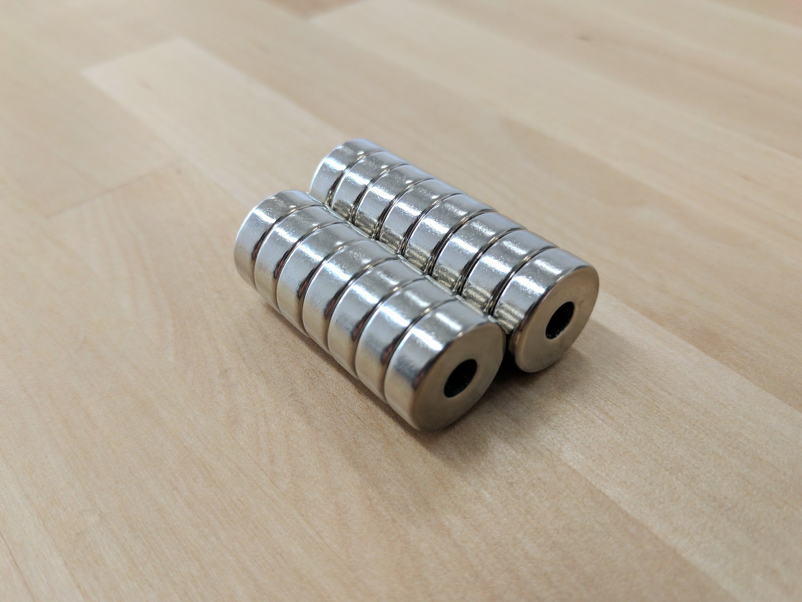

|Qty.                          |Component                     |$/unit                        |Subtotal                      |
|------------------------------|------------------------------|------------------------------|------------------------------|
|15                            |[15 x 5 x 5mm Ring Magnets](#ring-magnets)|$2.00                         |$30.00
|12                            |[Compression Springs](#compression-springs)|$0.25                         |$3.00
|1                             |[UTM Plug](#utm-plug) |$1.00                         |$1.00
|50                            |[Zip Ties](#zip-ties) |$0.05                         |$2.50
|2                             |[Red Markers](#red-markers)|$0.25                         |$0.50
|1                             |[3mm Hex Driver](#3mm-hex-driver)|$5.00                         |$5.00
|1                             |[2mm Hex Driver](#2mm-hex-driver)|$5.00                         |$5.00
|1                             |[8mm Box Wrench](#8mm-box-wrench)|$5.00                         |$5.00
|1                             |[5.5mm Box Wrench](#55mm-box-wrench)|$5.00                         |$5.00
|1                             |[8mm Wrench](#8mm-wrench)|$5.00                         |$5.00
|1                             |[Phillips Screwdriver](#phillips-screwdriver)|$5.00                         |$5.00
|1                             |[Bladed Screwdriver](#bladed-screwdriver)|$5.00                         |$5.00
|**87**                        |**TOTALS**                    |                              |**$72.00**

# Ring Magnets
These magnets keep tools attached to the UTM.



|                              |                              |
|------------------------------|------------------------------|
|**Material**                  |Neodymium (NdFeB)
|**Grade**                     |N48
|**Coating**                   |Nickle (Ni)
|**Magnetization**             |Through ring
|**Pull Force**                |7.59 lbf
|**Outer Diameter**            |15mm
|**Inner Diameter**            |5mm
|**Thickness**                 |5mm
|**Recommended Supplier**      |[Apex Magnets](https://www.apexmagnets.com/15-x-5-x-5mm-rings)
|**Price**                     |$2.00
|**Quantity**                  |15

# Compression Springs
These springs keep the screws in the UTM in contact with screws in the tools for electrical connections.

|                              |                              |
|------------------------------|------------------------------|
|**Material**                  |Stainless Steel
|**Free Length**               |11mm
|**Compressed Length**         |4.09mm
|**Outer Diameter**            |4.4mm
|**Inner Diameter**            |3.6mm
|**Wire Diameter**             |0.4mm
|**Spring Rate**               |0.62 Newtons/mm
|**Load Capacity**             |4.36 Newtons
|**Price**                     |$0.25
|**Quantity**                  |12

# UTM Plug

|                              |                              |
|------------------------------|------------------------------|
|**Price**                     |$1.00
|**Quantity**                  |1

# Zip Ties
These zip ties are used to attach wires to the UTM electrical connection screws and for cable management.

|                              |                              |
|------------------------------|------------------------------|
|**Material**                  |Nylon
|**Color**                     |Black
|**Length**                    |63.7mm
|**Price**                     |$0.05
|**Quantity**                  |50

# Red Markers
Used to calibrate FarmBot's camera for pixel to coordinate conversion software.

|                              |                              |
|------------------------------|------------------------------|
|**Material**                  |Rubber
|**Color**                     |Red
|**Price**                     |$0.25
|**Quantity**                  |2

# 3mm Hex Driver
This hex (allen) driver is used to tighten all of the M5 screws on FarmBot.

<iframe class="embedly-embed" src="//cdn.embedly.com/widgets/media.html?src=https%3A%2F%2Fwww.youtube.com%2Fembed%2F-RoldWV-ut4%3Ffeature%3Doembed&url=http%3A%2F%2Fwww.youtube.com%2Fwatch%3Fv%3D-RoldWV-ut4&image=https%3A%2F%2Fi.ytimg.com%2Fvi%2F-RoldWV-ut4%2Fhqdefault.jpg&key=02466f963b9b4bb8845a05b53d3235d7&type=text%2Fhtml&schema=youtube" width="854" height="480" scrolling="no" frameborder="0" allowfullscreen></iframe>

|                              |                              |
|------------------------------|------------------------------|
|**Hex Size**                  |3mm
|**Bit Material**              |Hardened steel with a titanium nitride coating
|**Handle Material**           |Anodized aluminum
|**Price**                     |$5.00
|**Quantity**                  |1

# 2mm Hex Driver
This hex (allen) driver is used to tighten all of the M5 screws on FarmBot.

|                              |                              |
|------------------------------|------------------------------|
|**Hex Size**                  |2mm
|**Bit Material**              |Hardened steel with a titanium nitride coating
|**Handle Material**           |Anodized aluminum
|**Price**                     |$5.00
|**Quantity**                  |1

# 8mm Box Wrench
This box wrench is used to tighten all of the M5 screws on FarmBot.

|                              |                              |
|------------------------------|------------------------------|
|**Box Size**                  |8mm
|**Handle Material**           |Anodized aluminum
|**Price**                     |$5.00
|**Quantity**                  |1

# 5.5mm Box Wrench
This box wrench is used to tighten all of the M3 locknuts on FarmBot.

|                              |                              |
|------------------------------|------------------------------|
|**Box Size**                  |5.5mm
|**Handle Material**           |Anodized aluminum
|**Price**                     |$5.00
|**Quantity**                  |1

# 8mm Wrench
The wrench is for tightening M5 locknuts and adjusting eccentric spacers throughout FarmBot.

|                              |                              |
|------------------------------|------------------------------|
|**Size**                      |8mm
|**Price**                     |$5.00
|**Quantity**                  |1

# Phillips Screwdriver

|                              |                              |
|------------------------------|------------------------------|
|**Bit Size**                  |6mm
|**Price**                     |$5.00
|**Quantity**                  |1

# Bladed Screwdriver

|                              |                              |
|------------------------------|------------------------------|
|**Bit Size**                  |2.5mm
|**Price**                     |$5.00
|**Quantity**                  |1

